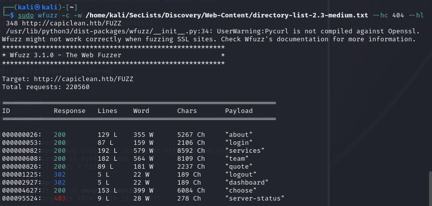

+++ 
draft = true
date = 2024-02-02T13:07:16+01:00
title = "Bizness HTB Walkthrough"
description = "testestestestest"
slug = ""
authors = ["Dennis Drebitca"]
tags = ["Hash cracking", "Hashcat", "CVE-2023-51457", "Dirsearch"]
categories = []
externalLink = ""
series = ["HTB"]
+++


[comment]: <> (Insertar imagen de la carátula de la máquina)


The IClean HTB machine is an medium difficulty level HackTheBox Machine. The main techniques and tools used to crack this machine are:

        - Dirsearch
        - CVE-2023-51467
        - Grep, find and strings
        - Hashcat


## Reconnaissance

We start a broad Nmap scan by executing the following command:

```sh
sudo nmap -sS -T5 -vvv -p- 10.10.11.12 -Pn -oG nmap_inicial
```

Where the arguments mean:

    -sS: SYN port scan
    -T5: Using timing template 5 of NMAP
    -vvv: Triple verbose so NMAP prints a lot of information
    -p-: All ports are scanned
    -Pn: Skips Host Discovery
    -oG: Grep Format

The scan returns the following information:


It looks like ports 20 and 80  are open. Classic open ports for SSH and HTTP. Next, we run a more comprehensive scan on the open ports:

```sh
sudo nmap -sCV -p22,80,443 10.10.11.12 -oN nmap_exhaustivo -v
```

Now the arguments used mean:

    -sCV: Launches all scanning scripts to discover services and versions running on these ports
    -oN: Normal output format
    -v: Single verbose

The results for this second scan are the following:


Trying to access the page, it does not connect since we haven't added the website to our /etc/hosts file, and it doesnt know where to redirect. We simply have to edit the hosts file and add the IP and URL at the end.

Lets also run WhatWeb to see more information about the web page:

```sh
whatweb http://capiclean.htb/
```


We now know that uses python 3.10.12 and Werkzeug 2.3.7. Could't find any relevant exploits with this information.

## Directory discovery

Now lets try to enumerate subdirectories via brute force with Dirsearch, a open-source python tool that can be found in [GitHub](https://github.com/maurosoria/dirsearch.git). 

First, we add the website to our /etc/hosts file and then we run the following command:

```sh
dirsearch -u http://capiclean.htb/ --exclude-status 403,404
```


It doesn't reveal anything interesting. Lets try WFUZZ and use a bigger dictionary.

We have to run

```sh
sudo wfuzz -c -w /home/kali/SecLists/Discovery/Web-Content/directory-list-2.3-medium.txt --hc 404 --hl 348 http://capiclean.htb/FUZZ
```

It reveals an interesting subdirectory: "quote"




## Initial access


## Privilege escalation


```sh
find . -type f -name '*Admin*'
```


