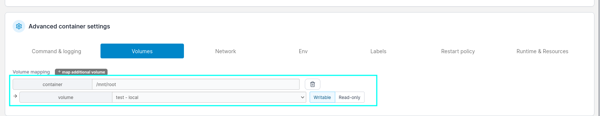

+++ 
draft = false
date = 2024-06-10T13:07:16+01:00
title = "Runner HTB Walkthrough"
description = ""
slug = ""
authors = ["Dennis Drebitca"]
tags = ["Grep","ffuf","JohnTheRipper","CVE-2024-27198","CVE-2024-21626","runC","Docker Escape"]
categories = []
externalLink = ""
series = ["HTB"]
+++


[comment]: <> (Insertar imagen de la carátula de la máquina)


The Runner HTB machine is a medium difficulty level HackTheBox Machine. The main techniques and tools used to crack this machine are:

    - Subdirectory discovery with ffuf
    - CVE-2024-27198
    - Hash cracking with JohnTheRipper
    - Docker escape
    - CVE-2024-21626

## Reconnaissance

We start a broad Nmap scan by executing the following command:

```sh
sudo nmap -sS -T5 -vvv -p- 10.10.11.13 -Pn -oG nmap_inicial
```

Where the arguments mean:

    -sS: SYN port scan
    -T5: Using timing template 5 of NMAP
    -vvv: Triple verbose so NMAP prints a lot of information
    -p-: All ports are scanned
    -Pn: Skips Host Discovery
    -oG: Grep Format

The scan returns the following information:


It looks like ports 20, 80 and 8000 are open. Next, we run a more comprehensive scan on the open ports:

```sh
sudo nmap -sCV -p22,80,8000 10.10.11.13 -oN nmap_exhaustivo -v
```

Now the arguments used mean:

    -sCV: Launches all scanning scripts to discover services and versions running on these ports
    -oN: Normal output format
    -v: Single verbose

The results for this second scan are the following:


This is the page visible on port 80:


It doesn't appear to be anything interesting in this page. In the meantime, lets fuzz looking for subdomains.

```sh
ffuf -w /usr/share/seclists/Discovery/DNS/subdomains-top1million-20000.txt -u http://runner.htb -H "Host: FUZZ.runner.htb" -ic -t 200 -c -fs 154
````


It is important to user the parameter -fs 154, to filter out any false positives.


There doesn't seem to be any low-hanging subdomains. Lets look for web content.

```sh
ffuf -w /usr/share/seclists/Discovery/Web-Content/directory-list-2.3-medium.txt  -u http://runner.htb/FUZZ -fs 154 -ic -t 200
```

Nothing either. Lets now look at the service running on port 8000. NSCA is a Nagios service that allows you to receive check results from remote machines and applications with Nagios. 

Lets learn how it works. For this, we have to clone the git repo and compile the binaries. All the instructions are [on the github page](https://github.com/NagiosEnterprises/nsca?tab=readme-ov-file
). Once it is compiled, we have these files:


The binaries are inside the /src folder. NSCA uses the binary send_nsca to send information to the server. The message sent can be encrypted with a password, but lets try to see if maybe the encryption isn't used. We will use the sample send_nsca.cfg found in the folder sample-config.

```sh
<host_name>[tab]<svc_description>[tab]<return_code>[tab]<plugin_output>[newline]
```

This is the test message that will be sent:


And we just run the following command, piping the file "test" into send_nsca.

```sh
/send_nsca 10.10.11.13 -p 8000 -c send_nsca.cfg < test

```


However, all of this seemed to be a rabbit hole, because i have discovered a subdomain using the largest dictionary of subdomains in SecLists. There is a "teamcity" subdomain that has to be added to /etc/hosts.


This is the teamcity login page that we land on.


## Initial access

Searching for exploits for teamcity, we have found [the following one](https://github.com/Chocapikk/CVE-2024-27198), CVE-2024-27198:

```sh
python CVE-2024-27198.py -t http://teamcity.runner.htb -u dennis -p dennis
```


We land on the teamcity dashboard.


Navigating to Administration > Backup > All except build artifacts > Start Backup, generates a backup of TeamCity which can be downloaded. There is a database dumbp, in which we can see password hashes for users John and Matthew.


Using JohnTheRipper, we can crack the hash for matthew:

```sh
john --wordlist=/home/kali/SecLists/Passwords/Leaked-Databases/rockyou.txt hash
```

```sh
matthew:piper123
```


The password for John is tougher to crack. We can find a SSH private key by searching for the string "BEGIN" using grep:


```sh
grep -Ril "BEGIN" .
```


It only works with user John, and we got the user flag.


Something interesting is that Docker appears to be installed. 


## Privilege escalation

Lets enumerate further for ways to get root access to the machine. Using linpeas, we discover that there is another host that we have not discovered: portainer-administration.runner.htb


Navigating to portainer-adrministration.runner.htb:


Whith matthew's credentials, we can log in:


Here we can mount the root filesystem into a container, and read the root flag. To do this, we first need to get the volume information of the machine to emulate one like it with portainer.

```sh
cat /etc/fstab
```


Now we go and create volume with the root filesystem mapped.


Next, we create a container and add the anterior volume, mapping it to /mnt/root. Click add container:


Now select the image:


Then, enable interactive & TYY console, and click on volumes.


Map /mnt/root to the created volume.



The last thing we have to do is spawn the shell and read the root flag.


And just like that, we can read the root flag and the system is PWND.

**Another way of escaping the container is found in [CVE-2024-21626](https://nitroc.org/en/posts/cve-2024-21626-illustrated/?source=post_page-----103250a9acd3--------------------------------#exploit-via-setting-working-directory-to-procselffdfd)**

## Conclusion

Hacking through the Runner HTB machine provides valuable insights into penetration testing techniques, including enumeration, vulnerability exploitation, and privilege escalation. By understanding these steps, aspiring ethical hackers like me can enhance their skills and contribute positively to the cybersecurity landscape.
