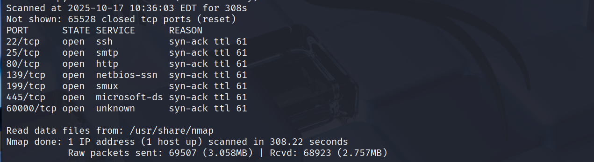
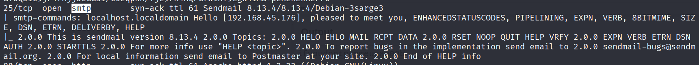
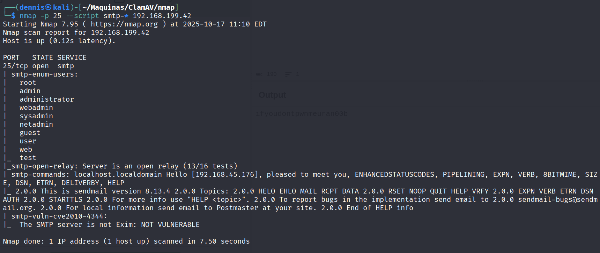
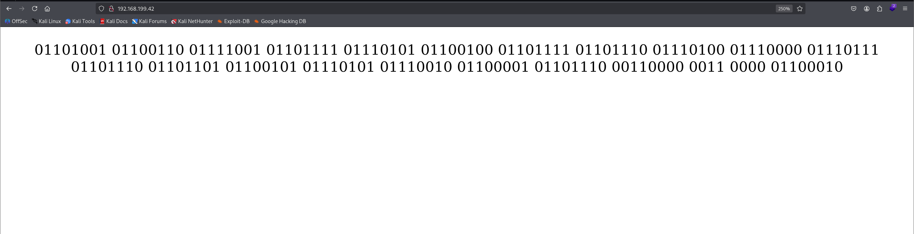
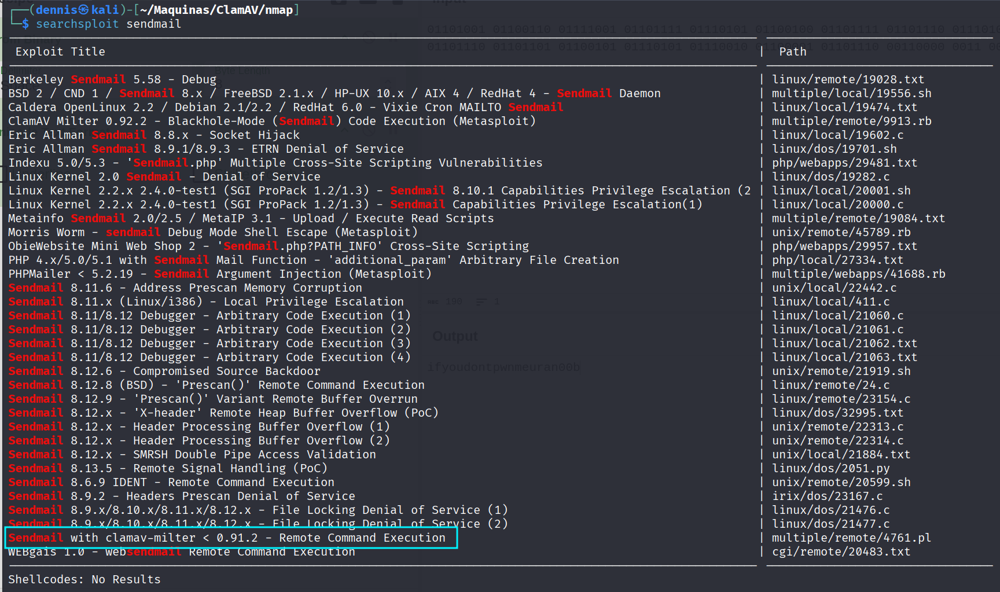
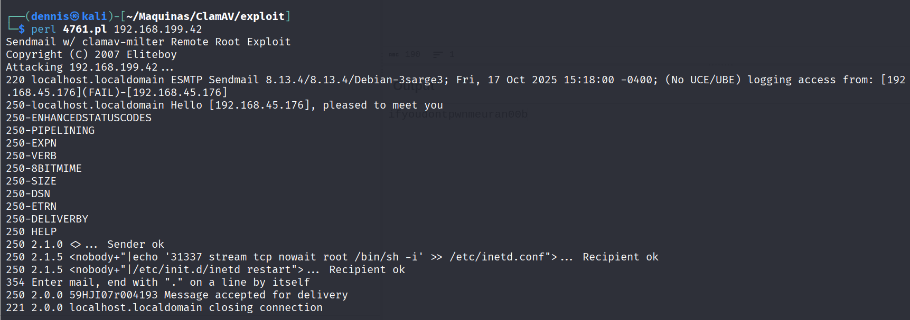
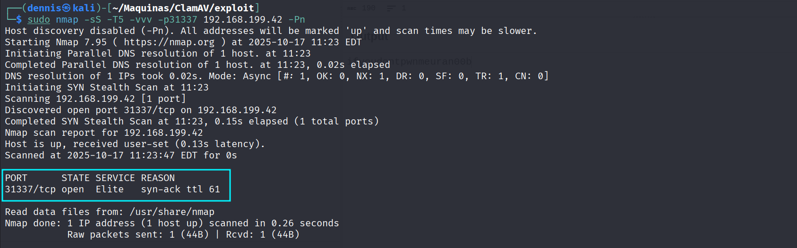

+++
draft = false
date = 2025-08-29T18:00:00+01:00
title = "ClamAV Offsec Walkthrough"
description = "A walkthrough for the OffSec machine ClamAV, exploiting a vulnerability in Sendmail with clamav-milter to gain remote root access."
slug = "clamav-walkthrough"
authors = ["Dennis Drebitca"]
tags = ["Sendmail", "ClamAV", "Remote Command Execution", "RCE", "Perl", "SMTP Open Relay", "inetd", "SearchSploit", "CyberChef", "Binary Decoding"]
categories = []
externalLink = ""
series = ["Offsec"]
+++

## ClamAV OffSec Walkthrough

### 1. Reconnaissance

First, a ping is made to verify connection with the machine:


A high TTL of ~130 is observed. However, the later Nmap scan will show a TTL of 61, which is more typical for Linux machines.

A nmap SYN scan is run to discover all open ports:

sudo nmap -sS -T5 -vvv -p- 192.168.199.42 -Pn -oG nmap_inicial

Where the parameters mean:

- sS: SYN scan
- T5: Using NMAP Timing Template 5
- vvv: Triple verb for NMAP to display a lot of information
- p-: All ports scan
- Pn: Skip host discovery
- oG: Greppable format

The result shows several open ports:



Second, a more thorough scan is performed only on the open ports to detect which services are running on those ports:

```sh
sudo nmap -sCV -vvv -p22,25,80,139,199,445,60000 192.168.199.42 -oN nmap_exhaustive
```

Where the parameters mean:

- sCV: Execution of service detection scripts and their version.
- vvv: Triple verb for NMAP to display a lot of information
- p-: Only the open ports are scanned
- oN: Normal format

The result of the scan is as follows:


Several interesting services can be observed: ssh, smtp, http, and smb. The SMTP service, **Sendmail 8.13.4/8.13.4/Debian-3sarge3**, looks particularly interesting and old.



To gather more information, we run `nmap`'s SMTP scripts against port 25:
```sh
nmap -p 25 --script smtp-* 192.168.199.42
```


This scan confirms the server is an **open relay** and lists potential usernames.

Let's investigate the website on port 80:



The page displays a long string of binary text.

### 2. Exploitation and Privilege Escalation

The binary string from the website is suspicious. We can use CyberChef to decode it. Using the "From Binary" operation, we get a clear text string:


The message is `ifyoudontpwnmeuran00b`. This is a clear hint.

Given the Sendmail version (8.13.4) and the hint, we use `searchsploit` to find known vulnerabilities:

searchsploit sendmail



A very promising remote command execution exploit is found: **Sendmail w/ clamav-milter < 0.91.2 - Remote Command Execution (4761.pl)**.

We examine the exploit script to understand what it does:
```sh
cat 4761.pl
```


The Perl script connects to the SMTP server (which we know is an open relay) and sends a specially crafted email. The payload (in the `RCPT TO:` command) appends a new line to `/etc/inetd.conf`, which will start a root shell (`/bin/sh -i`) on port **31337** when accessed.

Let's run the exploit:
```sh
perl 4761.pl 192.168.199.42
```


The exploit connects and the message is "accepted for delivery." This should have created our backdoor.

We can quickly scan for port 31337 to see if the exploit worked:
```sh
sudo nmap -sS -p31337 192.168.199.42 -Pn
```



The port is now open. All that's left is to connect to it using `netcat` to get our shell:
```sh
nc 192.168.199.42 31337
```


We execute `whoami` and confirm we are **root**. The machine has been pwned.

### 3. Attack Mitigation

To mitigate this specific vulnerability (CVE-2007-0021) and the attack vector:

 - Update ClamAV-Milter: The vulnerability exists in versions of `clamav-milter` prior to 0.91.2. Updating this package to the latest version resolves the remote command execution vulnerability.
 - Disable Open Relay: The exploit was heavily dependent on the SMTP server being an open relay. The Sendmail configuration (`sendmail.mc`) should be hardened to only accept and relay mail from trusted domains and IPs.
 - Harden File Permissions: The payload relied on being able to write to `/etc/inetd.conf`. This file's permissions should be hardened (e.g., `chmod 644`) to prevent modification by any user other than root.
 - Principle of Least Privilege: The Sendmail service should not be running with privileges that allow it to write to critical system configuration files.
 - Modernize Services: `inetd` is an outdated superserver. If possible, it should be disabled or replaced with `xinetd`, which offers more granular