+++ 
draft = false
date = 2025-05-18T13:07:16+01:00
title = "Cockpit Offsec Walkthrough"
description = ""
slug = ""
authors = ["Dennis Drebitca"]
tags = ["SQL injection", "SQLmap", "Privilege Escalation", "Feroxbuster", "BurpSuite", "tar wildcard exploitation"]


categories = []
externalLink = ""
series = ["Offsec"]
+++


## Introduction

### SQL injection vulnerability

A SQL Injection (SQLi) vulnerability is one of the most critical threatsin web applications that interact with databases. This vulnerability occurs when an application does not properly validate and sanitize user input before using it in SQL queries, allowing an attacker to manipulate these queries to access, modify, or delete data in the database.

The attack relies on injecting malicious SQL code into input fields, such as login forms, URLs, or parameters in the query. If the application is vulnerable, the injected code can alter the expected query, allowing unauthorized actions such as credential extraction, obtaining sensitive information, or even full access to the database.

There are several types of SQL Injection, including:

- Error-based SQLi: The attacker causes the database to return error messages revealing informationabout its structure.
- UNION-based SQLi: Leverages theUNION clause to combine results from multiple queries and exfiltrate data.
- Blind SQLi: The database response does not return direct information, so the attacker infers data with Boolean questions or by measuring response times.
- Out-of-band SQLi: Alternative methods, such as HTTP request generation or DNS connections, are used to extract information.

### Consequences of a SQLi Attack

The consequences of a SQL Injection (SQLi) attack can be devastating, as they directly affect the integrity, confidentiality, and availability of data in a database. Depending on the severity of the vulnerability and the creativity of the attacker, the impacts can range from a simple leakof information to full control of the system.

Main consequences of an SQLi:

- Theft of sensitive data
- Impersonation and unauthorized access
- Data Manipulation or Deletion
- Server takeover
- Reputational impact and legal sanctions
- Heavy query denial of service (DoS)

## Exploitation of the Offsec Cockpit Machine

### Reconnaissance

First, a ping is made to verify connection with the machine:

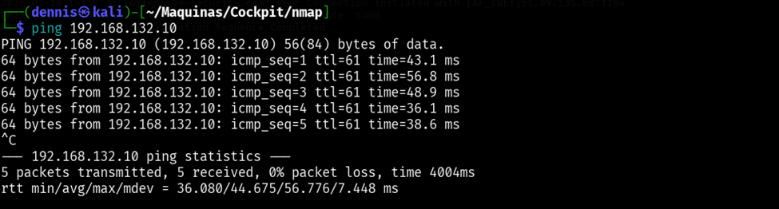
Figure 1. Ping the victim machine

A bit of a weird TTL is observed, it is usually 64 for Linux machines and 128 for Windows machines.

A nmap SYN scan is run to discover the open ports:
```sh
sudo nmap -sS -T5 -vvv -p- $tgt -Pn -oG nmap_inicial
```

Where the parameters mean:

- -sS: Escaneo SYN
- -T5: Using NMAP Timing Template 5
- -vvv: Triple verb for NMAP to display a lotof information
- -p-: All ports are scanned
- -Pn: Skip host discovery
- -ogG: Formato Grep

The result is as follows:

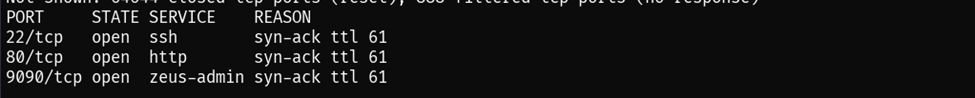
Figure 2. Initial nmap scan.

Second, a more thorough scan is performed only on the open ports to detect which services are running on those ports:
```sh
sudo nmap -sCV -vvv -p22,80,9090 $tgt -oN nmap_exhaustive
```

Where the parameters mean:

- -sCV: Execution of service detection scripts and their version.
- -vvv: Triple verb for NMAP to display a lotof information
- -p-: Only open ports are scanned
- -oN: Normal Format

The result of the scan is as follows:

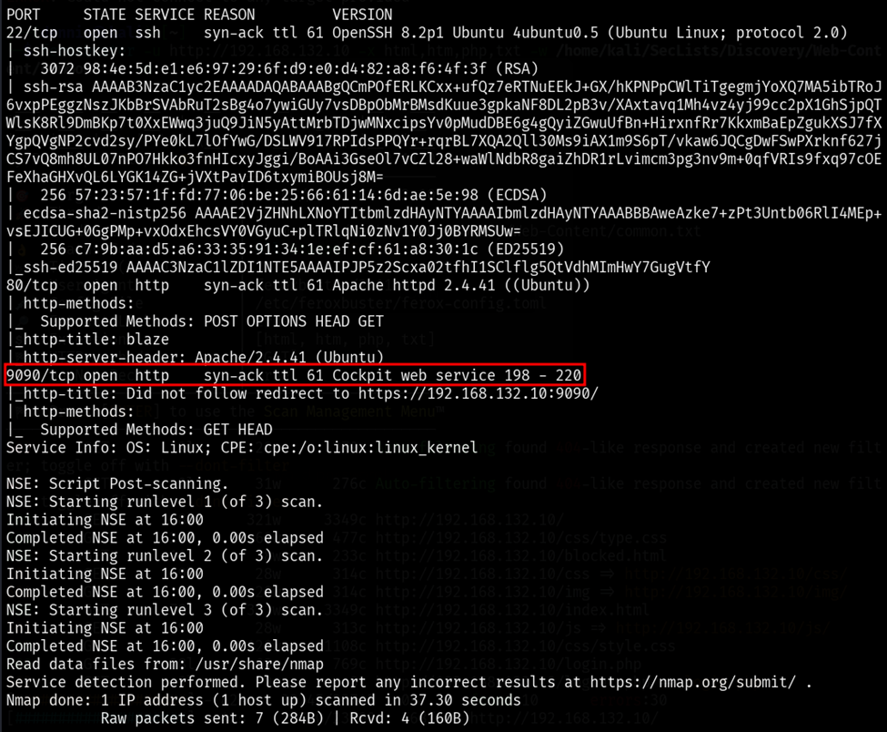
Figure 3. Comprehensive nmap scanning.

On port 9090 there is a login page to an Ubuntu system but we do not have credentials. This looks official, so it won't have any easy vulnerabilities.

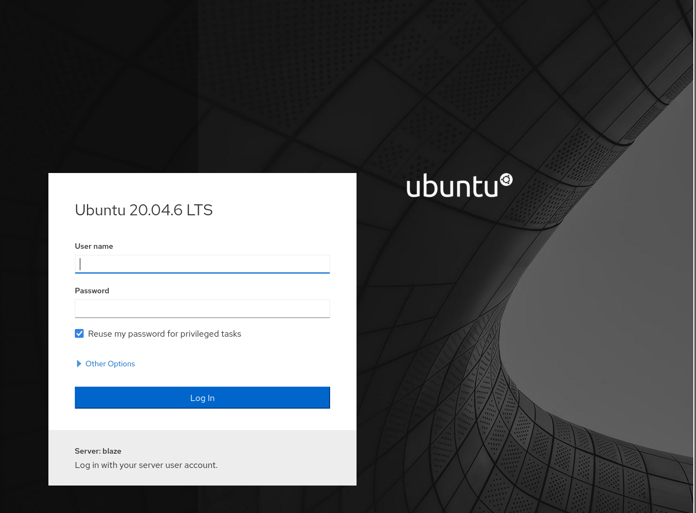
Figure 4. Page present in port 9090.

The web page present on port 80 is as follows:

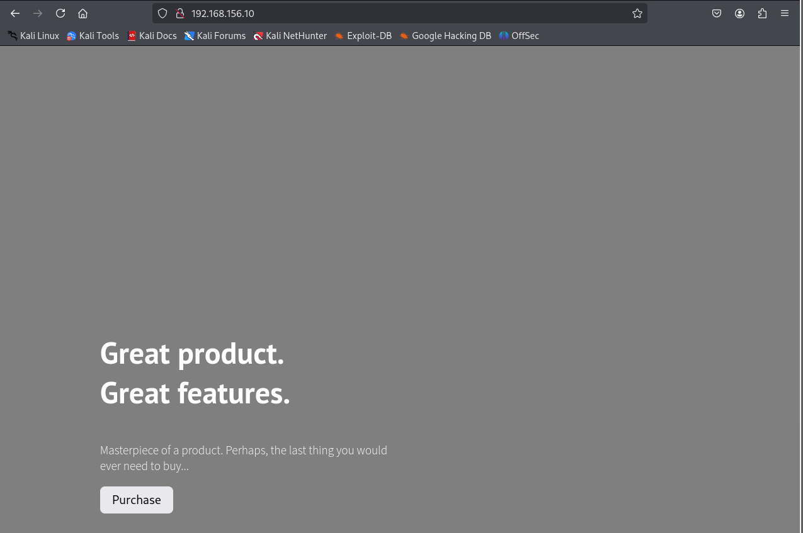
Figure 5. Website at port 80.

However, this is a completely static page with nothing interesting. It is suspected that there are more interesting subdirectories present, so we continue with subdomain discovery using the _feroxbuster tool_.
```sh
feroxbuster -u <http://192.168.132.10> -x html,htm,php,txt -w /home/kali/SecLists/Discovery/Web-Content/common.txt -n
```

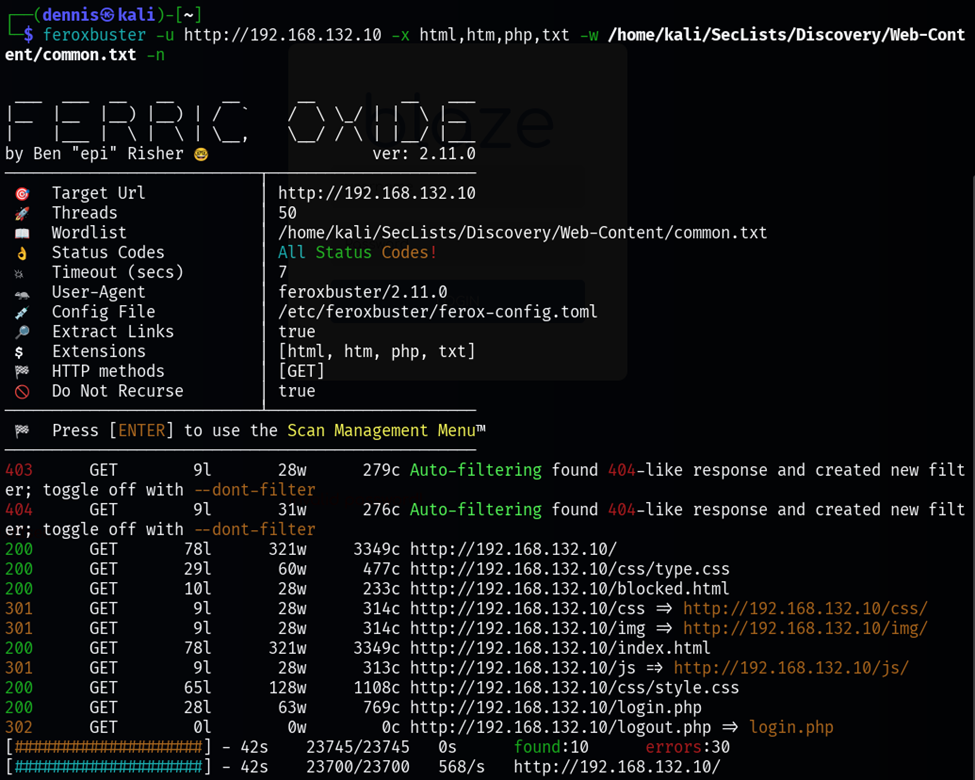
Figure 6. Subdirectory discovery with feroxbuster.

The most interesting subdirectory is _/login.php._ This is a login form. Attempts have been made to search for default credentials and common credentials, but nothing has worked. However, entering a single quotation mark denotes that some sort of SQLi vulnerability exists:

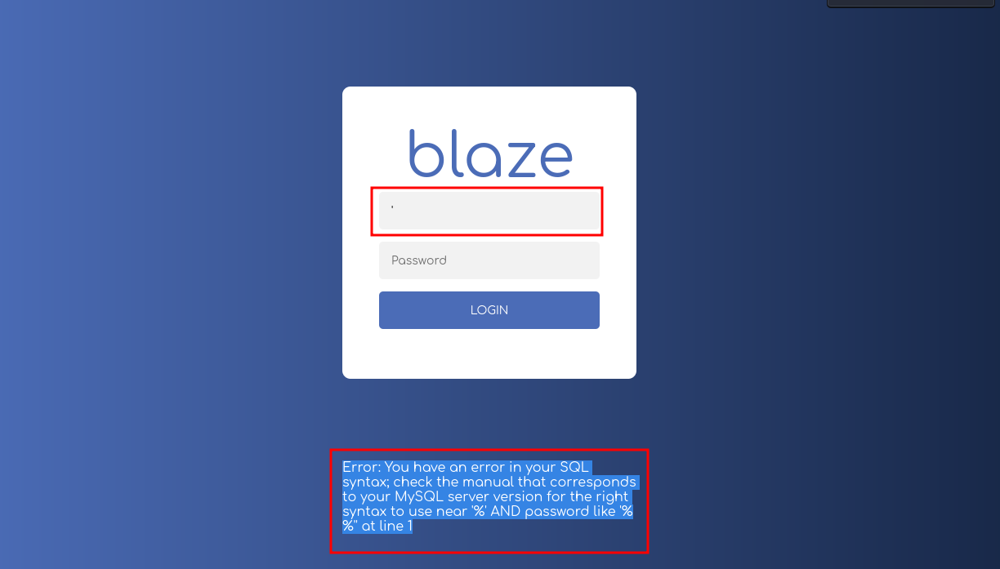
Figure 7. SQL error. Denotes the possible existence of SQLi

### Initial foothold

Now that we are aware that there may be a SQLi vulnerability. The first attempt and idea is to use SQLmap to try to find the right query to attack the vulnerability automatically. First, the request is intercepted with BurpSuite:

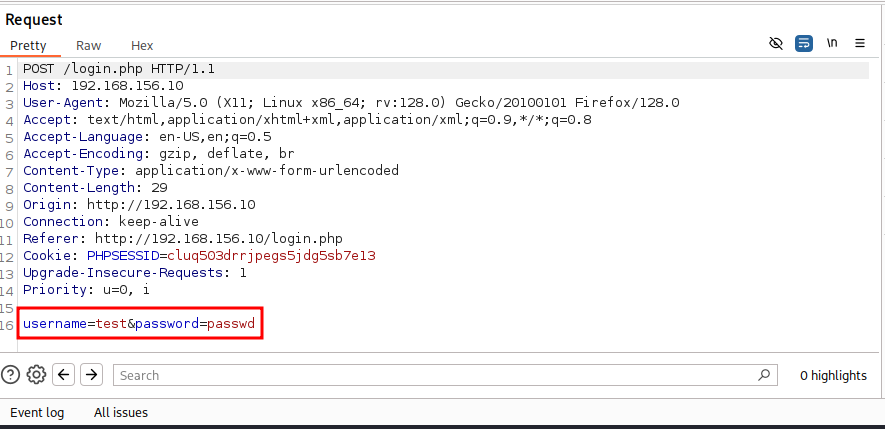
Figure 8. Request intercepted by BurpSuite.

The parameters that are going to be injected are _username_ and _password._ The intercepted request is saved in the requests.txt file and the following command is executed:
```sh
sqlmap -r request.txt -p username password
```

The result is as follows: sqlmap shows that the parameter is not injectable. It could be that there is a WAF or something that stops the bulk queries:

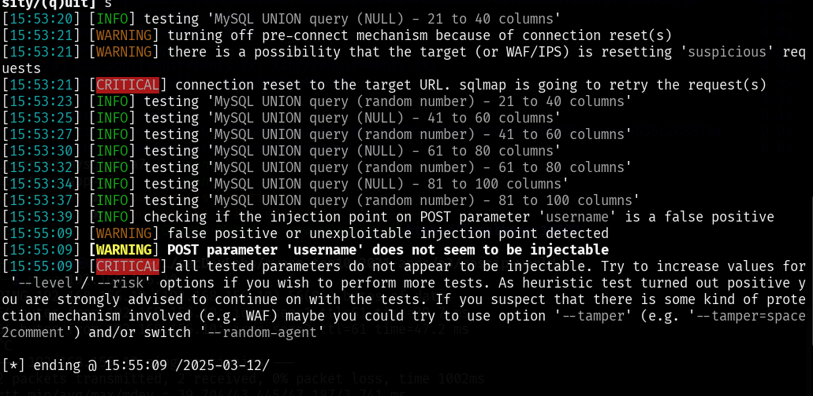
Figure 9. SQLmap failed.

A manual injection is also attempted since the output seen in Figure 8 clearly denotes a SQLi vulnerability. The following website has been found interesting, and there is an injection that works:

<https://github.com/Mehdi0x90/Web_Hacking/blob/main/Login%20Bypass.md>

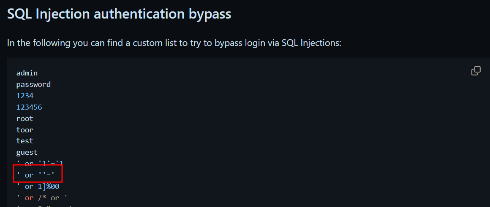
Figure 10. List of injections to make login bypass.

The admin injection also _works-- -_

The query running on the server should look something like this:
```sql
SELECT * FROM users WHERE username = 'USER_INPUT' AND password = 'PASSWORD_INPUT'
```

And the first case resolves to _SELECT \* FROM users WHERE username = '' OR '' = '' AND password = ''._ Login is successful since an empty string is always the same as another empty string.

The second to _SELECT \* FROM users WHERE username = 'admin'-- -' AND password = ''_

Using any of the injections, you access the following admin panel:

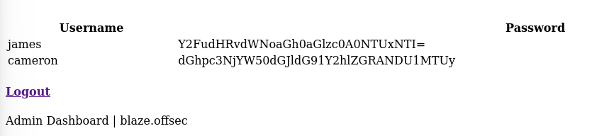
Figure 11. Admin panel.

Passwords are base64 encrypted. The decoded usernames and passwords are as follows:

- james: canttouchhhthiss@455152
- cameron: thisscanttbetouchedd@455152

Trying to do ssh, no luck as it requires our public password to be set to authorized_keys.

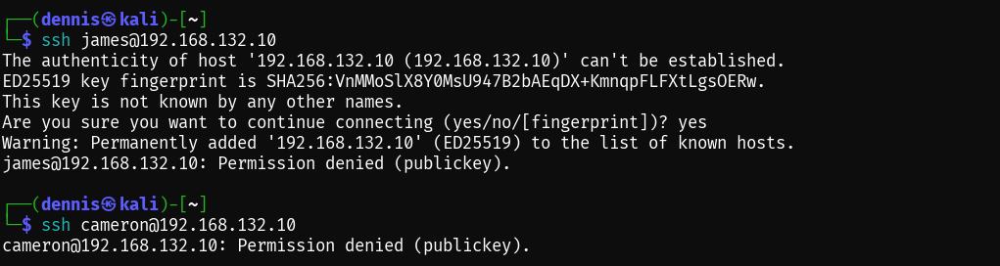
Figure 12. SSH login attempt failed.

However, user _james_ can access the Ubuntu control panel on port 9090:

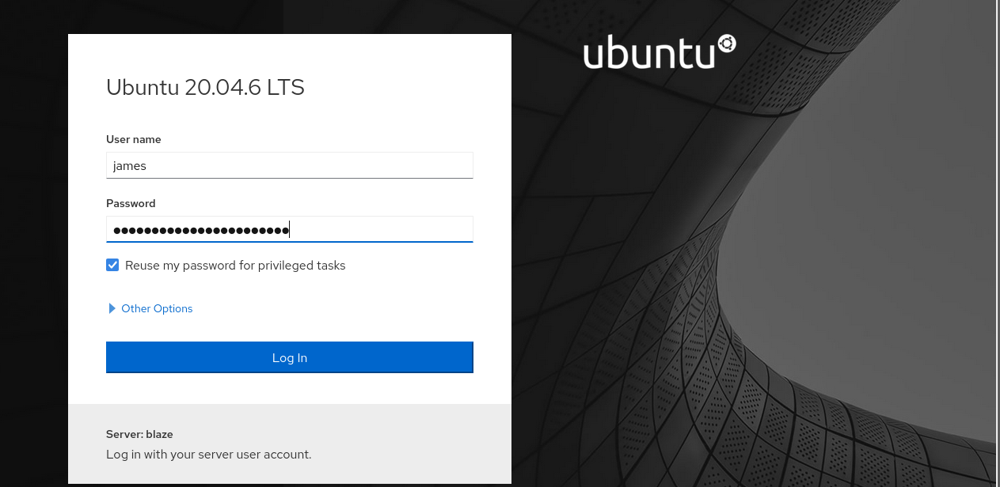
Figure 13. Login on the port 9090 panel.

Navigating the interface, it is discovered that it is possible to spawn a terminal on the victim computer like James:

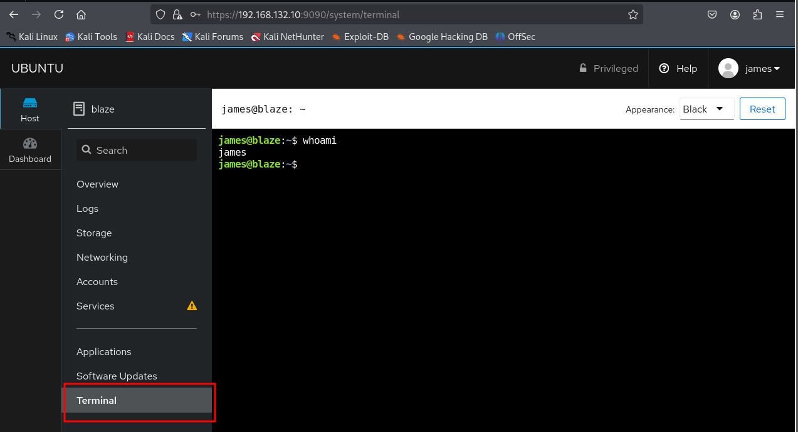
Figure 14. Terminal in the system.

To connect from our attacking terminal, it is necessary to add our SSH public key to the authorized_keys file.

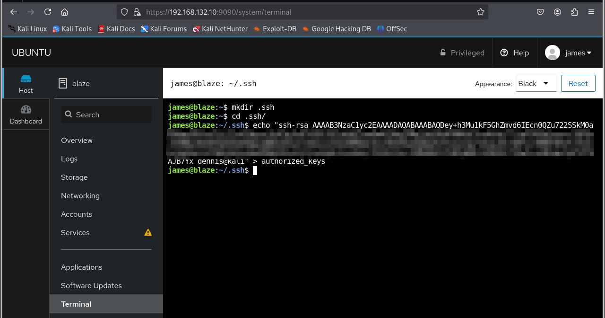
Figure 15. Insertion of our ssh public key into authorized_keys.

And now the victim computer can be accessed via SSH with a fully interactive console:

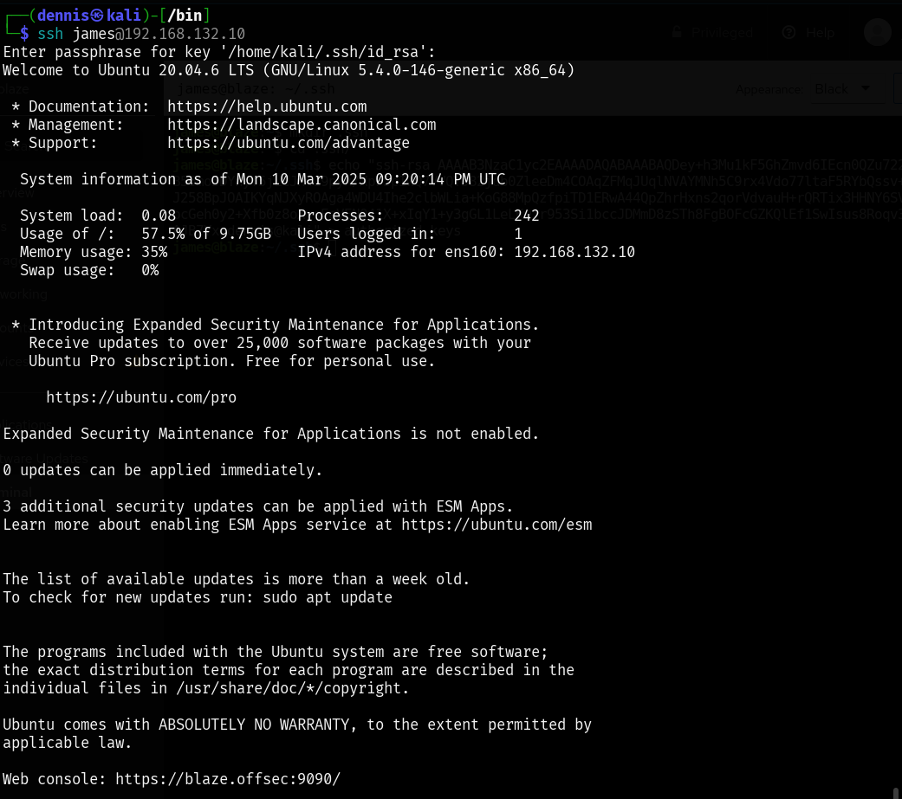
Figure 16. SSH login on the victim machine with the user james.

### Privilege escalation

Once inside the system using SSH, the _sudo -l_ command is executed to find out if there are any commands that the user _james_ can execute as root:

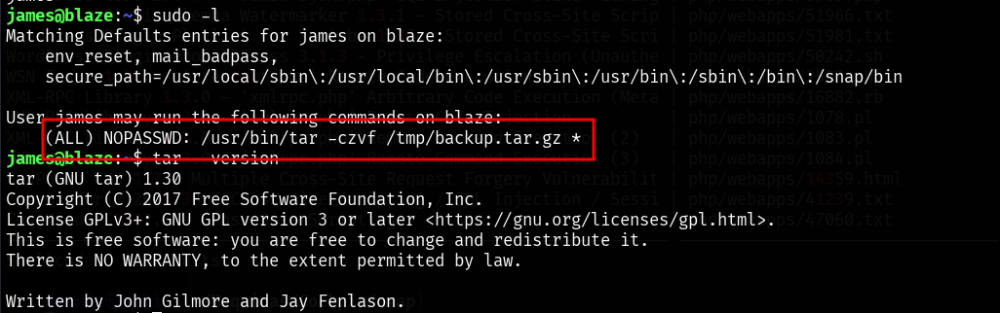
Figure 17. Running sudo -l

Apparently, you can run the command _/usr/bin/tar -czvf /tmp/backup.tar.gz \*_

This can lead to a rather interesting privilege escalation found in the following link:

<https://medium.com/@polygonben/linux-privilege-escalation-wildcards-with-tar-f79ab9e407fa>

The steps to execute privilege escalation are as follows:

- Creating the files _‘--checkpoint=1’_ and _‘--checkpoint-action=exec=sh privesc.sh’_
- Creating the bash script _privesc.sh_

Inside the privesc.sh file is the payload to be executed. In this case, a new _dennis_ user with root permissions will be added. First, the password is generated:

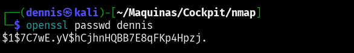
Figure 18. Creating the "dennis" password

The line to be injected into /etc/password is as follows:
```sh
dennis:$1$7C7wE.yV$hCjhnHQBB7E8qFKp4Hpzj.:0:0:root:/root:/bin/bash_
```

The payload that contains the privesc.sh file is the addition of this line to the /etc/passwd file:

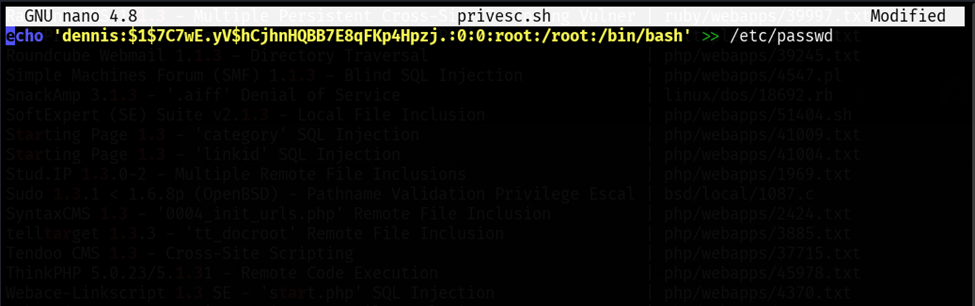
Figure 19. File Contents privesc.sh

Now, with the execution of the _/usr/bin/tar -czvf /tmp/backup.tar.gz \*_ command, the files in this directory are not interpreted as filenames but as parameters of the command, resulting in the parsed command being executed
```sh
/usr/bin/tar -czvf /tmp/backup.tar.gz --checkpoint=1 --checkpoint-action=exec=sh privesc.sh
```

If we now run the command sudo _/usr/bin/tar -czvf /tmp/backup.tar.gz\*,_ the payload is executed and we can switch to the _dennis_ user who has root privileges. The second flag can be recovered and the equipment has been completely breached.

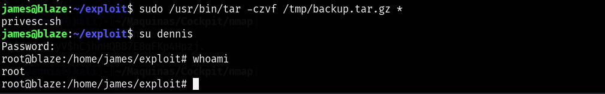
Figure 20. Payload execution.

### Mitigating the SQLi vulnerability

To mitigate this vulnerability, it is essential to implement various security measures that guarantee the integrity of the database and the protection of information. First, it is advisable to use parameterized queries and object-relational mapping (ORM) frameworks, which avoid the concatenation of SQL strings and significantly reduce the risk of injection. It is also essential to apply rigorous validation and sanitation of the inputs provided by users, with the aim of filtering and restricting special characters that may compromise the query.

Additionally, it is crucial to restrict the privileges of the accounts used by the app, ensuring that they only possess the permissions strictly necessary to execute their functions. This way, even in the event of a vulnerability, the impact of the attack will be limited. Finally, implementing complementary solutions, such as web application firewalls (WAFs) and intrusion detection tools, provides an additional layer of protection by identifying and blocking exploitation attempts before they can compromise the system.