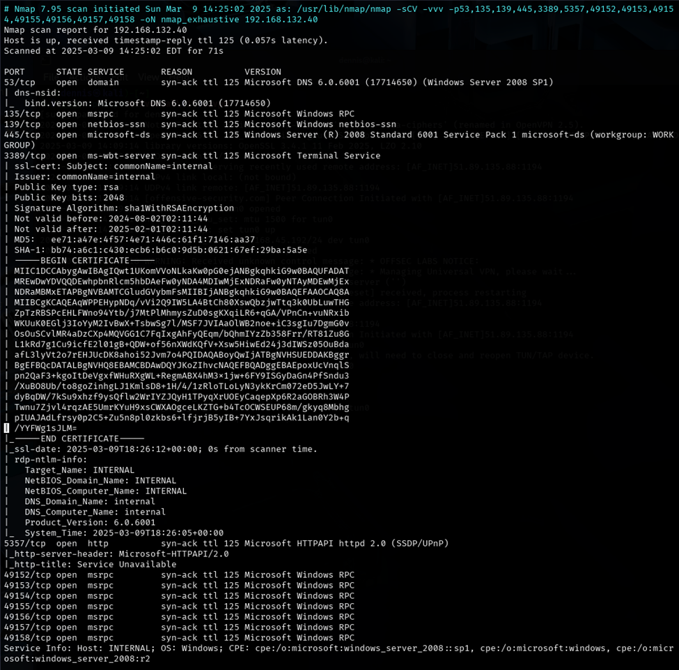
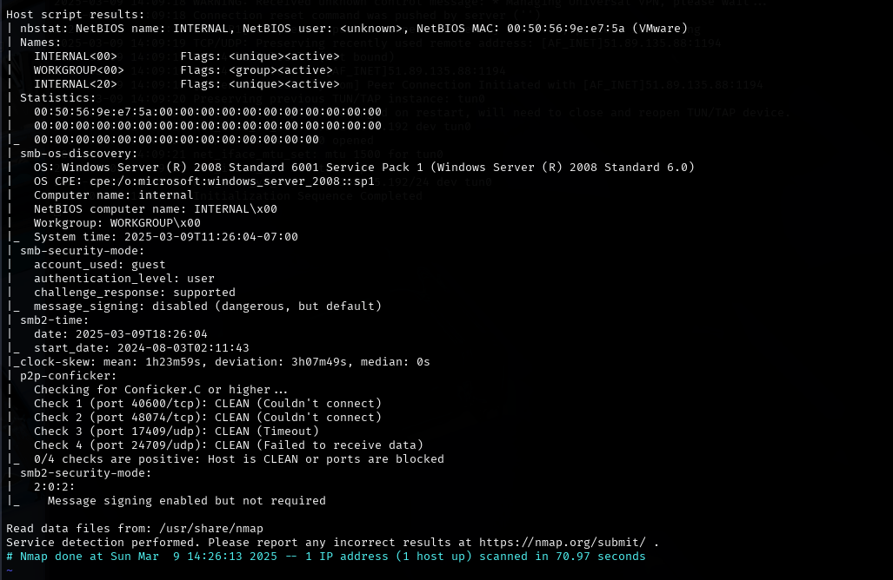
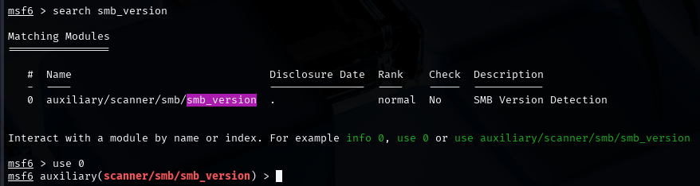
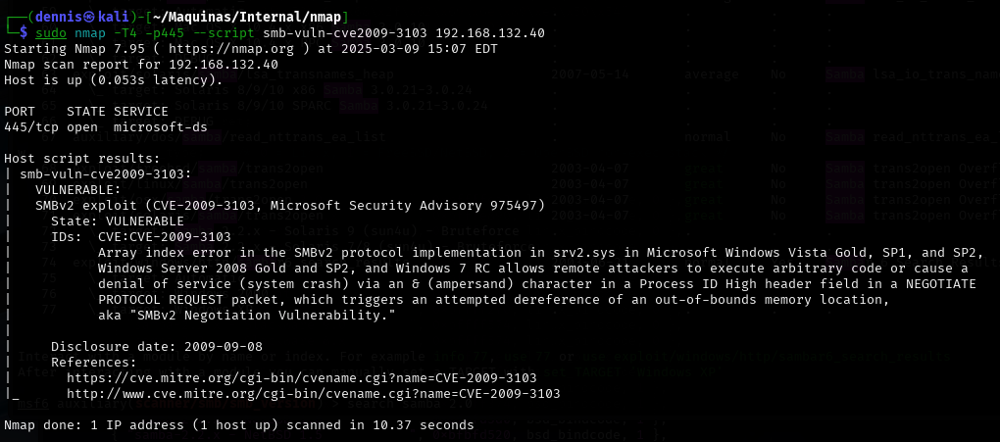
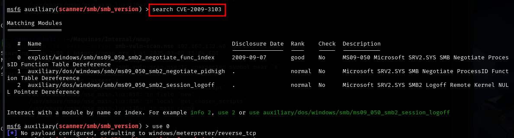
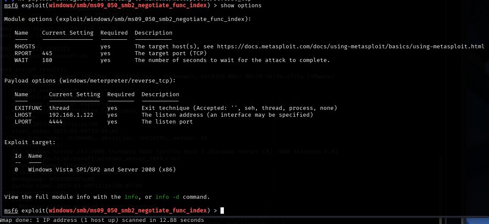
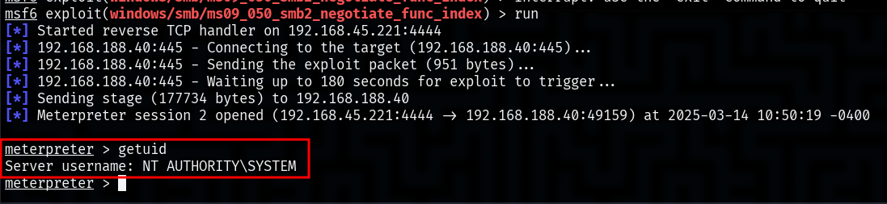

+++
title = "Internal Offsec Walkthrough"
date = 2025-06-09T15:43:16+01:00
draft = false
description = ""
slug = ""
authors = ["Dennis Drebitca"]
tags = ["Metasploit", "Nmap", "SMB", "CVE-2009-3103"]
categories = []
externalLink = ""
series = [""]
+++


****

## Introduction

This post analyzes the process of privilege analysis, exploitation, and escalation in a vulnerable Windows environment. To do this, a network scan is carried out using Nmap, identifying open ports and services on the target system. Subsequently, using Metasploit, the presence of vulnerabilities in the SMB service is searched for and verified.

In particular, the system is found to be vulnerable to CVE-2009-3103, a security flaw in SMB 2.0.2 that allows remote execution of code with elevated privileges. By exploiting this vulnerability, access is gained to the victim machine with NT AUTHORITY\SYSTEM privileges, granting full control over the system.

The purpose of this work is to demonstrate the methodology used in penetration testing to identify and exploit vulnerabilities in Windows systems, as well as to present mitigation strategies to prevent this type of attack.

#### Metasploit

Metasploit is a widely used tool in cybersecurity for penetration testing. Its main function is to identify and exploit vulnerabilities in systems and applications, allowing professionals to assess the level of security in an environment. What makes Metasploit so useful is its huge database of exploits, payloads, and modules, making it easy to execute simulated attacks without needing to develop code from scratch.

To start using it, simply run msfconsole, which opens its main interface. From there, you can search for vulnerabilities, select an exploit with use and configure the necessary parameters, such as the victim's IP (RHOSTS) and the attacker's IP (LHOST). Once everything is ready, the attack is launched with a run or exploit, which, if the vulnerability is exploitable, can give access to the target system.

Metasploit not only serves to exploit vulnerabilities, but also allows advanced actions to be taken after the attack. With meterpreter, for example, you can interact with the compromised system, execute commands, extract information, and even escalate privileges. In addition, it has tools to evade detections and generate custom payloads. All in all, it is a very powerful platform, both offensive and defensive, as it allows you to find and fix security flaws before they are exploited by real attackers.

## Exploitation of the Offsec Internal Machine

### 2.1 Reconnaissance

First, a ping is made to verify the connection with the machine:


Figure 1. Ping the victim machine

A bit of a weird TTL is observed, it is usually 64 for Linux machines and 128 for Windows machines.

A nmap SYN scan is run to discover open ports:
```sh
sudo nmap -sS -T5 -vvv -p- 192.168.132.40 -Pn -oG nmap_inicial
```

Where the parameters mean:

-   S: Escaneo SYN
-   5: Using NMAP Timing Template 5
-   vv: Triple verbose for NMAP to display a lot of information
-   -: All ports are scanned
-   n: Skip host discovery
-   gG: Formato Grep

The result is as follows:


Figure 2. Initial nmap scan.

It can be suspected that it is Windows by open port 445. Second, a more thorough scan is performed only on the open ports to detect which services are running on them:
```sh
sudo nmap -sCV -vvv -p53,135,139,445,3389,5357,49152,49153,49154,49155,49156,49157,49158 192.168.132.40 -oN nmap_exhaustive
```

Where the parameters mean:

-   sCV: Execution of service detection scripts and their version.
-   vvv: Triple verbose for NMAP to display a lot of information
-   p-: Only open ports are scanned
-   oN: Normal Format

The result of the scan is as follows:



Figure 3. Comprehensive nmap scanning. Part A.



Figure 4. Comprehensive nmap scanning. Part B.

Ports 139 and 445 are open, corresponding to the Samba service. Using the Mtasploit tool, a script is launched that checks the version of Samba that is running on the server. To do this, launch the Metasploit tool with the *msfconsole command, *and search for the module smb_version:

search smb_version



Figure 5. Search for the smb_version module

To select that module, run the *use 0 command. *The RHOSTS parameter must be configured. This is done by the *set RHOSTS command <IP of the victim machine>. *Once the remote host is configured, the module is executed with the *run* command. The result is the detection of the SMB service version. This is SMB 2.0.2. Upon an internet search, this version is vulnerable to MS09-50 () CVE-2009-3103 (). To check this, there is an nse script. To do this, the following command is executed:
```sh
sudo nmap -T4 -p445 smb-vuln-cve2009-3103 192.168.132.40
```

The result is as follows: SMB is vulnerable to CVE-2009-3103.



Figure 6. Result nse.

### 2.2 Initial exploitation and escalation of privileges.

Metasploit has a module to exploit CVE-2009-3103. To do this, the following commands are run in msfconsole:
```sh
search CVE-2009-3103
```

Use 0



Figure 7. Selecting the right Metasploit module.

Before running the module, certain parameters must be defined. Configurable parameters are displayed with the *show options command.*



Figure 8. Module options.

The following parameters must be configured:

-   RHOSTS: The IP of the victim machine.
-   RPORT: Port of the victim machine that uses the SMB service. In this case it is the default port.
-   LHOST: la IP de la máquina atacante.
-   LPORT: Listening port of the attacking machine.

Once configured, the module is executed with the *run*  command.



Figure 9. Successful execution of the module.

The exploit has been successfully executed and a meterpreter session has been achieved on the victim machine, with the user NT AUTHORITY\SYSTEM.  The built-in NT AUTHORITY\SYSTEM service account, commonly referred to as "SYSTEM", is a special account in Windows operating systems. It has the highest privileges within the local system, surpassing even a local administrator account in terms of access to system resources.

### 2.3 Vulnerability mitigation

To mitigate the CVE-2009-3103 vulnerability, the first thing to do is to apply Microsoft security updates. The specific patch for this issue is found in MS09-050, so updating the operating system is the best way to prevent attacks. If the system is no longer supported and cannot be upgraded, it is best to consider a migration to a newer, more secure version.

Another important measure is to disable SMBv1 and SMBv2 if they are not needed. This can be done from PowerShell, thus avoiding the use of outdated protocols that have been the target of multiple attacks in the past. It's also critical to restrict access to ports 139 and 445, which are the ones SMB uses, by configuring rules in the firewall to block incoming connections, especially from external or unreliable networks.

In addition, it is key to strengthen security with stricter access controls. Limiting SMB usage to only authorized devices and enabling multi-factor authentication (MFA) on administrative accounts can make an attack much more difficult to execute. Along with this, it is important to monitor network activity using intrusion detection tools (IDS/IPS) and regularly review system logs for potential exploitation attempts.

Finally , a good protection strategy is to segment the network to prevent lateral movements by an attacker in case they manage to compromise a system. Separating the most sensitive resources into different zones of the network and enforcing stricter access rules can make all the difference and prevent a vulnerability in SMB from affecting the entire infrastructure.