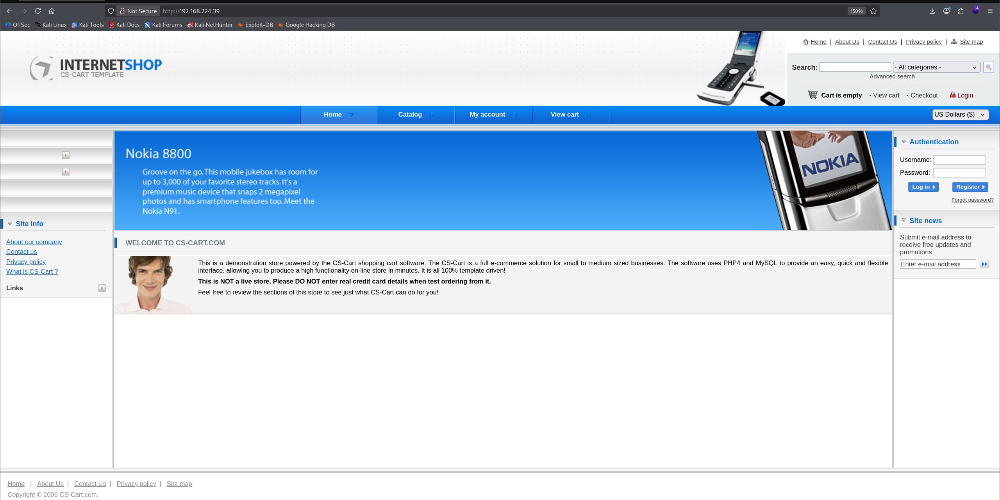
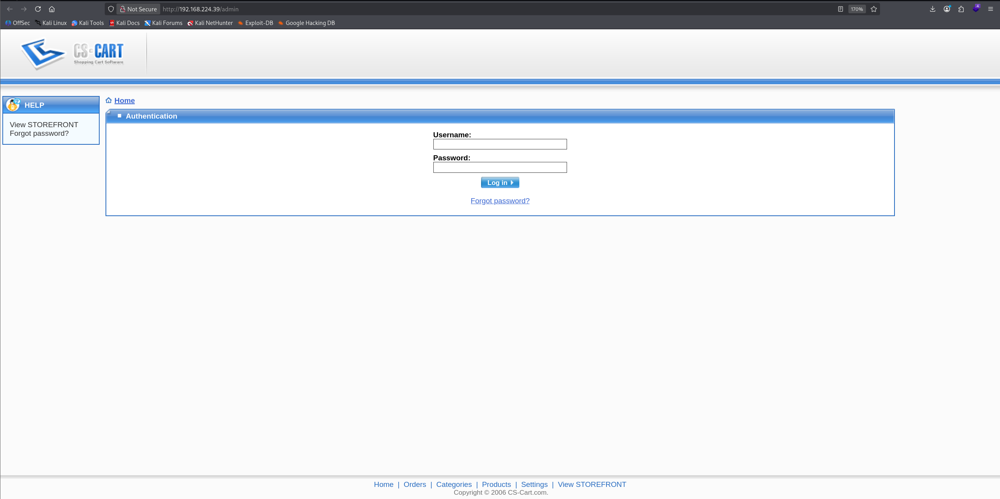
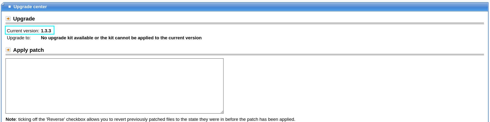
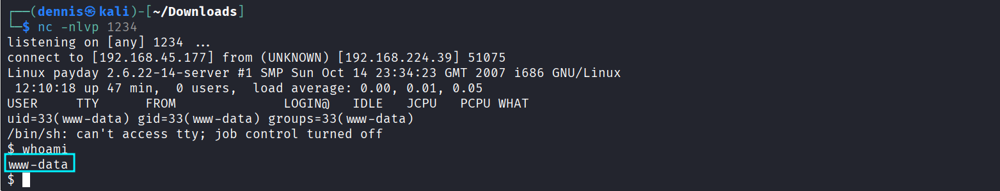
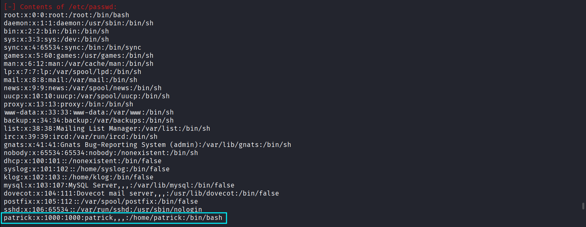
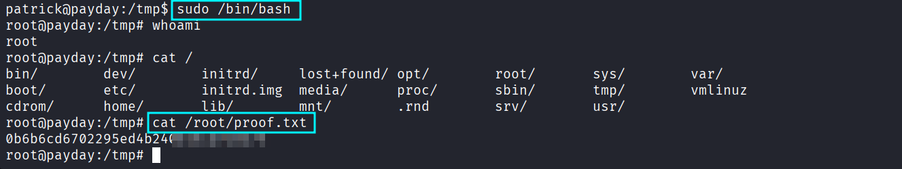

+++
draft = false
date = 2025-11-29T19:00:00+01:00
title = "Payday Offsec Walkthrough"
slug = "payday-walkthrough"
description = ""
authors = ["Dennis Drebitca"]
tags = ["CS-Cart Authenticated RCE", "Weak Credentials", "PHP Webshell"]
categories = []
externalLink = ""
series = ["Offsec"]
+++


## Payday OffSec Walkthrough


This walkthrough documents the full compromise of the OffSec “Payday” target machine.
The attack path involves classic recon, discovery of an outdated CS-Cart e-commerce panel, authenticated file upload leading to RCE, and finally a privilege escalation via weak local user credentials and unrestricted sudo access. 
Despite a large attack surface (SMTP/IMAP/SSLv2/Samba 3.x/etc.), the intended path is surprisingly simple—but easy to overlook.


## 1. Reconnaissance


A full SYN scan is then launched:
```sh
sudo nmap -sS -T5 -vvv -p- $tgt -Pn -oG nmap_inicial
```

Scan reveals multiple services including:

- Apache + PHP 5  
- Dovecot (IMAP/POP3, SSLv2 enabled)  
- Samba 3.0.26a  
- OpenSSH 4.6p1  
- CS-Cart web application  
- A variety of outdated, potentially vulnerable services  

Next, a version and script scan of the discovered ports:
```sh
sudo nmap -sCV -vvv -p22,139,445,631,2181,2222,8080,8081,34051 $tgt -oN nmap_exhaustive
```


### Notable Findings:

- Apache 2.2.4 + PHP 5.2.3: extremely old, many known vulnerabilities.
- Dovecot (IMAP/POP3) with SSLv2 enabled: deprecated, vulnerable protocol.
- Samba 3.0.26a: version affected by multiple exploits (e.g., CVE-2007-2447 — "LNK exploitation").
- CS-Cart store running version 1.3.3, which is publicly known to support authenticated RCE via template upload.
- Many SSL certificates dated 2008 → clearly an old Ubuntu system.

We also have a web portal, so the recon proceeds:



Directory brute-force with feroxbuster:
```sh
feroxbuster -u http://192.168.224.39 -w /usr/share/wordlists/seclists/Discovery/Web-Content/directory-list-2.3-medium.txt
```


An admin panel is identified.  
Credentials admin:admin work.



Once authenticated, the CS-Cart version is visible:



Version: 1.3.3 — vulnerable to authenticated RCE (Exploit-DB 48891).

Exploit summary:

- Upload a PHP reverse shell via the template editor
- Rename extension to *.phtml*
- Access it in the skins directory to trigger execution


After uploading `shell.phtml`, visiting:

http://[victim]/skins/shell.phtml

…gives us a reverse shell:


We are now www-data.




## 2. Exploitation & Privilege Escalation

LinEnum is executed (LinPEAS fails for some reason).  
One of the findings is a MySQL login accessible from www-data:


Although the DB is accessible, the data inside is useless for privilege escalation:


It’s easy to get tunnel vision here, but the key lies elsewhere.

### The crucial discovery:

The system contains a user named Patrick:



Trying the obvious, weak password:

patrick

…works.

We switch to the user:


Patrick has full sudo rights:

```sh
sudo -l  
→ (ALL : ALL) ALL
```

Meaning: root is one command away.

We retrieve escalate and retrieve the proof:



Machine fully compromised.  
Moral of the story: always test weak credentials — even if the system looks complicated. PWNED :)


## 3. Attack Mitigation

To prevent this compromise, the following measures should be applied:

### Web Application
- Update or decommission CS-Cart 1.3.3 — it is critically outdated and contains RCE flaws.
- Enforce strong admin credentials; prevent default/weak passwords.
- Restrict file upload functionality; whitelist extensions and disable .phtml execution.
- Move administrative panels behind VPN or IP allowlists.

### System Configuration
- Remove legacy software: PHP 5, Apache 2.2, OpenSSH 4.6p1, Samba 3.x, Dovecot SSLv2.
- Disable SSLv2 across all services.
- Keep certificates up-to-date and use modern ciphers.

### Privilege Management
- Enforce strong user passwords.
- Remove unnecessary sudo permissions.
- Audit `/etc/sudoers` regularly.