+++
title = "ARP and DNS spoofing with Bettercap"
date = 2025-02-09T15:43:16+01:00
draft = false
description = ""
slug = ""
authors = ["Dennis Drebitca"]
tags = ["Bettercap", "ARP spoofing", "DNS spoofing", "Cradential theft", "Wireshark", "Website cloning"]
categories = []
externalLink = ""
series = ["Network attacks"]
+++


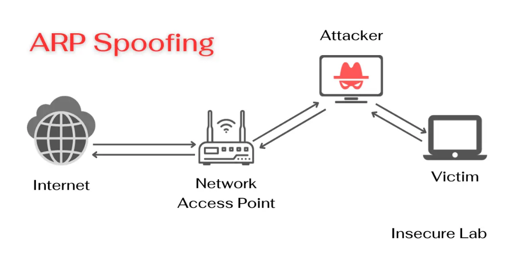

[1. Introduction](#introduction)

[2. Attack Execution](#arp-spoofing-attack)

[2.1. ARP Poisoning](#arp-spoofing-attack)

[2.2. DNS Spoofing](#dns-spoofing-attack)

[2.3. Fake Web Page Setup](#fake-web-page-setup)

[2.4. Credential Theft](#credential-theft)

[3. Stopping the attack](#stopping-the-attack)

[4. Conclusions](#conclusions)

# Introduction

In the field of cybersecurity, analyzing vulnerabilities in local networks is a fundamental task for understanding potential threats and designing appropriate defense mechanisms. Among the most common attacks affecting the integrity and confidentiality of information in a network are ARP Spoofing and DNS Spoofing, techniques used to intercept, modify, and redirect traffic from devices connected to a LAN.

This work aims to analyze how these attacks function, detailing their principles and their impact on network security. Additionally, a proof-of-concept will be carried out using the Bettercap tool in a virtualized environment to demonstrate the feasibility of these attacks and their potential use in security audits.

## The ARP Protocol and Its Vulnerability

The Address Resolution Protocol (ARP) is a communication protocol used in local networks to map IP addresses to MAC (Media Access Control) addresses. Its primary function is to allow devices in an Ethernet network to identify the physical address of other devices within the same network segment.

However, ARP lacks authentication mechanisms, making it susceptible to identity spoofing attacks. An attacker can exploit this vulnerability to manipulate the correspondence between IP and MAC addresses within a network, redirecting legitimate traffic to their device without the victims noticing.

## ARP Spoofing Attack

ARP Spoofing, also known as ARP poisoning, is an attack in which a malicious actor sends false ARP responses on the network to associate their MAC address with another device’s IP address, usually the router or a workstation. In this way, the victim's traffic is redirected to the attacker, allowing them to intercept and manipulate data packets.

The attack is carried out in the following stages:

1. Sending forged ARP packets: The attacker generates fraudulent ARP responses that trick the victim into believing that the attacker's MAC address corresponds to the gateway’s IP address.
2. Intercepting traffic: By modifying the victim’s ARP cache, traffic directed to the gateway flows through the attacker before reaching its final destination.
3. Potential data manipulation or capture: The attacker can analyze the intercepted traffic, perform Man-in-the-Middle (MitM) attacks, or redirect the victim to malicious sites.

## DNS Spoofing Attack

DNS Spoofing is a technique used to alter domain name resolution, redirecting victims to fake servers instead of legitimate ones. When a victim attempts to access a website, their device queries a DNS server to obtain the corresponding IP address. An attacker who has already carried out an ARP Spoofing attack can intercept these requests and respond with an IP address they control.

The attack is conducted as follows:

1. Intercepting DNS requests: Through ARP Spoofing, the attacker captures DNS queries sent by the victim.
2. Sending false DNS responses: Instead of the real IP address of the requested site, the attacker responds with the address of a malicious server hosting a fake webpage.
3. Redirecting the victim to a fake site: When the victim attempts to log into a legitimate service, such as a social network or an online banking platform, they unknowingly enter their credentials on an attacker-controlled site.

This attack is commonly used for credential theft and phishing schemes.

## Bettercap as a Security Auditing Tool

To execute the aforementioned attacks, Bettercap will be used—an advanced network security auditing tool. Bettercap allows the execution of Man-in-the-Middle (MitM) attacks, traffic analysis, and real-time packet manipulation.

Its key features include:

- ARP and DNS spoofing to intercept traffic.
- Capturing credentials transmitted in plaintext.
- Modifying HTTP/HTTPS traffic in real time.
- Functionality in both wired and wireless network environments.

## Test Environment

The study will be conducted in a virtualized environment with two Kali Linux machines:

- Attacker machine: IP address 192.168.238.128, terminal with a black background.
- Victim machine: IP address 192.168.238.129, terminal with a yellow background for easier distinction.

# Attack Execution

## 2.1. ARP Poisoning

Before executing the attack, let's examine the information contained in our devices' ARP tables. To do this, we run the following command:

```sh
arp -a
```

The ARP table of the attacking machine is as follows:

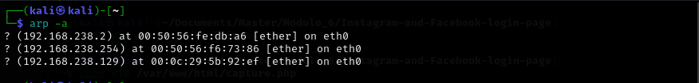

And on the victim machine, the following:

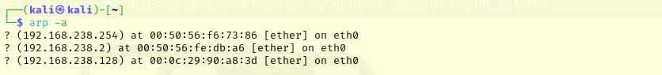

As we can see, both machines know each other's IP and MAC addresses through the ARP protocol. Next, we will execute the ARP poisoning attack using the Bettercap tool. To do this, we will execute the following commands on the attacking machine:
```sh
sudo bettercap -iface eth0
```
This starts the bettercap tool.

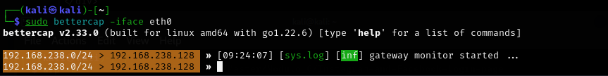

By executing the command “net.probe on”, the tool will start sending packets to “discover” which computers are on the network. With the command “net.show” we can see that it has recognized several other computers, including what will be the victim machine, with IP 192.168.238.129.

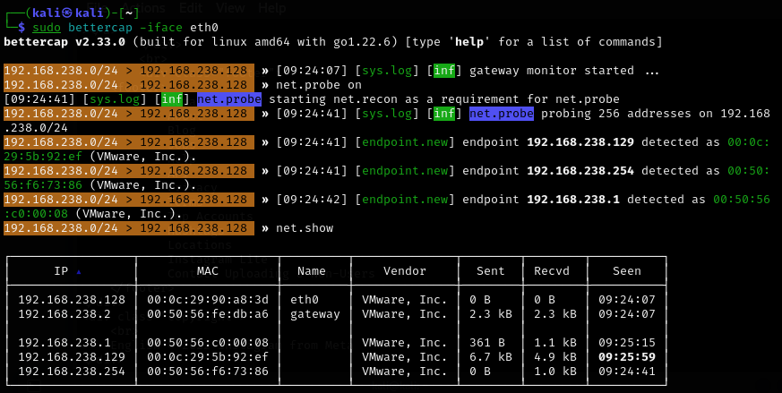

It is important after a few minutes to stop the net.probe service by executing the command “net.probe off”, otherwise the arp table of the attacking machine will be contaminated with incomplete requests:

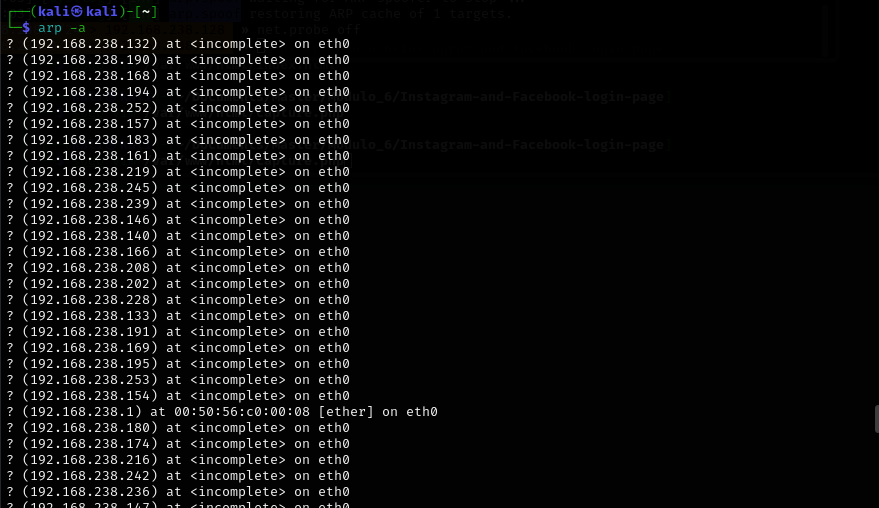


After executing “net.probe off”, the ARP table of the attacking machine returns to normal:

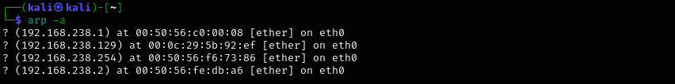

Now, to execute the ARP spoofing, the following command is executed:

```sh
set arp.spoof.targets 192.168.238.129; set arp.spoof.fullduplex true; arp.spoof on
```

The first part of the command, “set arp.spoof.targets” sets the IP address of the victim machine, in this case 192.168.238.129.

The second part of the command configures the ARP attack to be full duplex, i.e. both the Gateway and the victim machine are attacked.

The third part of the command starts the ARP spoofing.

To check if the attack has been successful, we can check the ARP table of the victim machine:

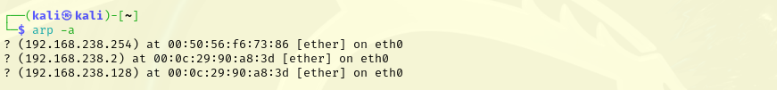

As can be seen, the MAC address of the Gateway is now the same MAC address as that of our attacking machine. In addition, it can be verified that we are in a duplex ARP spoofing using Wireshark. You can see that ARP responses are sent to both the Gateway (“_ARP 192.168.238.129 (Victim) is at \[ATTACKING MAC]”) and the victim machine (“_ARP 192.168.238.2 (GW) is at \[ATTACKING MAC]”).

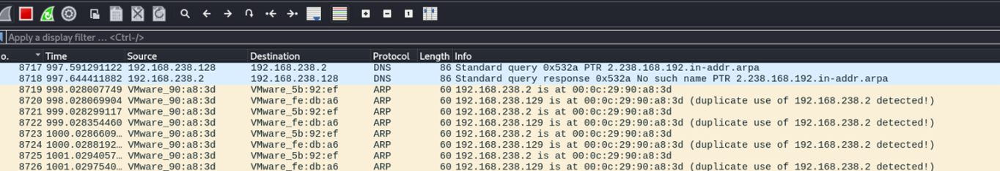

Poisonous ARP requests from the attacking machine to the victim and to the GW.

### 2.2. DNS Spoofing

We will also perform DNS spoofing, so that, in this case, all DNS requests to [www.instagram.com](http://www.instagram.com) go through our attacking machine. To do this, we run the following commands in the Bettercap tool:

```sh
set dns.spoof.domains [www.instagram.com](http://www.instagram.com) -> All DNS requests to [www.instagram.com](http://www.instagram.com) will be intercepted.
set dns.spoof.address 192.168.238.128 -> Requests to previously configured websites (Instagram, in this case) will be redirected to our attacking machine.
dns.spoof on -> DNS spoofing is enabled.
```

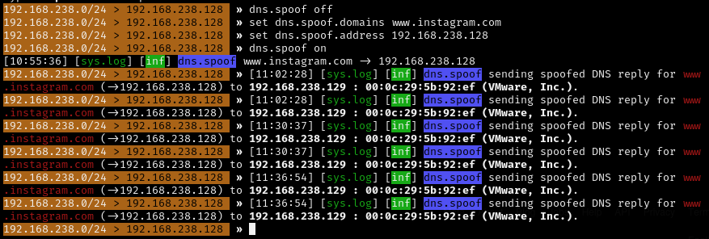

A Wireshark capture shows DNS spoofing in action:

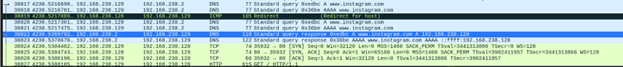
Poisoned DNS requests.

You can see the DNS response, where it resolves [www.instagram.com](http://www.instagram.com) to 192.168.238.128, the IP of our attacker machine.

### 2.3. Set-up of the fake website

An apache http server will be configured on the attacking machine to take advantage of the DNS spoofing attack and capture the victim's credentials. Right now, the user of the victim machine is unaware that he is subjected to A) an ARP spoofing attack and B) a DNS spoofing attack, as the attack is completely unnoticeable to the user.

A clone of the Instagram home page is going to be configured that captures the data entered by the user. For this purpose, the following project on [GitHub](https://github.com/athrvadeshmukh/Instagram-and-Facebook-login-page) has been used.

To do this, we git clone the project:

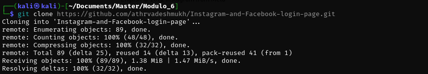.

Illustration 11. Git clone of the project

The index.html file must be modified so that instead of redirecting to a page, it sends a POST request to a malicious PHP file that will store the username and password in clear text.  
The modified index.html file is as follows:

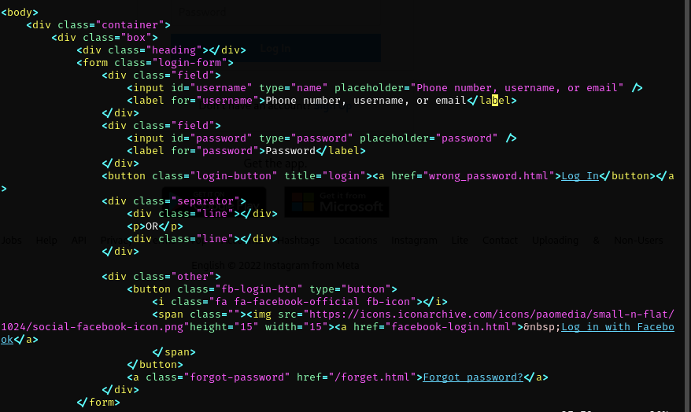

And now it looks like this:

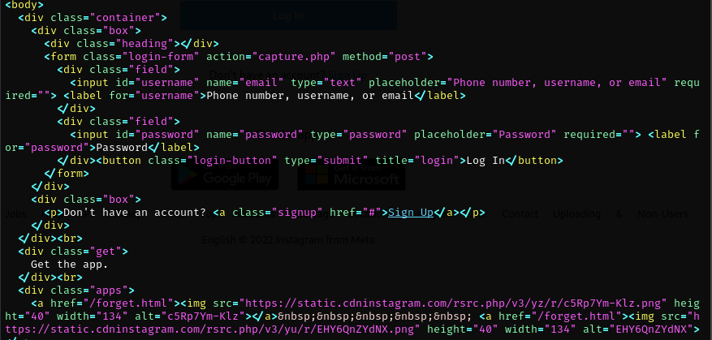


Now the form will send a POST request to the capture.php web page with the credentials in clear text:

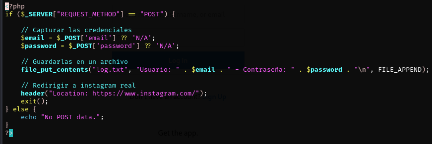

It is important to create the log.txt file and chown www-data and chmod 777 so that there are no permissions problems.

Now the last thing to do is to copy the content of this folder to /var/www/html/ and check if everything works correctly:

```sh
sudo cp -r -p -var/www/html/ -> Copy the files to the root of the web page.
sudo systemctl restart apache2 -> Restart apache2
```

And now we can navigate to localhost, which is our own IP of the attacker where our malicious web page is hosted:


If we enter the data, it redirects us to the original Instagram website.


From the attacking machine, the fake web page is working correctly.

### 2.4. Credentials theft

The ARP spoofing and DNS spoofing attack allows us to monitor all packets circulating between the victim machine and the GW. Therefore, we can find those credentials that are transmitted unencrypted by using Wireshark. To do this, we will try to enter [www.instagram.com](http://www.instagram.com) on the victim machine:

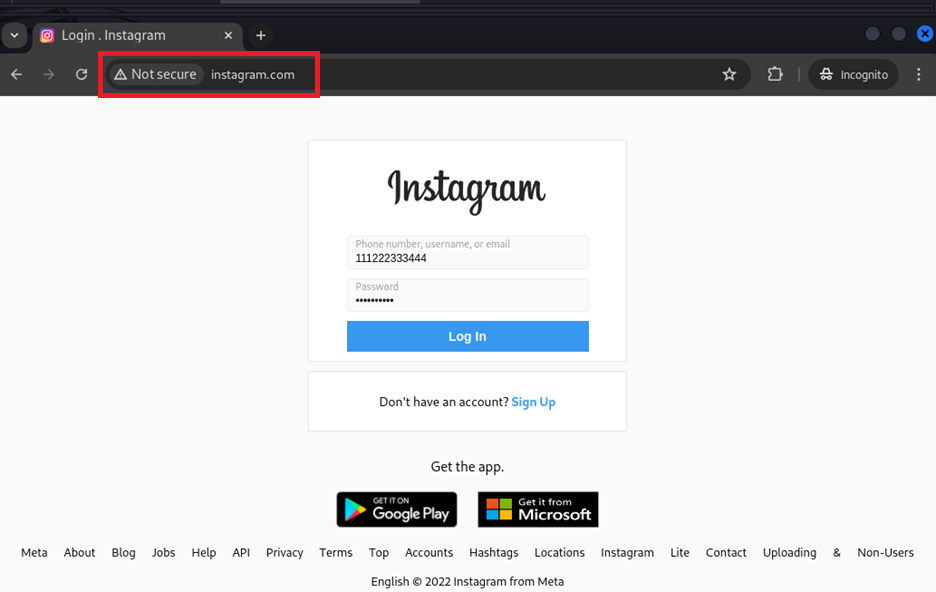

It is important to note that the address is instagram.com.

But this is our fake website as we have poisoned the DNS. When the victim presses the enter button, the data is transmitted unencrypted since http is being used and not https:

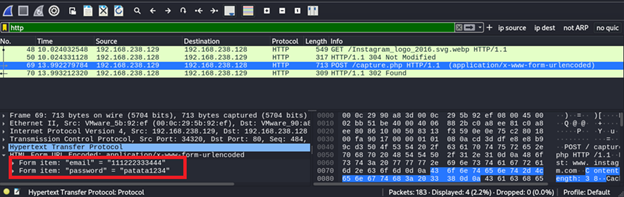

With wireshark we have captured the credentials sent in clear text, and on the attacking machine we can see the same credentials captured by the malicious php script:

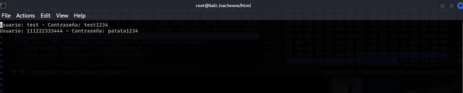

# Stopping the attack

To end the attack, the following commands are executed in Bettercap:
```sh
dns.spoofer stop -> Stops the DNS spoofer
arp.spoofer stop -> Stop the ARP spoofer
exit -> Closes the Bettercap tool
 ```

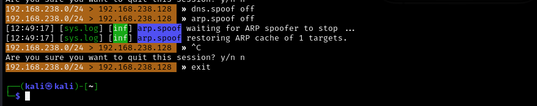

Now it remains to check if the ARP tables are back to normal. ARP table of the attacking machine:
 
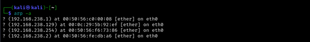
 
ARP table of the victim machine:

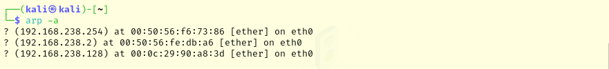

As can be seen, the ARP tables have been restored and the attack has been successfully completed.


# Conclusion

This work has demonstrated the feasibility of ARP Spoofing and DNS Spoofing attacks, showing the inherent vulnerabilities of ARP and DNS protocols in local networks. Through the Bettercap tool, it has been possible to intercept and manipulate the traffic of the victim machine, showing how an attacker can perform a Man-in-the-Middle (MitM) attack to steal credentials or redirect a user to fraudulent sites unnoticed.

However, an attacker with greater knowledge and more advanced tools could significantly increase the impact of the attack. Techniques such as SSL stripping allow a victim to be forced to communicate over HTTP instead of HTTPS, removing the encryption layer and allowing credentials to be captured in clear text. Similarly, downgrade attacks, such as those that exploit vulnerabilities in older protocols (e.g., forcing a server to use TLS 1.0 instead of TLS 1.2 or 1.3), allow attackers to weaken the security of the connection and facilitate the interception of sensitive data.

In addition, an attacker could combine DNS Spoofing with more sophisticated attacks, such as injecting malicious content into legitimate websites or exploiting vulnerabilities in browsers and applications to further compromise the victim. Tools such as Responder or Evilginx make it possible to capture NTLM authentication password hashes on internal networks or even evade two-factor authentication on websites through reverse proxy attacks.

To mitigate these risks, it is essential to adopt additional security measures, such as:

- Use of HSTS (HTTP Strict Transport Security) to prevent connections from being forced to use HTTP instead of HTTPS.
- Disabling insecure protocols and configuring servers to force the use of TLS 1.2 or 1.3.
- Multi-factor authentication (MFA) to reduce the impact of compromised credentials.
- Real-time traffic monitoring and analysis, using tools such as Zeek or Suricata to detect anomalous network behavior.
- Network segmentation and use of secure VPNs to limit the scope of potential insider attacks.

While this work has demonstrated the effectiveness of ARP and DNS Spoofing in a controlled environment, future studies could focus on the implementation of detection and mitigation techniques in enterprise networks, as well as on the evaluation of more advanced attacks, such as those that combine social engineering with network traffic manipulation.

In conclusion, security in local networks remains a critical challenge, and MitM attacks remain a real threat if adequate protection measures are not implemented. The combination of best practices, secure protocols and monitoring tools is key to minimizing these risks and strengthening the security of the network infrastructure.