+++
title = "Configure and deploy Azure Firewall Manager: Part 1"
date = 2024-02-26T08:43:16+01:00
draft = false
description = ""
slug = ""
authors = ["Dennis Drebitca"]
tags = ["Azure"]
categories = []
externalLink = ""
series = ["Microsoft Azure", "Configure and deploy Azure Firewall Manager"]
+++

Azure Firewall Manager is a central network security policy and route management service for globally distributed, software-defined perimeters. It can provide security management for two network architecture types, the secured virtual hub and the hub virtual network.

Using Azure Firewall Manager, you can create secured virtual hubs to secure your cloud network traffic destined to private IP addresses, Azure PaaS, and the Internet. Traffic routing to the firewall is automated, so there's no need to create user-defined routes (UDRs).

In this series of posts, we will learn how to:

1. Create the spoke virtual network
2. Create a secured virtual hub
3. Connect the hub and spoke virtual networks
4. Deploy the servers
5. Route traffic to your hub
6. Create a firewall policy and secure the hub
7. Test the firewall

For part 1 of the series, we will configure points 1, 2 and 3.

## Create a hub and spoke architecture

In this first secrtion, we will create two spoke virtual networks and subnets and the secured virtual hub where you can place our servers.

### Create two spoke virtual networks and subnets

First, we will create a Resource Group where all the resources in this project will be allocated. The Resource Group will be named **Az_FW_Man_Project.**

We have to click Resource Groups -> Create

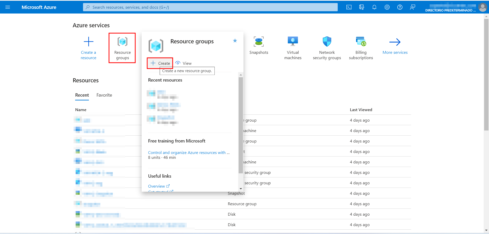

Then, select the Subscription, the Resources Group's name and the Region. Then, click "Review + create". Then, click create.

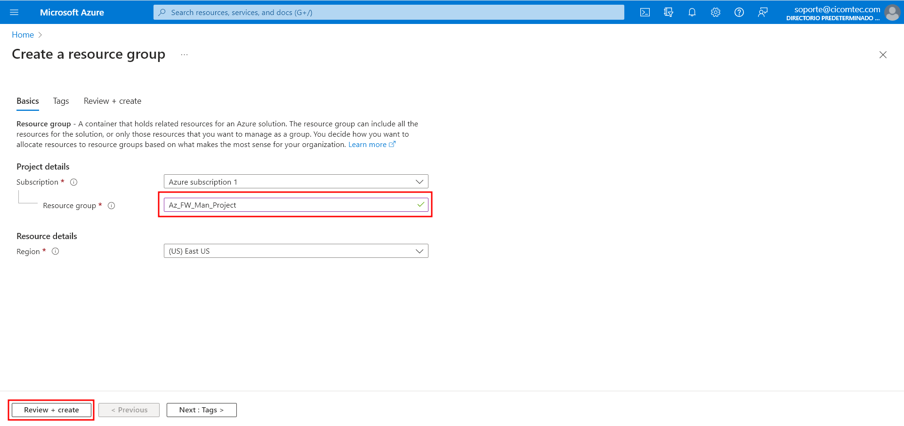

Now that we have the Resource Group where all our resources will live, lets create the two spoke virtual networks and subnets. The two virtual networks will each have a workload server in them and will be protected by the firewall.

1. From the Azure portal home page, select Create a resource.

2.	Search for Virtual network and select Create.

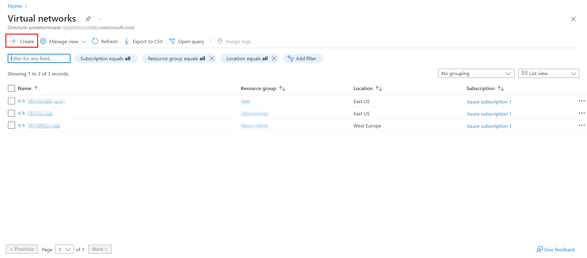

3.	Select your subscription, the Resouce Group we have created earlier, and the name of the virtual network. In this case, it will be Spoke-1. Also select the Region, it has to be the same as the RG (Resource Group).

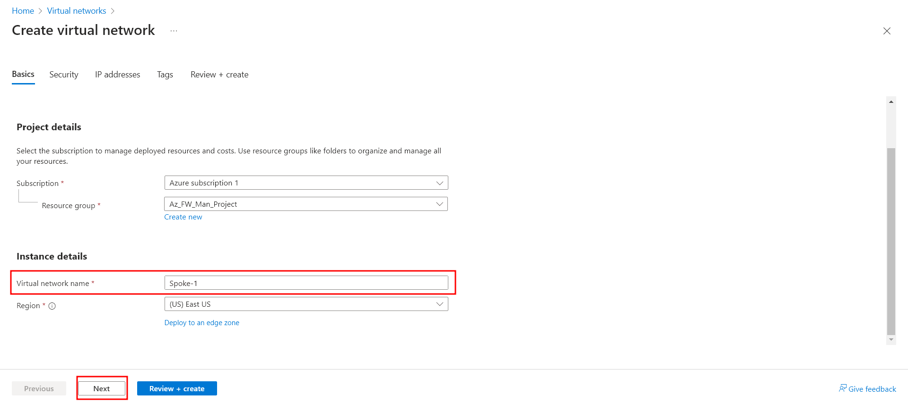

4.	Select Next: IP Addresses.

5.	For Address space, accept the default 10.0.0.0/16. Select Add subnet.

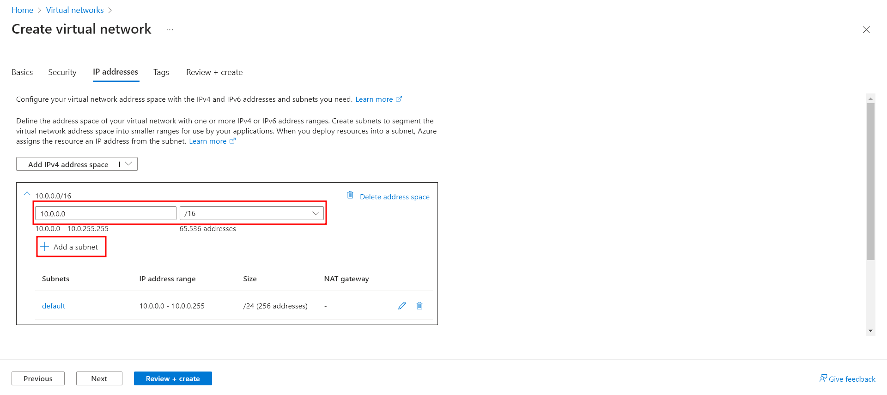

6.	For Subnet name, type Workload-1-SN. For Subnet address range, type 10.0.1.0/24. Click Add.

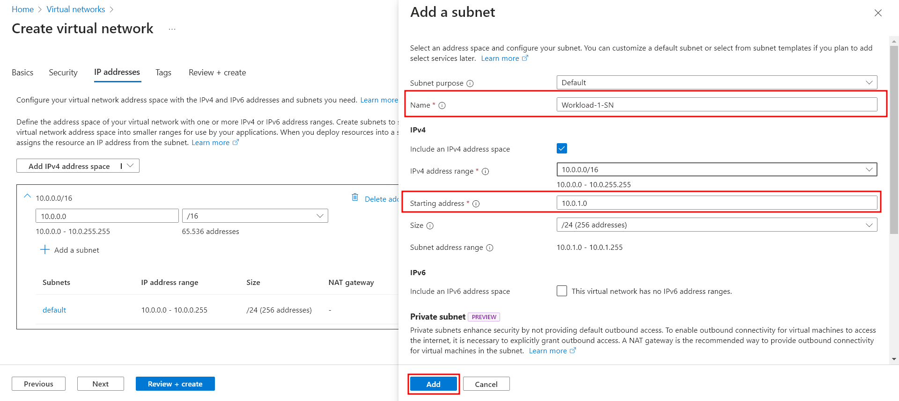

7. Lastly, delete the default subnet. The only subnet now should be Workload-1-SN. Select Review + create and then select Create.

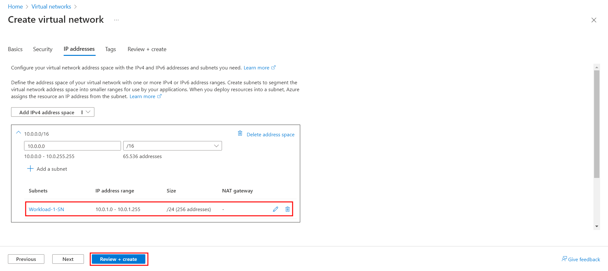

You can review the settings in this window before clicking Create.

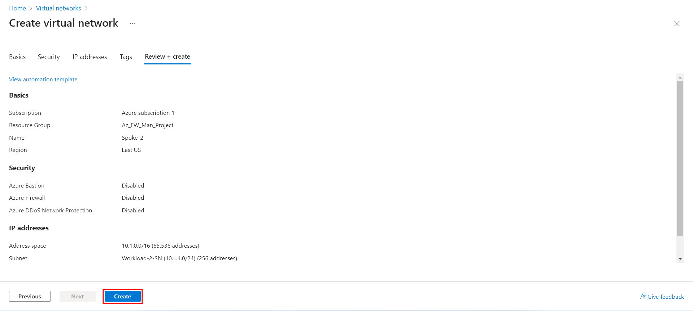

Repeat this procedure to create another similar virtual network in the fw-manager-rg resource group:

Name: Spoke-02

Address space: 10.1.0.0/16

Subnet name: Workload-02-SN

Subnet address range: 10.1.1.0/24

It is important that the subnet address ranges do not overlap.

### Create the secured virtual hub:

Create your secured virtual hub using Firewall Manager.

1.	From the Azure portal home page, select All services. In the search box, type Firewall Manager and select Firewall Manager.

2.	On the Firewall Manager page under Deployments, select Virtual hubs.

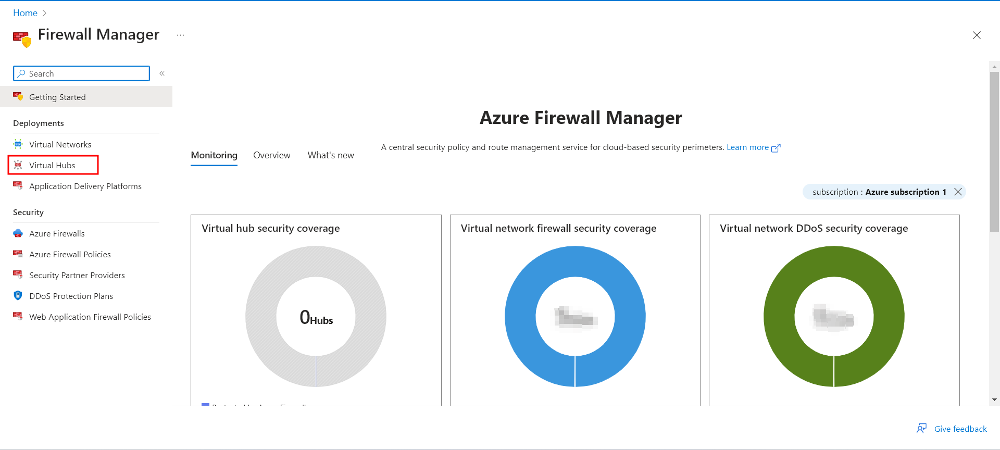

3.	On the Firewall Manager | Virtual hubs page, select Create new secured virtual hub.

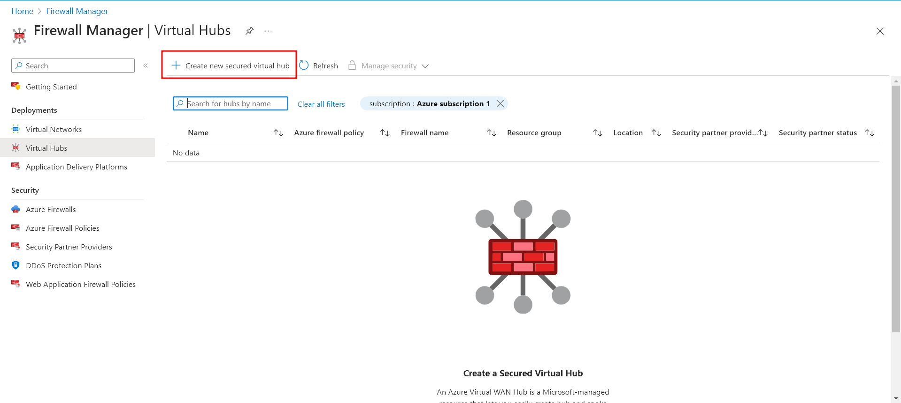

4.	Select your Subscription, Resource group (Az_FW_Man_Project) and Region (East US).

5.	For the Secured virtual hub name, type Hub-1. For Hub address space, type 10.2.0.0/16.

6.	Select New vWAN and name it  VWan-1. For Type Select Standard.

7.	Leave the Include VPN gateway to enable Trusted Security Partners check box cleared.

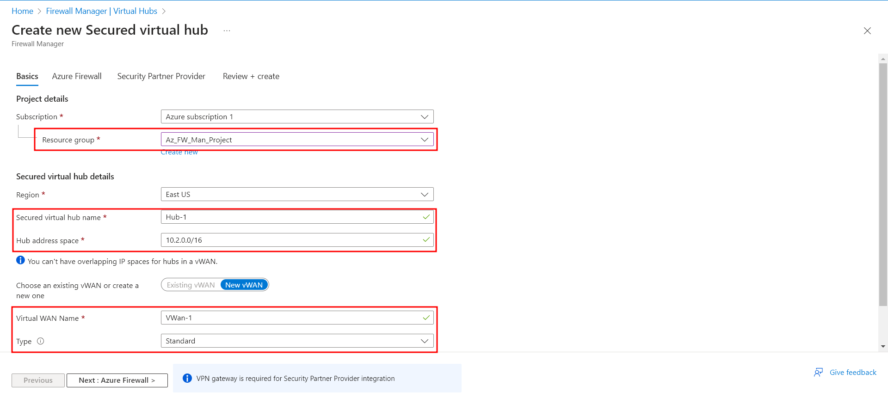

8.	Select Next: Azure Firewall.

9.	Accept the default Azure FirewallEnabled setting.

10.	For Azure Firewall tier, select Standard. IMPORTANT TO SELECT STANDARD.

11.	For Avaliablity zones, I selected None. Also specify the number op public IP addresses needed. In this case, 1 is enough.

12.	Select the Firewall Policy to apply at the new Azure Firewall instance. Select Default Deny Policy, which we will modify later in the post.

13.	Select Next: Security Partner Provider.

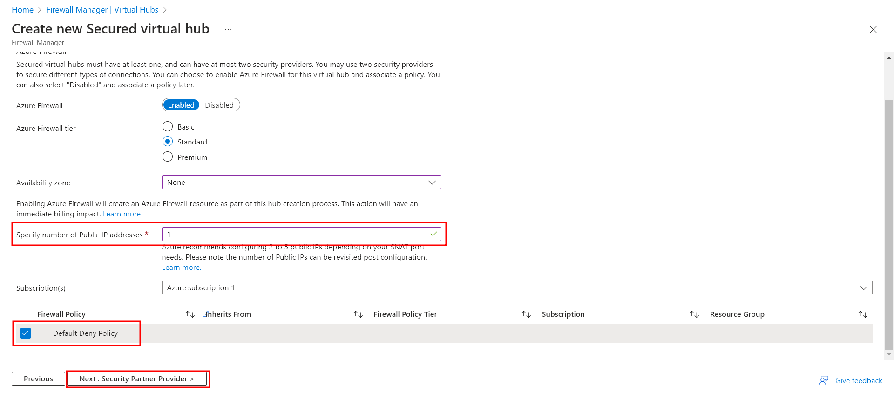

14.	Accept the default Trusted Security Partner Disabled setting and select Next: Review + create.

15.	In this page, we can review the settings for our virtual hub. Once everything is checked, select Create. It may take up to thirty minutes for the secured virtual hub to create. 

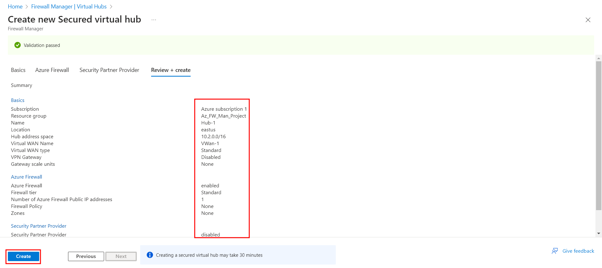

You can get the firewall public IP address after the deployment is complete.

1.	Open Firewall Manager.

2.	Select Virtual hubs.

3.	Select hub-01.

4.	Under Azure Firewall, select Public IP configuration.

5.	Note the public IP address to use later.

### Connect the hub and spoke virtual networks

Here, we will peer (or connect) the hub and spoke virtual networks. Peering is a mechanism that seamlessly connects two or more Azure virtual networks. Once peered, these networks appear as one for connectivity purposes, and the traffic between them travels through the Microsoft backbone infrastructure, not over the public internet.

Lets peer the hub and spoke virtual networks:

1.	Select the resource group of the project, then select the VWan-1 virtual WAN which we configured earlier.

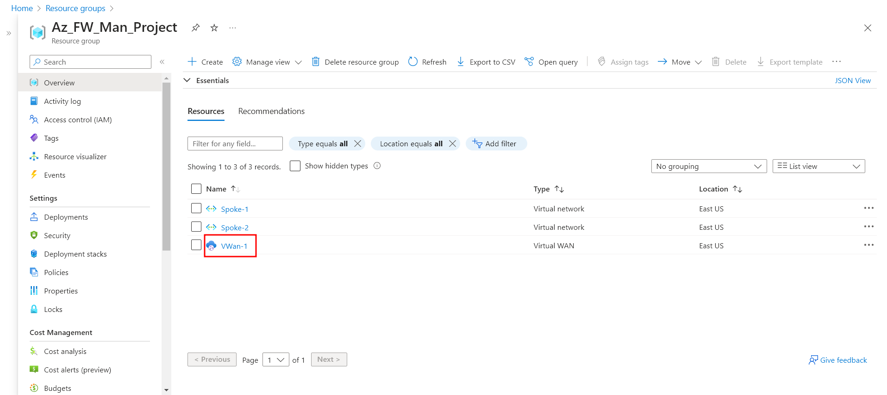

2.	Under Connectivity, select Virtual network connections. Select Add connection.

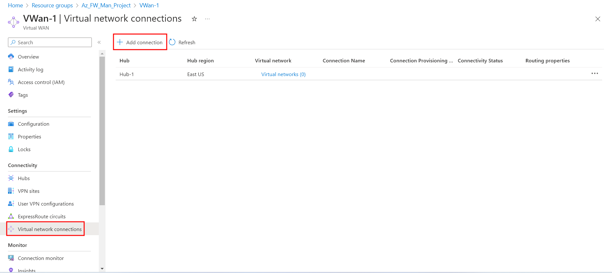

3.	For Connection name, type Hub-Spoke-1. For Hubs, select Hub-1. For Resource group, select the project's Resource Group.

4.	For Virtual network, select Spoke-1. Leave everything else as is.

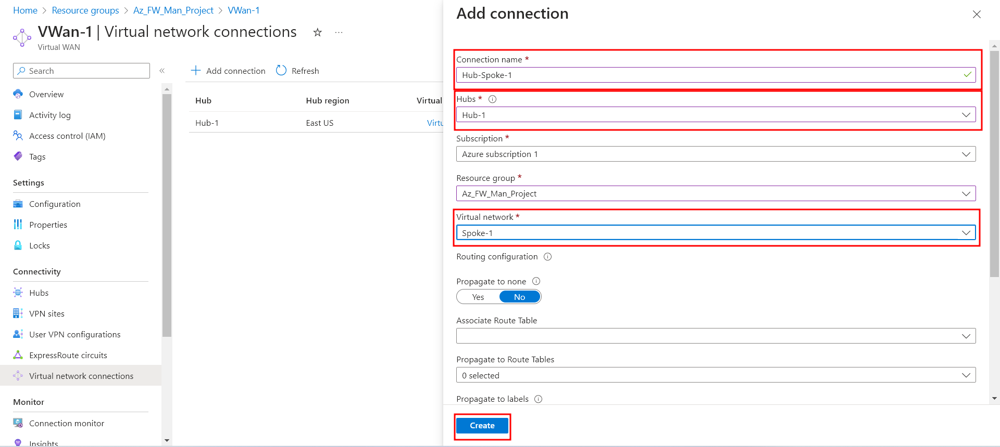

5.	Select Create.

6.	Repeat to connect the Spoke-2 virtual network: connection name - Hub-Spoke-2.

We have successfuly created our two spoke virtual networks and the secure hub, and peered them toguether. 

Thank you for reading Part 1 of the "Configure and deploy Azure FW Manager" series. In Part 2 of the series, we will create a firewall policy and secure our hub. In the last part of the series, Part 3, we will deploy the "workload" servers, and thest the firewall.