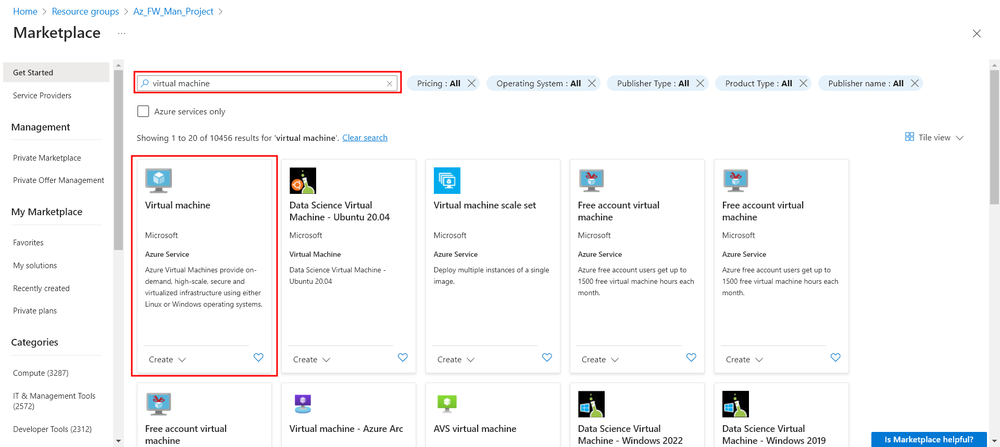
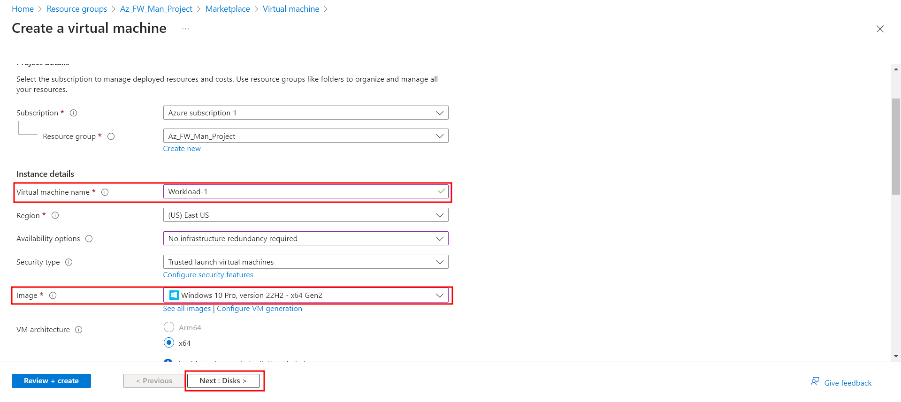
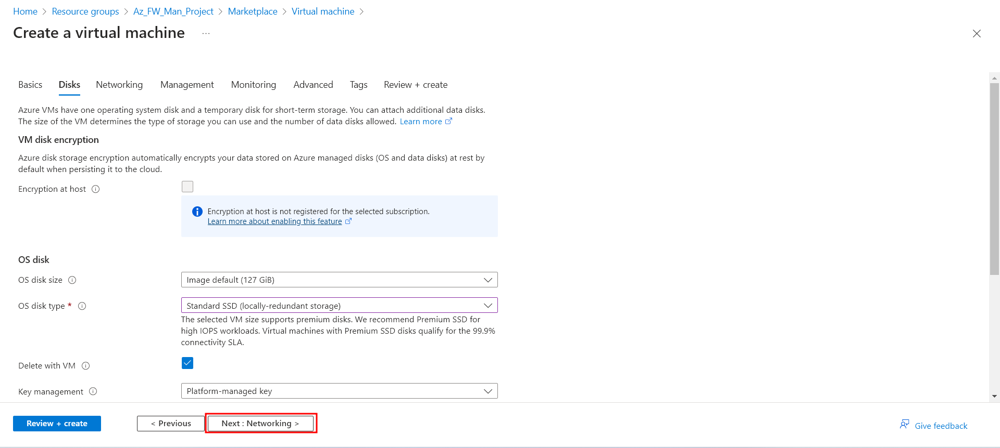
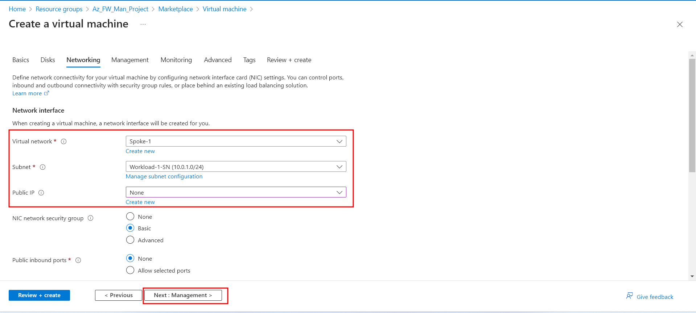

+++
title = "Configure and deploy Azure Firewall Manager Part 2: Deploy the servers"
date = 2024-03-09T08:43:16+01:00
draft = false
description = ""
slug = ""
authors = ["Dennis Drebitca"]
tags = ["Azure","Virtual Machines"]
categories = []
externalLink = ""
series = ["Microsoft Azure", "Configure and deploy Azure Firewall Manager"]
+++

For part 2 of the series, we will deploy our workloads/servers. This process is similar as to any virtual machine deployment in the Azure Cloud.

### Deploy the servers

Deploying servers involves setting up and preparing a server to host and run applications or services. When discussing deploying servers in a cloud environment, this process often consists of creating and configuring virtual machines, setting up network connectivity and security, and installing and configuring software, all done within the cloud provider's management interface or using infrastructure as code (IaC) tools such as Terraform.

In this case, the servers will be regular Windows 10 virtual machines.

1.	On the Azure portal, go to the Marketplace. Search for Virtual Machine, and select it.

2.	Enter these values for the virtual machine:

	-	Resource Group: The project's Resource Group
	-	Virtual Machine name: Workload-1
	-	Region
	-	Availability option: No reduncancy required in my case
	-	Security type: As-is
	-	Image: Select Windows 10 Pro

3.	Select Next: Disks and then Next: Networking.

5.	Select Spoke-1 for the virtual network and select Workload-1-SN for the subnet.

6.	For for Public IP, select **None**. This is because we will connect to our VMs via the secured Virtual Hub. Also select None for Public inbound ports.

9.	Accept the other defaults and select Next: Management.

10.	Select Next: Monitoring.

11.	Select Disable to disable boot diagnostics. Accept the other defaults and select Review + create.

12.	Review the settings on the summary page, and then select Create.

Now, we create another workload. This VM will be named Workload-2, and will have almost the same configuration as Workload-1.

These are the differences:

	-	Name: 			Workload-2
	-	Virtual Network: 	Spoke-2
	-	Subnet: 		Workload-2-SN

After the servers are deployed, select a server resource, and in Networking note the private IP address for each server. We are now ready for part 3, configuring a Azure Firewall Policy and testing it.