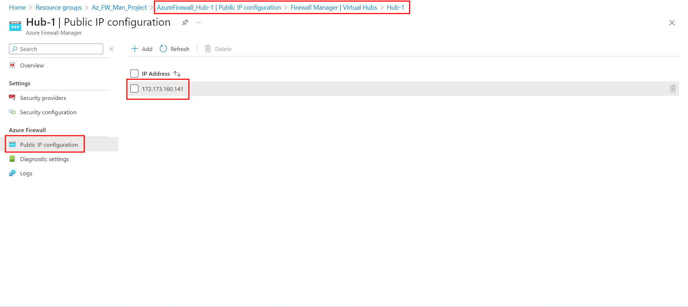
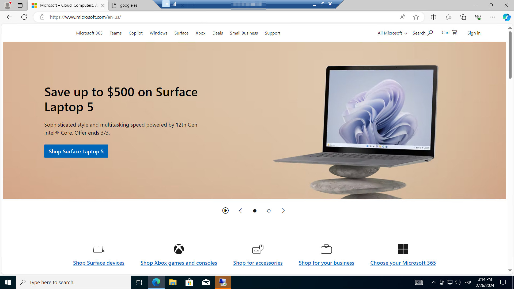
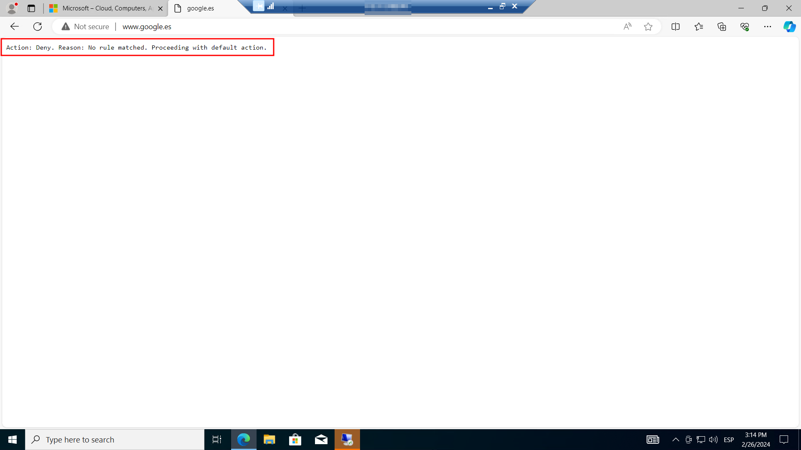
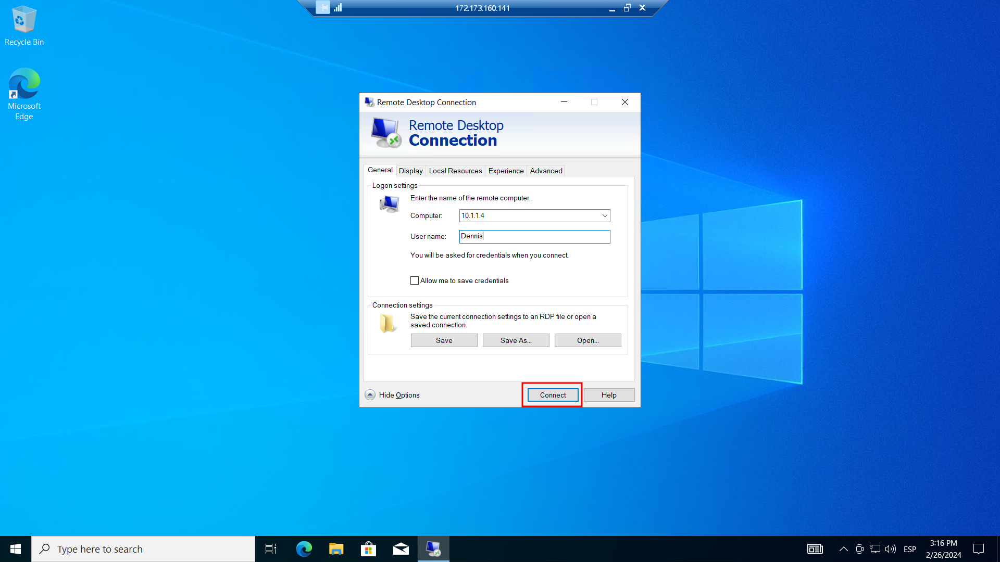
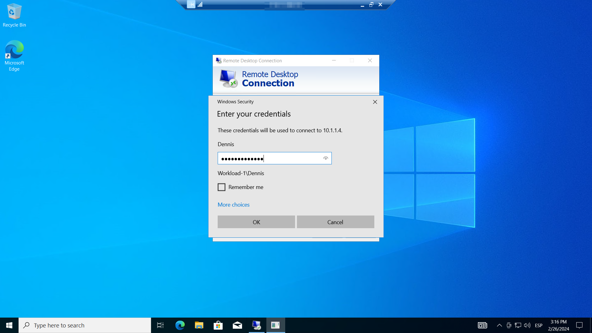
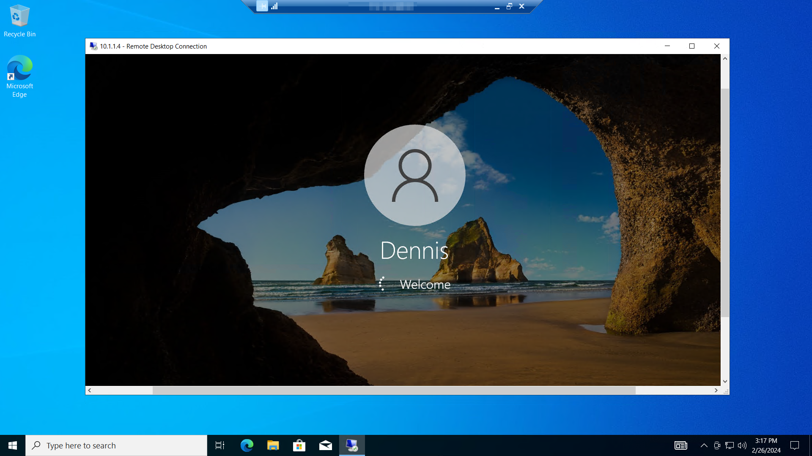
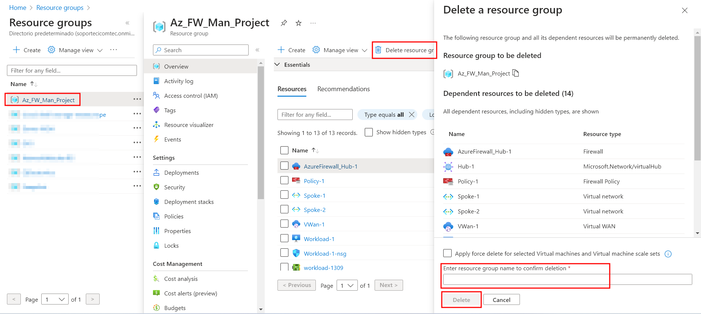

+++
title = "Configure and deploy Azure Firewall Manager Part 3: Test the Firewall"
date = 2024-04-11T08:43:16+01:00
draft = false
description = ""
slug = ""
authors = ["Dennis Drebitca"]
tags = ["Azure","Virtual Machines"]
categories = []
externalLink = ""
series = ["Microsoft Azure", "Configure and deploy Azure Firewall Manager"]
+++

For part 3 of the series,  test the firewall in two steps. First, we’ll test the application rule; then, we’ll test the network rule. To test the firewall rules, we’ll connect a remote desktop using the firewall’s public IP address, which is NATed to Workload-1. From there, we’ll use a browser to test the application rule and connect a remote desktop to Workload-2 to test the network rule. It is important to remember, as with all testing, firewall testing is essential to maintaining a secure network and mustn’t be overlooked.

### Test the application rule

Lets test that the application rule is working as expected.

First, we have to locate the firewall's IP address. WE have to navigate to the Resource Group of our project, then select Hub-1 -> Public IP configuration, and the IP address will be displayed.

With this information, we will connect a remote desktop to the firewall public IP address, and sign into Workload-1.

Now we will open Internet Explorer and browse to https://www.microsoft.com. We can see that the web page is accessible and loads correctly.

Now we try to browse to https://www.google.com. This website is blocked by the firewall and we can´t access it.

Now that we have verified that the firewall application rule is working, we can browse to the one allowed fully qualified domain name (FQDN), but not to any others. The FQDN represents a domain name of a host or IP address(es). We can use FQDNs in network rules based on DNS resolution in Azure Firewall and Firewall policy. This capability allows us to filter outbound traffic with any TCP/UDP protocol (including NTP, SSH, RDP, and more).

### Test the network rule

From Workload-1, we open a remote desktop to the Workload-2 
**private** IP address. 

We can succesfully log in, verifying that we can connect a remote desktop to a server located in another virtual network.

### Clean up resources

Now that we have tested our firewall, we can delete the resource group associated with the project if it isn't needed anymore. This is done to not waste resources, and to not be targeted by malicious activity.

We go to the resource group Az_FW_Man_Project, then Delete resource group. A prompt will appear asking us to type the resource group name to confirm deletion.

Thank you for reading.