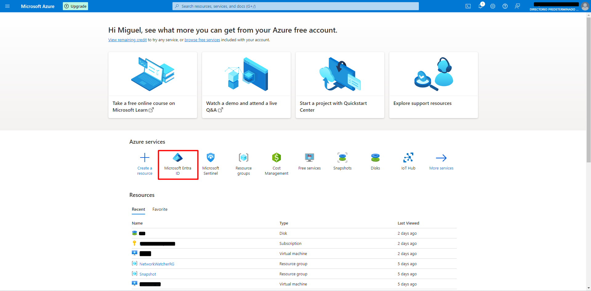
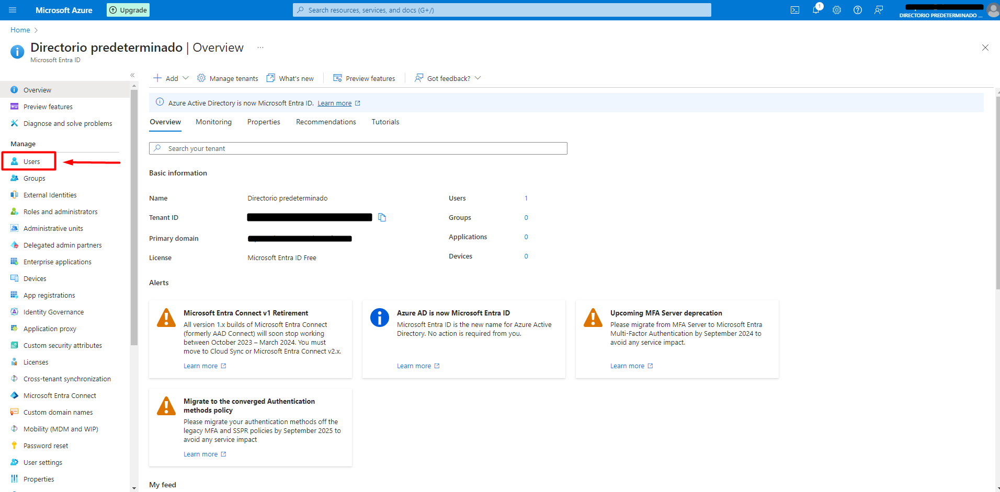
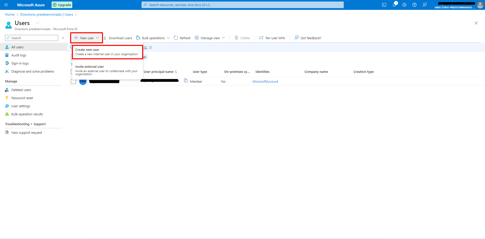
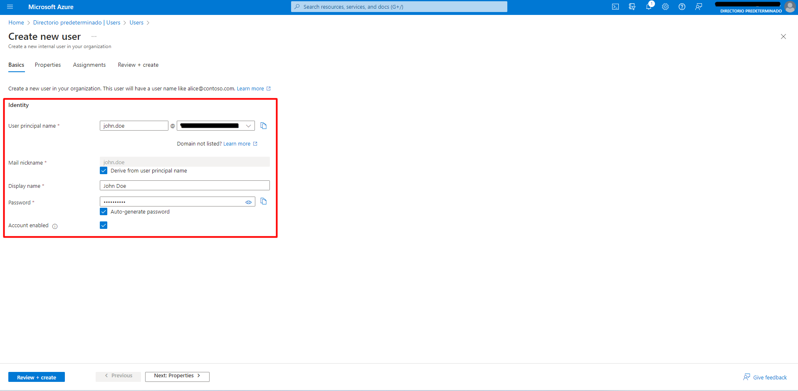
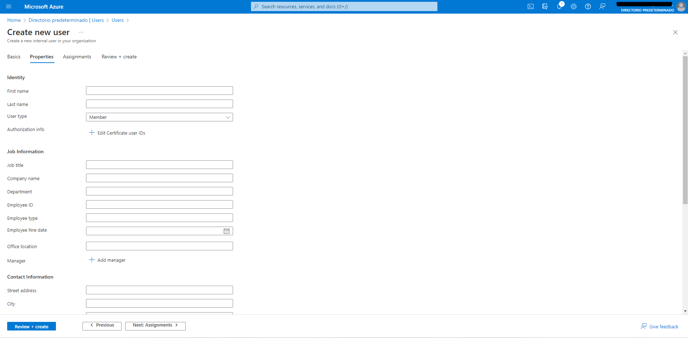
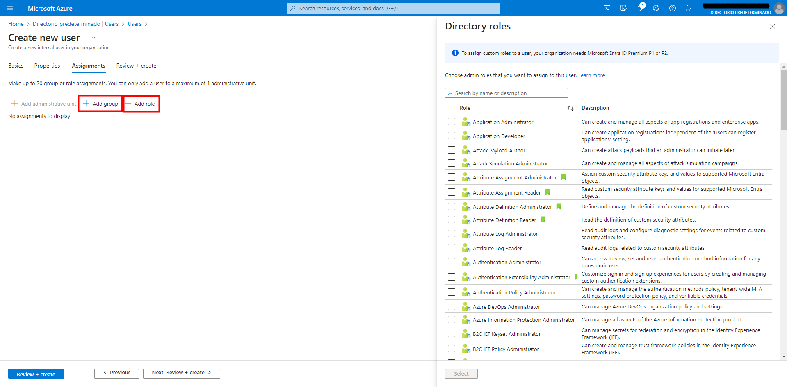
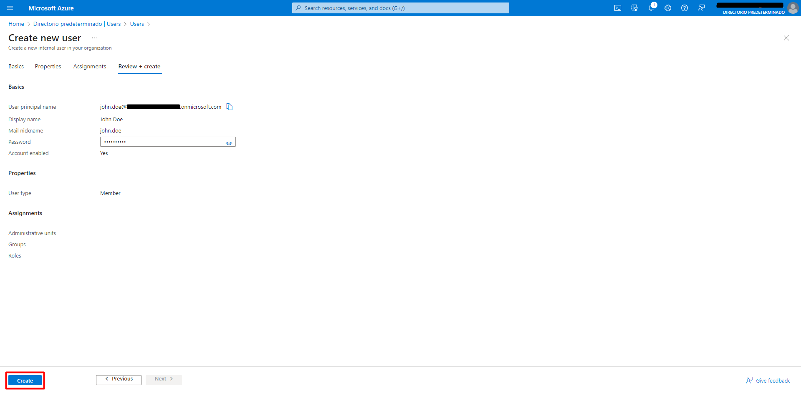
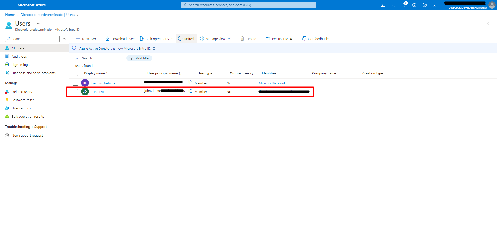
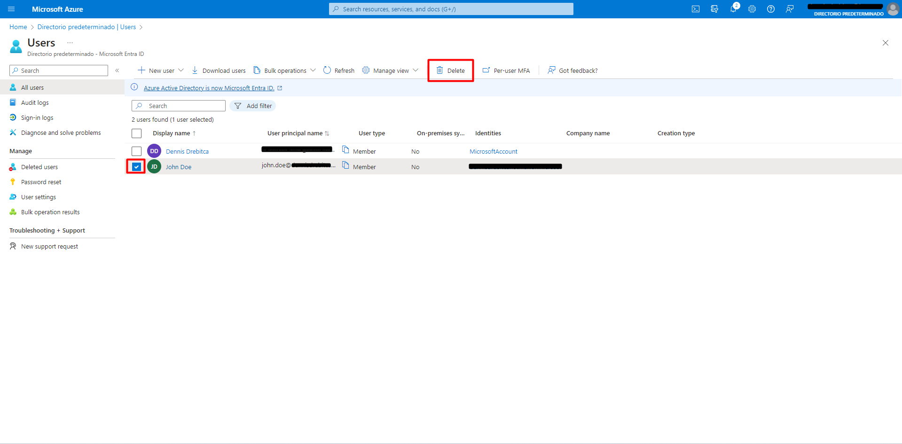

+++
title = "Azure: Manage Entra ID users via Azure Portal"
date = 2023-12-03T15:43:16+01:00
draft = false
description = ""
slug = ""
authors = ["Dennis Drebitca"]
tags = ["Azure"]
categories = []
externalLink = ""
series = ["Microsoft Azure"]
+++

In this post we will learn how to create, edit and delete Microsoft Entra ID users. [Microsoft Entra ID](https://www.microsoft.com/en-us/security/business/identity-access/microsoft-entra-id) is an integrated cloud identity and access solution, and a leader in the market for managing directories, enabling access to applications, and protecting identities.

To create a user, first navigate to Microsoft Entra ID in the Azure Portal.

Then click on Users.

You will be seeing the Users page. On the left hand menu, we can see the following tabs:

	-All users. Shows a list of all users, where users can be created, edited and deleted.
	-Audit Logs
	-Sign-in Logs
	- Diagnose and solve problems

	-Deleted users. Here are deleted users stored for a period of 30 days. They can be recovered 
	within this time period, after which the user is permanently deleted.
	-Password reset. Here you can reset a user's password.
	-User settings
	-Bulk operation results

In this case, we have to navigate to the All Users tab. New users can be created by clicking New User -> Create new user. The beneath option, Invite external user, is used to create a user in Azure B2C and B2B.

 Then, we have to imput the profile information for the new user. All the sections in this view are mandatory to be completed. We can choose a password, or it can be auto-generated. Then, click "Next: Properties"

Here we can imput more information about the user. This information can be used to create and be added dynamic groups, where depending on the user's attributes like Location and Department, they can dynamically be assigned to a group or role. This feature helps with security because when a user changes departments, for example, all access to the previous department is revoked automatically. Then, click "Next: Assignments".

Here on this page, the user can be assigned a group and/or a role. To have the ability to create custom roles, a Microsoft Entra ID Premium Plan is needed. Then, click "Next: Review + create".

In this page the information about the new user has to be reviewed. If eferything is correct, click "Create"

Going back to the users page, the new user has been created succesfully. Here he can see a bit of information about the user.

To delete a user, click on the box on the left of the user, and then click on Delete.

The user has not been entirely deleted. It doesn't have acces to the resources anymore, and lives in the "Deleted users" tab on the left menu, and can be recovered if needed. The user will remain in the Deleted users section for a period of 30 days, afther which it will be completely deleted and unrecovereable.
