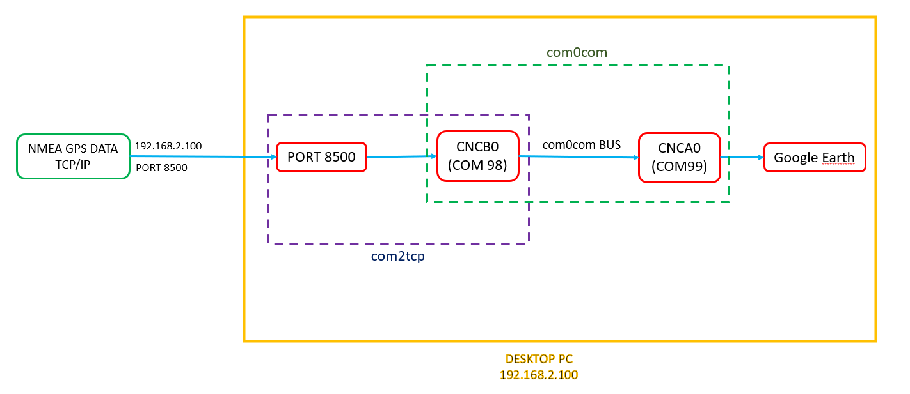
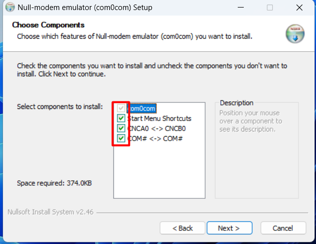
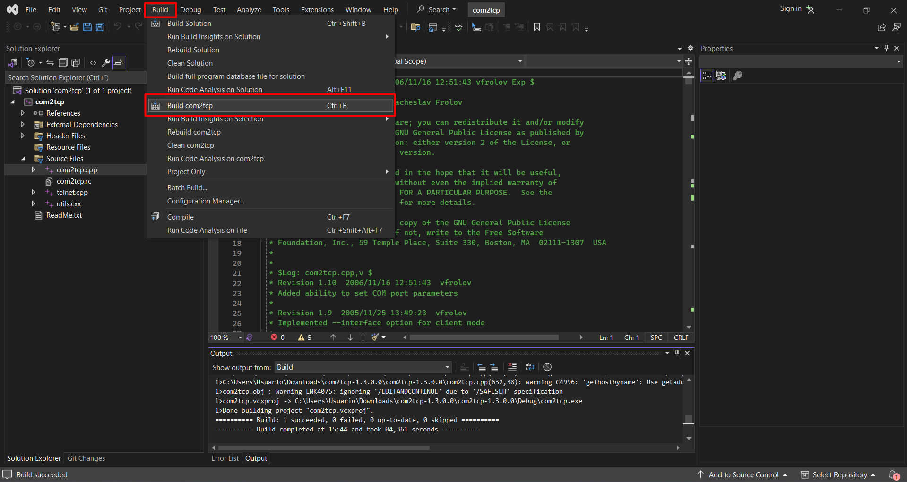
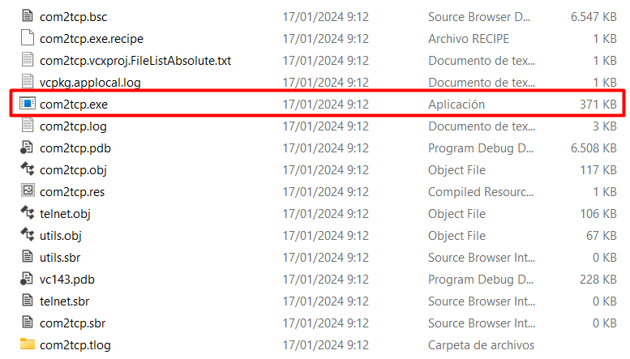
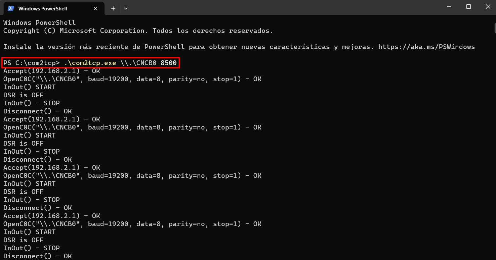
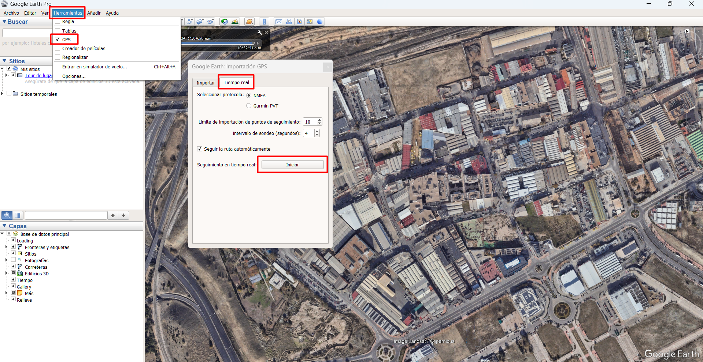
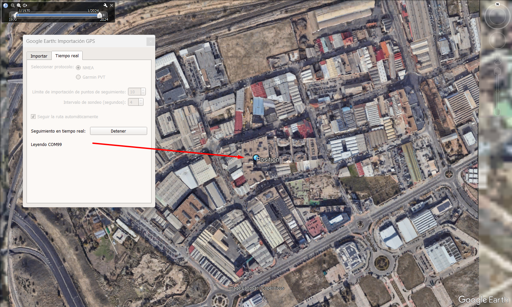

+++
title = "GPS NMEA TCP/IP stream to COM port via com0com and com2tcp"
date = 2023-12-29T15:43:16+01:00
draft = false
description = ""
slug = ""
authors = ["Dennis Drebitca"]
tags = ["open-source","windows","source code compilation"]
categories = []
externalLink = ""
series = []
+++

In this project we will explore how we can serve TCP/IP data coming in through an open port, and turn it into a virtual serial port or COM port. 
In this case, I have a router that has an internal GPS that can serve the NMEA sentences to a given IP and port via TCP/IP. However, most programs that use GPS (like Google Eart) do it through a COM port. So, how can we 'translate' the TCP/IP data into a serial COM stream?

This is achieved through virtual COM port simulation, a piece of software that can simulate a physical COM port connection. To the eyes of the software that reads the COM port, it is indistinguisheable from a physical port. There are a lot of options when choosing the software, so lets define the requirements:

	- Must have a CLI, not only GUI, so it can be setup using a VBS o Powershell script
	- Must be easy to control
	- Must provide a way to connect a TCP/IP stream to the COM port
	- Must be free and/or open source

Following these requirements, the programs chosen are com0com and com2tcp. They are part of the [Null-modem emulator](https://sourceforge.net/projects/com0com/) project on SourgeForge. The flow chart of the information is going to look like this:



## com0com

Quoting the author on SourgeForge:

'The Null-modem emulator (com0com) is a kernel-mode virtual serial port driver for Windows. You can create an unlimited number of virtual COM port pairs and use any pair to connect one COM port based application to another.'

It works by creating any number of virtual ports on the system, and linking them via a virtual bus. We will use the virtual COM pair number 0, where one of them is going to receive the TCP/IP traffic using the next program (com2tcp), and the other one is going to be the one connecting to the end software.

The com0com software presents itself as a self-signed x64 executable that installs the program. To install it, just run the installer as and administrator. Make sure that the all the following options are selected.



If after the installation a GUI appears, you can close it.

Then, open a administrator terminal window (cmd.exe on windows) and run the following commands one by one. First, navigate to the installation folder on the C:\ drive:

```cmd
cd C:\Program Files (x86)\com0com
```

Then, delete the COM1 pair, since we are going to work and edit the COM0 pair.

```cmd
.\setupc.exe remove 1
```

Then we are going to rename one of the COMs to COM99, which will be the one where Google Earth will be connected.

```cmd
.\setupc.exe change CNCA0 PortName=COM99
````

Now, COM ports are ready. When inspected in Device Manager, they should look like this:


## com2tcp

Com2tcp is the tool that translates the TCP/IP data into a serial output that will be connected to the virtual port CNCB0. 

The com2tcp software presents itself as a Visual Studio Project that has to be compiled. Open Visual Studio and import the .vcproj project file. Then, in the build menu, click 'Build Solution'



The compiled binary is in the Releases folder, alongside with many other files that are not strictly necessary for the program to function. The only file needed is the com2tcp.exe executable.





Next, open a terminal (Powershell or CMD) in that folder and run the following commands. In this case, I'm using Powershell:

```cmd
.\com2tcp.exe \\.\CNCB0 8500
````

This command links the data between port 8500 and CNCB0. When the command is run, we should see that data starts coming in. **DO NOT CLOSE THE WINDOW THE PROGRAM WILL STOP.** A future blog post will explain how to run the program as a service on the background every time the PC powers up.

*(Comment: If you want to kow more about the usage of com0com and com2tcp, you cand find more documentation [here](https://com0com.sourceforge.net/) and [here](http://com0com.sourceforge.net/doc/UsingCom0com.pdf) )*



Now, com2tcp is set up correctly, and the last piece of the puzzle has to be configured. The TCP/IP stream is now converted into a virtual COM port and served on port COM99, ready to be read.

## Google Earth

Now we can use the GPS' NMEA stream to see our GPS position in Google Maps, for example. Open Google Earth, go to Tools -> GPS -> Real Time -> Start.



 And, if everyting is set up properly, Google Earth should read the data coming in from COM99 and the GPS location should be shown on the map.



## Conclusion.

The null-modem emulator project is a open-source set of applications that allowed us to emulate a pair of virtual COM ports, and the redirection of TCP/IP data to them.

com0com is the program responsible to create the virtual COM pair at kernel-level, and the virtual bus that connects them. It is a simple precompiled executable that is easily installed.

com2tcp is the program that routes the TCP/IP stream into one of the virtual ports created by com0com. It is presented as C++ source code that has to be compiled.

In future posts, I will explain how to program, install and run com2tcp as a service on startup.