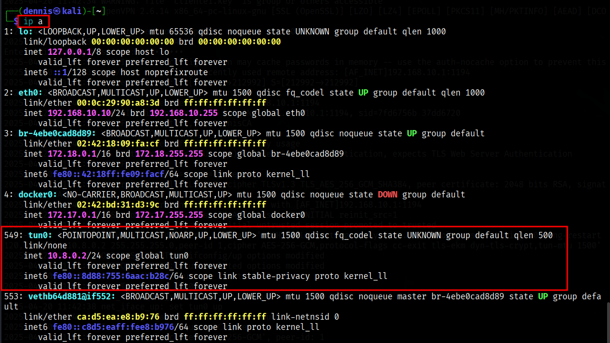

+++
title = "Operational installation of a VPN with OpenVPN"
date = 2025-05-20T15:43:16+01:00
draft = false
description = ""
slug = ""
authors = ["Dennis Drebitca"]
tags = ["PKI", "VPN", "OpenVPN", "Certificates", "Networkig", "VMWare"]
categories = []
externalLink = ""
series = ["Networking"]
+++


## Introduction

Currently, Virtual Private Networks (VPNs) are a widely used solution to establish secure communication channels over public or shared networks. Its main objective is to offer confidentiality, authentication and integrity in the transmission of data between different devices, simulating a private local network by encrypting the information that circulates through the network.

In this practice, a VPN has been implemented using OpenVPN, an open-source toolthat allows you to create encrypted tunnels based on the SSL/TLS protocol. The work environment is composed of three Kali Linux virtual machines:

- VM1 and VM2: VPN clients.
- VM3: VPN server.

The main objective has been to allow clients (VM1 and VM2), despite being on different physical networks (192.168.20.0/24 and 192.168.10.0/24 respectively), to communicate with each other exclusively through the VPN tunnel (10.8.0.0/24). To achieve this, the necessary certificates and keys have been generated with the easy-rsa tool, the OpenVPN server has been configured and the client-to-client option has been enabled to allow direct communication between clients within the tunnel.

As part of the additional challenge (bonus), the environment has been designed in such a way that communication between clinets is not possible through physical interfaces, thanks to network segmentation through different subnetworks. In this way, VM2 and VM3 do not have direct visibility between their local IPs, and can only exchange informationwhen connected to the VPN server, thus reinforcing the isolation and security of the environment.

This type of architecture is especially useful in scenarios where segmenting networks is required for security reasons, such as in corporate environments, data centers, or isolated test environments.

## Network Configuration

To segment the network totally, two different networks have been created in VMWare, VNet-1 and VNet-2. VNet-1 will occupy IP space 192.168.10.0/24, and VNet-2 will occupy space 192.168.20.0/24. In this way, client 1 will be connected to the VNet-1 network and client 2 to the VNet-2 network, ensuring a total segmentation of the network. The server will have 2 different network interfaces, one on each network. This configuration can be summarized in the following table:

First, the two virtual networks are created in VMWare:


Illustration 1. Creation of the VNet-1 virtual network.


Illustration 2. Creation of the VNet-2 virtual network.

Once the subnets have been configured and the network adapters of the machines have been connected to them, the IPs of the machines must be configured to be the right ones.

| **VM** | **Role** | **Network Adapter** | **IP address** |
| --- | --- | --- | --- |
| VM1 | Client 1 | Custom (VNet-1) | 192.168.10.10 |
| VM2 | clinet 2 | Custom (VNet-2) | 192.168.20.10 |
| VM3 | VPN Server | Two adapters: |     |
|     |     | \- Custom (VNet-1) | 192.168.10.1 |
|     |     | \- Custom (VNet-2) | 192.168.20.1 |

#### VM1 (Client 1)

- Adapter 1: Custom (VNet-1)
- IP: 192.168.10.10/24
- Gateway: 192.168.10.1 (the adapter IP in VM3)

To get this configuration, you need to run the following commands:
```sh
sudo ifconfig eth0 192.168.10.10 netmask 255.255.255.0
sudo ip route add default via 192.168.10.1 dev eth0
```


Illustration 3. Client Paths 1 (VM1).

#### VM2 (Client 2)

- Adapter 1: Custom (VNet-2)
- IP: 192.168.20.10/24
- Gateway: 192.168.20.1 (the IP of the adapter in VM3)

To get this configuration, you need to run the following commands:
```sh
sudo ifconfig eth0 192.168.20.10 netmask 255.255.255.0
sudo ip route add default via 192.168.20.1 dev eth0
```


Illustration 4. Client Paths 2 (VM2).

#### VM3 (VPN Server)

- Adapter 1: Custom (VNet-1) → IP: 192.168.10.1
- Adapter 2: Custom (VNet-2) → IP: 192.168.20.1

To get this configuration, you need to run the following commands:
```sh
sudo ifconfig eth0 192.168.10.1 netmask 255.255.255.0
sudo ifconfig eth1 192.168.20.1 netmask 255.255.255.0
```


Illustration 5. Virtual interfaces present on the server (VM3).

Importantly, these settings are temporary since ifconfig has been used, and will not be maintained after the machines are restarted.

## Infrastructure Installation

### PKI Configuration

The first step in building an openVPN service is to establish a PKI, "Public Key Infrastructure". This PKI consists of:

- A unique certificate (also known as a private key) and a private key for each server and client
- A master certificate issued by the CA (Certificate Authority)

Both the server and client are authenticated bi-directionally using the CA-signed certificates. This has several advantages:

- The server only needs to know its own certificate/key. You don't need to know each clinet's individual certificates.
- The server only accepts clients whose certificates have been signed by the CA. This can be checked on the server without the need for a connection to the CA, so the private key of the CA may be hosted on a different machine and even disconnected from the network.
- If the private key of any of the parties is exposed, it can be added to a CRL, "Certificate Revocation List", being able to reject compromised certificates without the need to rebuild the entire PKI infrastructure.
- The server can impose client-specific authorization rules based on data from the certificate itself.

#### Creating the CA and Certificates

First, the necessary packages are installed to build the infrastructure. OpenVPN and easy-RSA will be used. These can be installed using the following command:
```sh
sudo apt update & sudo apt install openvpn easy-rsa -y
```

Once the necessary tools have been installed, a directory called openVPN-CA is created in the user's personal folder with the file structure needed to work with easy-RSA.
```sh
make-cadir ~/openvpn-ca
cd ~/openvpn-ca
```

The next step is to modify the "vars" file with the default values that will be used when issuing the certificates. These are the parameters defined for this practice:

- set_var EASYRSA_REQ_COUNTRY "IS"
- set_var EASYRSA_REQ_PROVINCE "Madrid"
- set_var EASYRSA_REQ_CITY "Madrid"
- set_var EASYRSA_REQ_ORG "DennisCA S.A."
- set_var EASYRSA_REQ_EMAIL "<dennis@dennisCA.com>"
- set_var EASYRSA_REQ_OU "DennisCA S.A."
- set_var EASYRSA_KEY_SIZE 2048
- set_var EASYRSA_CA_EXPIRE 3650
- set_var EASYRSA_CERT_EXPIRE 365

The most important parameters are:

- EASYRSA_KEY_SIZE: Size of certificates, keys, etc. In this case, 2048 has been used, generating relatively weak keys. The use of 4096 or 8196-bit keys is recommended for added security.
- EASYRSA_KEY_EXPIRE: Days when the CA master certificate expires. 5 years is recommended.
- EASYRSA_CERT_EXPIRE: Days on which the issued certificate expires. 1 year is recommended.

The following command is then executed to start the PKI and build the CA:
```sh
./easyrsa heat-pki
./easyrsa build-ca
```


Illustration 6. PKI initialization.


Illustration 7. Creation of the CA.

Now you need to create the public-private key pair for the server. Each server has a unique key pair issued by the CA. Normally, the private keys of the servers are decrypted so that they can be restarted without user input. The request for the signature of the certificate is issued as follows:
```sh
./easyrsa gen-req server nopass
```

Illustration 8. Creating the Signature Request for the Server Key Pair.

The same is done for each clinet:
```sh
./easyrsa gen-req client1
./easyrsa gen-req client2
```

Illustration 9. Creating the Key Pair Signing Request for Client 1.

Next, the petition must be signed by the CA. This is done by first importing the request and then signing it, whether it is a request for both client and server. In our case, it is not necessary to import the requests since they have been generated on this same machine. To view such requests, you can use the following command:
```sh
./easyrsa show-req NAME
```


Illustration 10. Verification of the request for the server keys.

To sign the certificates and create them, the following commands are executed:
```sh
./easyrsa sign-req server server # To sign the server request
./easyrsa sign-req client client1 # To sign the clinet request
./easyrsa sign-req client client2
```

After confirming and entering the password for the CA key, the certificates required for both client and server have been created. Next, you need to generate the Diffie-Hellman parameters used for the TLS handshake in client-server authentication. To do this, the following command is executed:
```sh
./easyrsa gen-dh
```
Finally, a TLS key is created using openVPN:
```sh
openvpn --genkey secret TLS.key
```

Now we have all the necessary certificates and keys for the openVPN infrastructure.

### OpenVPN Server Settings

You need to copy the necessary certificates and files to the openVPN directory. The files required with ca.crt, server.crt, server.key, dh.pem and TLS.key:
```sh
sudo cp ca.crt dh.pem ./issued/server.crt ./private/server.key ./private/TLS.key /etc/openvpn
```
Next, you need to create the openVPN server configuration file. To do this, the file "/usr/share/doc/openvpn/examples/sample-config-files/server.conf" is taken as an example. It must be modified to fit our needs:

- port 1194 # Port
- Therefore, UDP # Protocol
- Dev tun # Device
- CA.crt # CA Certificate
- cert server.crt # Server certificate
- key server.key # Server private key
- dh dh.pem # DH Parameters
- TLS-AUTH TLS.key 0 # TLS Key
- Server 10.8.0.0 255.255.255.0 # VPN Subnet
- client-to-client # **VERY IMPORTANT: This option needs to be enabled so that clients can see each other through the VPN.**

The rest can be left with the default settings. Now, you can start the openVPN service with the server.conf configuration:
```sh
sudo systemctl start openvpn@server
```
To have the service start automatically when the machine starts, the following command can be executed:
```sh
sudo systemctl enable openvpn@server
```

### Configuring Clients

Once the server has been successfully configured, the clients need to be configured. To do this, the following files must be copied to each machine:

- ca.crt: The digital certificate (which acts as a public key) of the CA
- TLS.key: The TLS Private Key
- client.crt: The client's certificate
- cliente.key: The client's public key

Next, you need to create an openVPN client configuration file. This file must have the same configuration that has been created for the server. To do this, the file "/usr/share/doc/openvpn/examples/sample-config-files/client.conf" is taken as a starting point. The following important parameters are modified:

- remote 192.168.10.1 1194 # IP and port of the openVPN server
- CA.crt # CA Certificate
- cert cliente1.crt # clinet Certificate
- Key cliente1.key # clinet private key
- TLS-AUTH TLS.key 1 # TLS Key

All files and certificates must be copied to /etc/openvpn.
```sh
sudo cp \* /etc/openvpn
```

In the same way, on machine 2 the client.conf file must be modified as follows:

- remote 192.168.20.1 1194 # IP and port of the openVPN server
- CA.crt # CA Certificate
- cert cliente2.crt # clinet Certificate
- Key cliente2.key # clinet private key
- TLS-AUTH TLS.key 1 # TLS Key

The configuration has been carried out satisfactorily. Now all that remains is to start the openVPN services on both client machines, executing the command:
```sh
openvpn clientX.conf
```

## System Function Check

You can see that the VPN is working properly on the machines:

#### Client 1

Running openVPN yields the following output:


Illustration 11. OpenVPN output on client 1.

To verify that a new tun0 network virtual interface has been created, you can use the "ip a" command. Tun0 with IP 10.8.0.2 is displayed successfully.


Illustration 12. List of the client's virtual interfaces 1.

Finally, it remains to check the route through the VPN. To do this, use "ip r":


Illustration 13. Client IP routes 1.

It can be confirmed that the connection is perfectly configured.

#### Client 2

Running openVPN yields the following output:


Illustration 14. Output of openVPN on client 2.

To verify that a new tun0 network virtual interface has been created, you can use the "ip a" command. Tun0 with IP 10.8.0.3 is displayed successfully.


Illustration 15. List of the client's virtual interfaces 2.

Finally, it remains to check the route through the VPN. To do this, use "ip r":


Illustration 16. Client IP routes 2.

It can be confirmed that the connection is perfectly configured.

#### Server

You can check the status of the openVPN service using the following command:
```sh
sudo systemctl status openvpn@server
```

It can be seen that the service is running, and that the two clients have connected satisfactorily:


Illustration 17. Status of the openVPN service.

Likewise, the tun0 virtual interface can be observed using the command "ip a":


Illustration 18. List of virtual interfaces of the server.

## Checking the configured network

Before connecting the VPN, VM1 and VM2 can't ping each other (they're on different physical subnets and don't have routes between them). Once connected to the VPN, IPs such as 10.8.0.2 and 10.8.0.3, for example, will be assigned and they will be seen between them through the tunnel. Let's review the structure of the network once again:

| **VM** | **Role** | **IP address (physical adapters)** | **IP address (tun0)** |
| --- | --- | --- | --- |
| VM1 | Client 1 | 192.168.10.10 | 10.8.0.2 |
| VM2 | clinet 2 | 192.168.20.10 | 10.8.0.3 |
| VM3 | VPN Server | 192.168.10.1, 192.168.20.1 | 10.8.0.1 |

The 192.168.10/24 and 192.168.20/24 subnets are completely isolated and no routing rules have been added to the server, so clients cannot communicate before connecting to the VPN. This is shown by attempting to ping client 1 to client 2:


Illustration 19. Unsatisfactory ping from client 1 to 2.

In the opposite direction, from client 2 to client 1, there is also no connection:


Illustration 20. Unsatisfactory ping from client 2 to 1.

However, through the tun0 tunnel they do have a connection. Trying to ping from client 1 to client 2 through the tunnel, i.e. IP 10.8.0.3, you do have a connection:


Illustration 21. Ping response from client 2 to 1 via the VPN tunnel.

And conversely, from client 2 to client 1 with IP 10.8.0.2, you also have a connection:


Illustration 22. Ping response from client 1 to 2 through the VPN tunnel.

It can be seen that the objective of the practice has been met, since it has been possible for two machines in different subnets, which cannot be seen, to communicate through the VPN tunnel.

## Bibliography

“Easy-RSA v3 OpenVPN Howto.” _OpenVPN Community Wiki and Tracker_, community.openvpn.net/openvpn/wiki/EasyRSA3-OpenVPN-Howto. Accessed 20 Apr. 2025.

“Setting up Your Own Certificate Authority (CA).” _OpenVPN_, openvpn.net/community-resources/setting-up-your-own-certificate-authority-ca/.