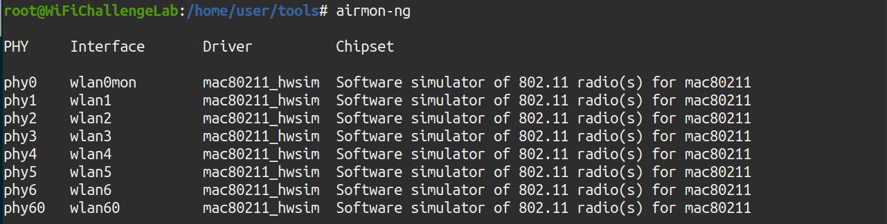
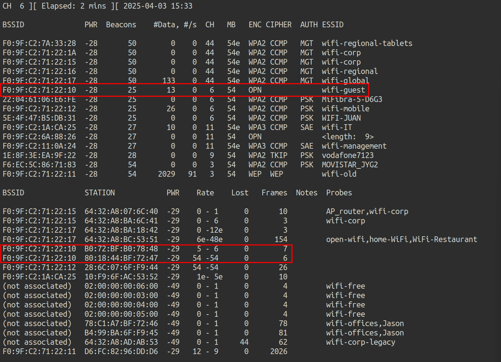
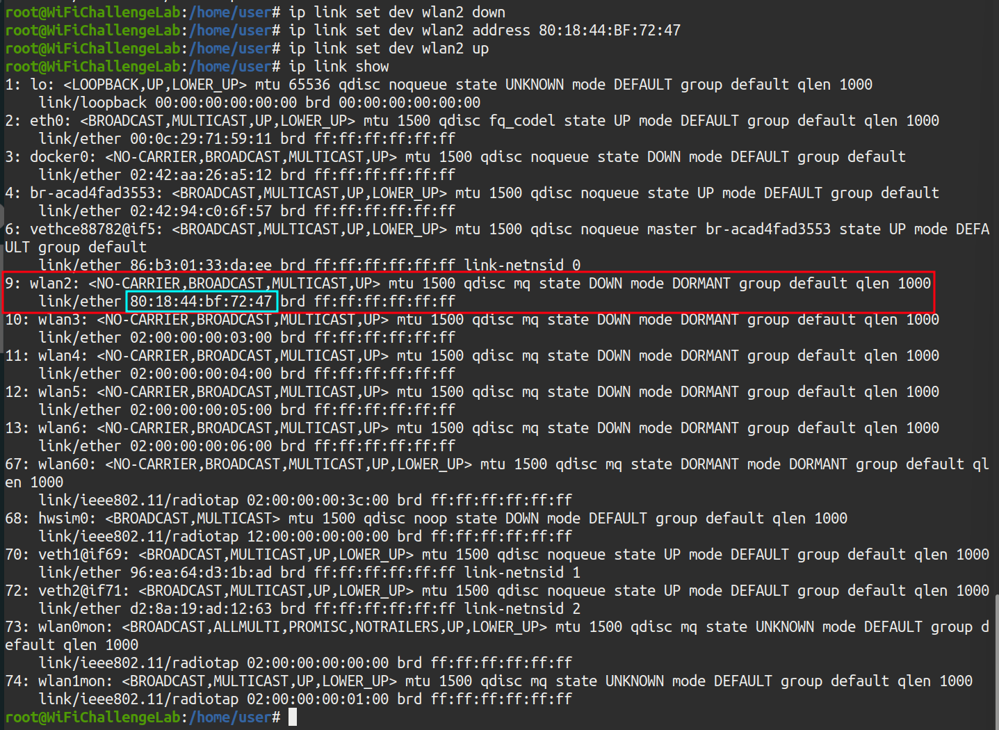
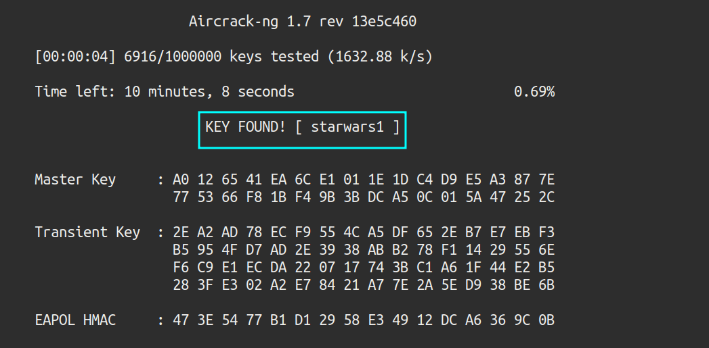
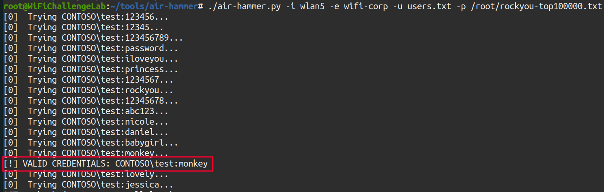

+++
title = "WifiChallenge Lab CTF"
date = 2025-05-15T15:43:16+01:00
draft = false
description = ""
slug = ""
authors = ["Dennis Drebitca"]
tags = ["Aircrack-ng suite", "MDK3", "MDK4", "air-hammer", "eapbuster", "hashcat", "wireshark", "hcxtool", "hxcdump", "hcxpcapngtool"]
categories = []
externalLink = ""
series = ["Pentesting wireless"]
+++


## Introduction

This write-up summarizes the completion of the WiFiChallenge Lab, a practical cybersecurity exercise focused on wireless network security. Throughout the lab, various Wi-Fi attack techniques were explored and executed, including packet capture, handshake extraction, password cracking, and exploiting common vulnerabilities in WEP and WPA/WPA2 networks. The objective was to simulate real-world scenarios, enhance practical skills in wireless penetration testing, and deepen understanding of Wi-Fi security protocols and their weaknesses. This walkthrough outlines the methodology, tools used, challenges encountered, and key takeaways from the experience.


### 1. What is the content of the file /root/flag.txt on the VM?

To confirm that the lab has been installed and started correctly, the flag located in the /root directory is extracted:


Illustration 1. Flag in the /root directory.

## Reconnaissance

### 2. What is the channel that the wifi-global Access Point is currently using?

To scan the environment, it is necessary to employ a network interface in monitor mode. To do this, the airmon-ng tool is used. To check which network interfaces are installed, you can run the "airmon-ng" command without arguments:



Illustration 2. Network interfaces installed.

The monitor mode is then mounted on the wlan0 interface using the command "airmon-ng start wlan0"


Illustration 3. Configuring the wlan0 interface in monitor mode.

Once the interface is in monitor mode, the environment can be captured using the airodump-ng tool. To do this, the following command is executed:

```bash
airodump-ng -w capture -b abg wlan0mon
```

Where the parameters mean:

- w capture2: Save to the "capture" document
- b abg: Capture the a, b and g bands, also capturing the 5GHz channels.
- wlan0mon: The interface that is going to be used. It must be in monitor mode.


Illustration 4. Capturing the environment. Multiple ESSIDs can be observed.

This is the answer to the first question: The global Wi-Fi network is on channel 44.

### 3. What is the MAC of the wifi-IT client?

In the previous screenshot you can also see the channel of the wifi-IT network. With this information, you can scan only on that channel so that there is less noise in the capture. To capture the MAC of the network client, airodump is used again, this time scanning only the desired channel. To do this, the following command is executed:

```sh
airodump-ng -c 11 wlan0mon
```

In parallel, the mdk3 tool is run to deauthenticate customers who are on those channels, and get more information about them. To do this, the wlan1 interface is put in monitor mode and the following command is executed in parallel:

```sh
mdk3 wlan1mon d -c 11
```

Where the arguments mean:

- wlan1mon: The interface to be used.
- d: The deauthentication attack is chosen.
- c 11: The attack is executed on channel 11.


Illustration 5. MDK3 execution.


Illustration 6. Capture of channel 11 with airodump-ng.

This way you get the MAC of the wifi-IT client: 10:F9:6F:AC:53:52.

### 4. What is the probe of 78:C1:A7:BF:72:46?

Using the screenshot above, you can see that MAC 78:C1:A7:BF:72:46 looks for the wifi-offices and Jason networks:


Illustration 7. Capture airodump-ng on channel 11.

### 5. What is the ESSID of the hidden AP (mac F0:9F:C2:6A:88:26)?

No customers are observed in the hidden network, so brute force must be used. To do this, the mdk4 tool and the wordlist rockyou.txt are used. First, you have to filter in the file rockyou.txt only the lines with 9 characters, since we know the length of the ESSID with previous captures. To do this, grep is used with regex:

```sh
grep -E'^. {9}$' /root/rockyou-top100000.txt > rockyou_9char.txt
```


Illustration 8. Number of lines in the new dictionary.

The new dictionary has approximately 120 thousand lines. The mdk4 tool is then used to perform a brute force attack against the MAC of the hidden AP:

```sh
mdk4 wlan1mon p -f rockyou_9char.txt -t F0:9F:C2:6A:88:26
```

Where the arguments mean:

- WLAN1MON: This is the name of the wireless network interface in monitor mode. It has to be in monitor mode for mdk4 to work.
- p: Indicates the "WPA Handshake Dictionary Attack" attack mode. This mode allows you to test passwordsagainst a Wi-Fi network when you have the handshake captured (although with mdk4 it is done in real time against active networks).
- f rockyou_9char.txt: Indicates the dictionary file that will be used for the attack (in this case, the one containing 9-character passwords).
- t F0:9F:C2:6A:88:26 - Specifies the MAC address of the target access point


Illustration 9. Failed attack.

The attack has not proved successful. The wordlist must be different. All networks start with "wifi-" so that prefix is added to the list rockyou.txt, using the sed command:

```sh
sed ‘s/^/wifi-/’ /root/rockyou-top100000.txt > rockyou2.txt
```

And again, only lines with 9 characters are selected with grep:

```sh
grep -E'^. {9}$' rockyou2.txt > rockyou_9char.txt
```


Illustration 10. Number of lines in the new dictionary.

There are only 3336 possible ESSIDs. Again, mdk4 is relaunched with the new dictionary.


Illustration 11. Successful attack.

And the attack has been successful, the ESSID of the hidden network is wifi-free.

## OPEN

### 6. What is the flag in the hidden AP router behind default credentials?

After connecting to the hidden network, the ifconfig command is executed to find out which is the subnet of the network:


Illustration 12. IP granted by the dhcp server.

To find active hosts on the network, an NMAP scan is performed:  
```sh
nmap 192.168.16.0/24
```


Illustration 13. NMAP scan to the wifi-free network.

There is host 192.168.16.1, the Gateway. Here's the interface accessed via port 80:


Illustration 14. AP web interface.

Testing passwords, weak admin/admin credentials are configured:


Illustration 15. Flag after logging in to the AP website.

And after logging in using the credentials, the flag is obtained.

### 7. MAC impersonation: What is the flag on the AP router of the wifi-guest network?

The Wi-Fi guest network is also open. After connecting to the network, the IP is checked again using the ifconfig command:


Illustration 16. IP granted by DHCP on the Wi-Fi guest network.

An NMAP scan is performed again to look for active hosts on the network:


Illustration 17. NMAP scanning on the wifi-guest network.

A host with IP 192.168.10.1 is observed with ports 22, 53, 80, 443 and 8080 open. By accessing the website of said host:


Illustration 18. Webpage of the host.

By clicking on "Continue", the website redirects us to the following login form:


Illustration 19. Login form.

We do not have the passwords, so one of the customers connected to the Wi-Fi guest network will be challenged. To do this, airodump-ng is executed on all channels in search of the MACs of the clients of the Wi-Fi guest network:

```sh
airodump-ng -w capture -b abg wlan0mon
```


Illustration 20. Capture airodump-ng.

There are 2 connected clients, with MAC addresses:

- 80:18:44:BF:72:47
- B0:72:BF:B0:78:48

We are going to replace our MAC address with the MAC address of one of the clients that are already authenticated, hoping that in this way the AP will not ask us for credentials. We connect to the wifi-guest network with the wlan2 adapter and execute the following commands:

```sh
ip link show
```

This command displays all network interfaces in the system (both physical and virtual), along with their status (enabled, disabled, MAC address, etc.). In this case, the MAC of our wlan2 interface is as follows:


Illustration 21. WLAN interface MAC2.

Our wlan2 device appears with its original MAC: 02:00:00:00:20:00. The following commands are then executed as root to change the MAC:

- ip link set dev wlan2 down_ # Disable the device to avoid problems
- ip link set dev wlan2 address 80:18:44:BF:72:47_ # Replace the MAC with the authenticated client
- ip link set dev wlan2 up_ # Wake up the device again
- ip link show_ # Shows the network devices again to check the change



Illustration 22. Successful change of the WLAN2 interface MAC.

The result is that our MAC is now that of an already authenticated device, so now through the browser you can access the router's login directly:


Illustration 23. Web login del AP.

However, now the default admin/admin credentials do not reveal the flag: you have to find the credentials of another user. However, as it is an open network, the traffic is not encrypted, so it can be captured with airodump and then inspected with wireshark for credentials. First, a capture is generated with airodump-ng:
```sh
airodump-ng -w dump.cap wlan1mon
```

Now, after capturing the traffic, you can inspect the traffic with wireshark.
```sh
wireshark dump.cap-01.cap
```


Illustration 24. Request POST to the login page.

In the POST request, you can get the credentials of the free1 user:

- Form item: "Username" = "free1"
- Form item: "Password" = "Jyl1iq8UajZ1fEK"
- Form item: "Submit" = "Login"

By entering the credentials on the AP website, you can get the flag for this challenge:


Illustration 25. Flag after stealing the free1 user's credentials.

## WEP

### 8. WEP cracking: What is the flag on the wifi-old AP website?

To crack the password of a WEP network, you have to use the airodump-ng and aircrack-ng tools. First, the packets #data are captured with airodump-ng:

```sh
airodump-ng -w WEP_capture --essid wifi-old -c 3 wlan0mon
```


Illustration 26. Capture airdump-ng.

To generate more traffic and capture more IVs, you can use the aireplay-ng tool:
```sh
aireplay-ng -3 -b F0:9F:C2:71:22:11 -h 1E:A8:5D:D1:1A:AF wlan0mon
```

After capturing a correct number of packets, the password is cracked with aircrack-ng:
```sh
aircrack-ng WEP_capture-01.cap
```


Illustration 27. Breaking the WEP password.

This password must be used without colons due to standard requirements. Once connected with the password "11BB33CD55", we can access the AP:


Illustration 28. Flag after logging in to the AP.

The WEP network flag is obtained.

## WPA2-PSK

### 9. WPA-Cracking with client: What is the wifi-mobile AP password?

Inspecting previous captures, the wifi-mobile network has the following characteristics:

- BSSID: F0:9F:C2:71:22:12
- CH: 6
- ENC: WPA2
- AUTH: PSK
- ESSID: wifi-mobile

Airodump-ng is executed against the bssid and channel to try to extract the handshake. To do this, the command:
```sh
airodump-ng -w wifi-mobile --bssid F0:9F:C2:71:22:12 -c 6 wlan0mon
```

At the same time, the mdk3 tool is run to deauthenticate clients and generate data packets to get the handshake faster.
```sh
mdk3 wlan1mon d -c 6_
```

And the handshake has been captured:


Illustration 29. Handshake capture.

Now what remains is to run aircrack to crack the password from the handshake, specifying /root/rockyou.txt as the dictionary.

```sh
aircrack-ng -w /root/rockyou-top100000.txt wifi-mobile-02.cap
```


Illustration 30. Wi-Fi mobile network password.

The password has been cracked: starwars1.

### 10. What is the IP of the web server in the wifi-mobile network?

After connecting to the network, ifconfig is run to check the assigned IP. With this information, an NMAP scan can be launched to discover active hosts:


Illustration 31. IP assigned.


Illustration 32. NMAP scan to the wifi-mobile network.

The router with IP 192.168.2.1 only shows the login page, but there is another host with port 80 open: 192.168.2.9


Illustration 33. Webpage on IP 192.168.2.9.

This flag is actually obtained for point 11. What we are asked at this point is the IP of the host: 192.168.2.9.

### What is the flag after login in wifi-mobile?

After obtaining the network password, the captured packets can be decrypted and the traffic inspected with wireshark, with the aim of stealing session cookies. To do this, the airdecap tool is used:
```sh
airdecap-ng -o wpa_decap -e wifi-mobile -p starwars1 wifi-mobile-02.cap
```


Illustration 34. Running the airdecap-ng tool.

Now, wireshark opens and the traffic is inspected:


Illustration 35. POST request to the AP login page.

In the POST request, you can get the credentials of the test2 user:

- Form item: "Username" = "test2"
- Form item: "Password" = "2q60joygCBJQuFo"
- Form item: "Submit" = "Login"

There is also a session cookie, which can be obtained from a GET request:


Illustration 36. GET request and PHP session cookie.

You can get the cookie "PHPSESSID=im8nhrv3dbnsihu4nholouv9si".

Logging into the router's administration panel, 192.168.2.1, gets the flag asking for the statement:


Illustration 37. Flag after logging in to the AP website.

### 11. Is there client isolation in the wifi-mobile network?

As seen in challenge number 9, there is no client isolation since we have gained access to 192.168.2.9 and the flag without having the MAC of the other user. (Figure 33).

### 12. AP-Less WPA Cracking: What is the wifi-offices password?

Scanning the environment again with airodump-ng, the wifi-offices network is not found, since if it were hidden or in the 5GHz band it would also be discovered. However, there are several customers who are looking for this website, in the Probes section:


Illustration 38. Capture airocump-ng.

To get the password for a Wi-Fi network that is not present, but with potential clients, you can create a fake AP with the same ESSID for clients to try to connect. With these connection attempts, the handshake will be captured.

To create the fake AP, hostapd is used, creating the following configuration file:


Illustration 39. Fake AP configuration file.

Hostapd is executed with the following command, in debug mode:

```sh
hostapd -d hostapd.conf
```


Illustration 40. Running hostapd with the configuration file configured.

In parallel, it is important to cast airodump-ng so that the handshake is captured:


Illustration 41. Captura del handshake de la red wifi-offices.

Now, to crack the handshake, you use the aircrack-ng tool, and the /root/rockyou-top100000.txt dictionary:
```sh
aircrack-ng wifi-offices-02.cap -w /root/rockyou-top100000.txt
```


Illustration 42. Running aircrack-ng.

The password has been successfully cracked, turning out to be "password1"

## WPA3-CCMP: SAE

### 13. WPA3-CCMP SAE bruteforce (Wacker): What is the flag on the wifi-management AP website?

Airodump-ng is used again to scan the environment on channel 11:
```sh
airodump-ng -c 11 wlan0mon
```


Illustration 43. Capture of airodump-ng on channel 11.

Apparently, the Wi-Fi management AP has no connected clients. This limits the attacks that can be performed against this AP. It is possible to perform an online brute force attack with a dictionary using the [Wacker tool](https://github.com/blunderbuss-wctf/wacker):


Illustration 44. Running the Wacker tool.

The parameters for the tool are as follows:

- wordlist /root/rockyou-100000.txt
- interface wlan3
- bssid F0:9F:C2:11:0A:24
- ssid wifi-management
- freq 2462 (Corresponding to CH 11)

The command results in the following:

```sh
./wacker.py --wordlist /root/rockyou-top100000.txt --interface wlan3 --bssid F0:9F:C2:11:0A:24 --ssid wifi-management --freq 2462
```


Illustration 45. Execution of the wacker.py command.

With this tool, you get the password for the Wi-Fi management network: chocolate1. We can now access the AP website at 192.168.14.1:


Illustration 46. Flag after logging in to the AP website.

### 14. WPA3-CCMP SAE cracking (Hcxdumptool): What is the flag on the wifi-IT AP website?

This network does have clients, so hcxdumptool can be used to capture the SAE handshake and crack it offline with Hashcat. To do this, the following command is executed:
```sh
sudo hcxdumptool -i wlan0mon -o wifi-management.pcapng --enable_status=15
```

Where the arguments are as follows:

- i wlan0mon: wlan0mon interface in monitor mode
- o wifi-management.pcapng: Output file.
- enable_status=15: Show states 1, 2, 4 and 8 (more info in the tool documentation).


Illustration 47. Running hcxdumptool.

After capture, you need to convert the handshakes to a format that hashcat can crack. This is achieved by using the hcxpcapngtool:
```sh
hcxpcapngtool -o hashcat_hash.22000 wifi-management.pcapng
```


Illustration 48. Running the hcxpcapngtool tool.

Once the handshakes have been converted to a format that can be cracked by Hashcat, the tool is run to try to get the passwords. It has been run on another Kali machine where Hashcat is updated, using the -m 22000 mode:
```sh
hashcat -m 22000 hashcat_hash.22000 rockyou-100000.txt
```


Illustration 49. Use of hashcat to crack the password.

And you get the wifi-IT password: bubblegum, in addition to the home-WIFI and wifi-mobile passwords. Once the connection with the Wi-Fi network is established, you can access the AP website, at the address 192.168.15.1:


Illustration 50. Flag on the AP administration website

## WPA3-CCMP MGT: Recon MGT

### 15. Domain extraction: What is the domain of the users of the wifi-regional network?

In the case of an incorrectly configured MGT network, access information in clear text may be leaked before the TLS tunnel is established. In this case, it would be possible to passively capture packets with airodump-ng and examine them later. To do this, airodump-ng is executed on channel 44:
```sh
airodump-ng -w wifi-regional -c 44 wlan0mon
```


Illustration 51. Airodump-ng capture of channel 44.

With wireshark, you can analyze captured traffic for clear text information:
```sh
wireshark wifi-regional-01.cap
```


Illustration 52. EAP packet with clear text information.

By applying the "eap" filter, the domain of the users of the Wi-Fi regional network is extracted in clear text: CONTOSOREG.

### 16. What is the email address of the servers certificate?

If the traffic obtained in challenge number 15 is further analyzed, the e-mail address of the certificate server can also be extracted:


Illustration 53. Capture of the e-mail address in clear text.

The mailing address is server@WiFiChallenge.com

### 17. What is the EAP method supported by the wifi-global AP?

The traffic obtained in challenge number 15 is re-analyzed, filtering by the MAC of the Wi-Fi AP and EAP protocol:


Illustration 54. Captured wireshark leaked.

A valid identity has been obtained, and the use of EAP-TLS is observed. You could also use the [EAP_buster tool](https://github.com/blackarrowsec/EAP_buster).

## WPA3-CCMP MGT

### 18. WPA3-CCMP MGT cracking (EAPhammer): What is Juan's flag on the wifi-corp AP website?

First, airodump-ng is launched to check if there are any clients connected to wifi-corp:
```sh
airodump-ng -w wifi-corp -c 44 --bssid F0:9F:C2:71:22:1A wlan0mon
```


Illustration 55. Capture airodump-ng.

- wifi-corp MAC 1: F0:9F:C2:71:22:1A
- wifi-corp MAC 2: F0:9F:C2:71:22:15
- Client 1 MAC: 64:32:A8:07:6C:40
- Client 2 MAC: 64:32:A8:BA:6C:41

To attack a misconfigured MGT network, it is possible to create a malicious AP with a self-signed certificate, the same type as the one customers expect. In this way, they will try to connect to the fake AP and send their credentials. To do this, [eaphammer](https://github.com/s0lst1c3/eaphammer), a tool to launch evil-twin attacks against WPA2-Enterprise networks, is used. First, you create the self-signed certificates by running:
```sh
./eaphammer --cert-wizard
```


Once the certificates are configured, the following command is executed
```sh
./eaphammer -i wlan2 --auth wpa-eap --essid wifi-corp --creds --negotiate balanced
```

Where the arguments are as follows:

- i wlan2: The interface used (wlan2)
- auth wpa-eap: Specifies the type of authentication. In this case, WPA-EAP.
- essid wifi-corp: Defines the name of the fake network (the SSID).
- creds: Enables authentication credential capture.
- Negotiate balanced: Use a balanced crypto trading method.


Illustration 56. Running the EAP_Hamer tool.

The fake AP is already running. Airplay-ng must now be used to deauthenticate clients from the original wifi-corp networks. There are two APs, so you have to attack both to prevent clients from connecting to the other AP that isn't being attacked. The following commands must be executed in parallel:
```sh
aireplay-ng -0 0 -a F0:9F:C2:71:22:1A wlan0mon -c 64:32:A8:07:6C:40
aireplay-ng -0 0 -a F0:9F:C2:71:22:15 wlan1mon -c 64:32:A8:07:6C:40
```

These aireplay-ng commands target client 1, with MAC 64:32:A8:07:6C:40.


Illustration 57. Running aireplay-ng against AP 1.


Illustration 58. Running aireplay-ng against AP 2.

After a few minutes, you get the NTLM hash of john in the eaphammer window:


Illustration 59. Obtaining the NTLM hash.

The NTLM to crack with hashcat is:
```sh
juan.tr::::549dc53acaaffe5194a685758b801dec5e01400ba17f9e27:4f9c7e009fdd25ae
```

To crack it, you run hashcat:
```sh
echo 'john.tr::::549dc53acaaffe5194a685758b801dec5e01400ba17f9e27:4f9c7e009fdd25ae' > hash # hash is saved in the "hash" document
hashcat hash rockyou-top100000.txt # Hash is cracked with hashcat
```


Illustration 60. Hashcat cracking of NTLM hash.

The password has been successfully cracked: bulldogs1234. With this, we can connect to the network with the following configuration:


Illustration 61. Parameters for connecting to the WPA2-Enterprise network.

By accessing the AP website (192.168.6.1), and logging in with CONTOSO\\juan.tr::bulldogs1234 credentials, we can get the following flag:


Illustration 62. Flag after logging in to the AP website.

### 19. WPA3-CCMP MGT online bruteforce (air-hammer): What is CONTOSO\\test flag on the wifi-corp AP website?

To perform brute force attacks knowing the username, you can use the [air-hammer](https://github.com/Wh1t3Rh1n0/air-hammer) tool. Air-Hammer is an online brute force attack tool used against WPA-Enterprise networks.


Illustration 63. Information about the air-hammer tool.

The following command is to be used:
```sh
./air-hammer.py -i wlan5 -e wifi-corp -u users.txt -p /root/rockyou-top100000.txt
```

You need to save the CONTOSO\\test user in the users.txt file:
```sh
echo ‘CONTOSO\\test’ > users.txt
```

And now you can launch air-hammer:


Illustration 64. Running the air-hammer tool.

Now, if you log in to the AP administration website, 192.168.6.1 with the credentials CONTOSO\\test::monkey, you get the flag:


Illustration 65. Flag after logging in to the AP website.

### 20. WPA3-CCMP MGT online bruteforce (air-hammer): What is the flag for the user with pass 12345678 on the wifi-corp AP?

As we know the password, you have to perform an attack similar to the previous one with air-hammer, but in this case it is not brute force but password spray. First, you have to generate the list of usernames. The statement states that you should use the top-usernames-shortlist.txt dictionary in /root/, but first add the domain "CONTOSO\\" to each line. To do this, the SED tool is used:

```sh
sed 's/^/CONTOSO\\\\/' /root/top-usernames-shortlist.txt > usernames-contoso.txt
```

Next, air-hammer is used again to make the password spray:
```sh
./air-hammer.py -i wlan5 -e wifi-corp -u usernames-contoso.txt -P 12345678
```


Illustration 66. Running air-hammer password spray.

Earned the credentials: "CONTOSO\\ftp:12345678". By logging in to the AP administration website, 192.168.6.1, you get the flag:


Illustration 67. Flag after logging in to the AP website with the credentials obtained.