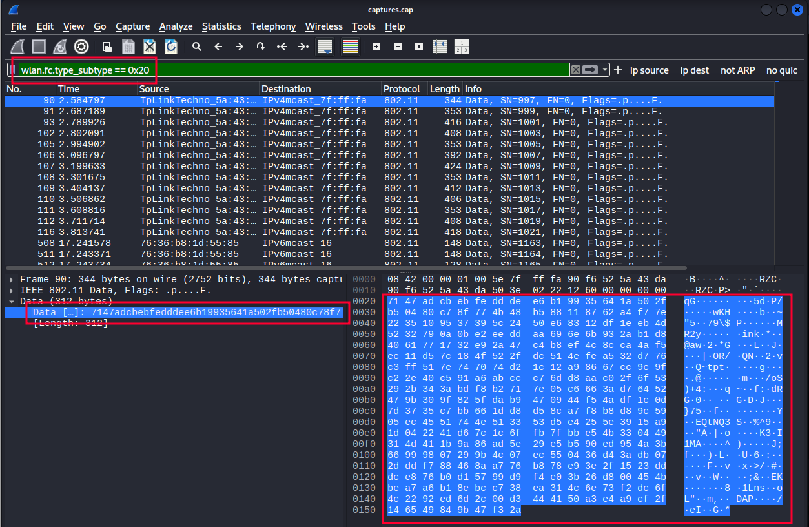

+++
title = " WPA/WPA2 Protocol: Packet format analysis and attacks against it"
date = 2025-06-01T15:43:16+01:00
draft = false
description = ""
slug = ""
authors = ["Dennis Drebitca"]
tags = ["wireshark", "aircrack-ng", "hcxpcapngtool", "hashcat"]
categories = []
externalLink = ""
series = ["Pentesting wireless"]
+++


## Identification of the different types of WPA protocol packets.

In this first phase, the analysis of a traffic capture corresponding to a WiFi network with WPA2-PSK authentication has been carried out. The tool used has been Wireshark, due to its ability to interpret and decompose network protocols in a detailed way. The purpose of this point is to identify the different types of packets involved in the WPA2 connection and authentication process, as well as to examine the most relevant fields of each and understand their function within the overall context of the capture.

To make the identification task easier, specific filters have been applied within Wireshark. The EAPOL filter has isolated the packets corresponding to the EAPOL protocol, essential for the analysis of the 4-way handshake. Also, using wlan.fc.type == 0x00 – wlan.fc.type == 0x0D the management frames, including Beacon, Probe, Authentication, and Association, have been identified.

First, all the captures have been put together into one using the "mergecap" tool. To do this, the following command has been executed:
```sh
mergecap -F pcap -w captures.cap *
```


Figure 1. Mergecap execution.

The 802.11X standard defines 3 different types of packages: Management, Control, and Data. The different types of packets are identified in the headers * *with 2 bits for the type and 4 bits for the subtype.

#### Management Frames

They are responsible for establishing, maintaining, and terminating connections between stations (clients) and access points (APs). They have 00 as their type identifier. There are 12 subtypes of management frames:

| Type Identifier | Subtype Identifier | Description of the subtype | Wireshark Filter |
| --- | --- | --- | --- |
| 00 | 0000 | Association Request | wlan.fc.type_subtype == 0x00 |
| 00 | 0001 | Association Response | wlan.fc.type_subtype == 0x01 |
| 00 | 0010 | Reassociation Request | wlan.fc.type_subtype == 0x02 |
| 00 | 0011 | Reassociation Response | wlan.fc.type_subtype == 0x03 |
| 00 | 0100 | Probe Request | wlan.fc.type_subtype == 0x04 |
| 00 | 0101 | Probe Response | wlan.fc.type_subtype == 0x05 |
| 00 | 0110-0111 | Reserved |  |
| 00 | 1000 | Beacon | wlan.fc.type_subtype == 0x08 |
| 00 | 1001 | ATIM | wlan.fc.type_subtype == 0x09 |
| 00 | 1010 | Disassociation | wlan.fc.type_subtype == 0x0A |
| 00 | 1011 | Authentication | wlan.fc.type_subtype == 0x0B |
| 00 | 1100 | Deauthentication | wlan.fc.type_subtype == 0x0C |
| 00 | 1101 | Action | wlan.fc.type_subtype == 0x0D |
| 00 | 1110-1111 | Reserved |  |

To see these types of packets, you can use the corresponding filter in wireshark. To view management packages, with subtypes ranging from 0x00 to 0x0D, you can use the following filter:
```sh
wlan.fc.type_subtype >= 0x00 and wlan.fc.type_subtype <= 0x0D
```


Figure 2. Management package filtering.

-   The most important management frame subtypes are the following:
-   Beacon: Periodically announced by the AP to show that the network is available (includes SSID, channel, capabilities...).
-   Probe Request: Sent by the customer to actively search for nearby networks.
-   Probe Response: Response from the AP to a probe request.
-   Authentication: Initiates client authentication with the AP (pre-802.1X or WPA2-PSK process).
-   Deauthentication: Terminates authentication. It can be legitimate or triggered by an attack.
-   Association Request: The client requests to join the network.
-   Association Response: The AP responds whether to accept or reject the request.
-   Disassociation: Notifies that the client or AP wants to disconnect.

Analyzing a beacon frame in Wireshark, subtype 0x08, the following fields can be seen:


Figure 3. Content of a beacon frame.

Among others, you can see:

-   Subtype of the plot
-   MAC address of the recipient
-   MAC address of the transmitter

#### Control Frames

These frames are used to control access to the wireless medium, helping to coordinate communication. They have 01 as their type identifier. There are 9 subtypes of management frames:

| Type Identifier | Subtype Identifier | Description of the subtype | Description of the subtype | Wireshark Filter |
| --- | --- | --- | --- | --- |
| 01 | 0000-0111 | Reserved |  |  |
| 01 | 1000 | Block Ack Request | wlan.fc.type_subtype == 0x18 | wlan.fc.type_subtype == 0x18 |
| 01 | 1001 | Block Ack | wlan.fc.type_subtype == 0x19 | wlan.fc.type_subtype == 0x19 |
| 01 | 1010 | PS-Poll | wlan.fc.type_subtype == 0x1A | wlan.fc.type_subtype == 0x1A |
| 01 | 1011 | RTS | wlan.fc.type_subtype == 0x1B | wlan.fc.type_subtype == 0x1B |
| 01 | 1100 | CTS | wlan.fc.type_subtype == 0x1C | wlan.fc.type_subtype == 0x1C |
| 01 | 1101 | ACK | wlan.fc.type_subtype == 0x1D | wlan.fc.type_subtype == 0x1D |
| 01 | 1110 | CF-end | wlan.fc.type_subtype == 0x1E | wlan.fc.type_subtype == 0x1E |
| 01 | 1111 | CF-end + CF-ack | wlan.fc.type_subtype == 0x1F | wlan.fc.type_subtype == 0x1F |

The most important subtypes of control frames are the following:

-   RTS (Request to Send): The client requests permission to send data, useful for collision avoidance.
-   CTS (Clear to Send): The AP responds to the RTS and authorizes the send.
-   ACK (Acknowledgment): Confirms that a frame has been received successfully.
-   Block ACK: Acknowledgment for multiple frames at once (more efficient).
-   PS-Poll: Sent by clients in power saving mode to request pending data from the AP.

To see these types of packets, you can use the corresponding filter in wireshark. To view control packets, with subtypes ranging from 0x18 to 0x1F, you can use the following filter:
```sh
wlan.fc.type_subtype >= 0x18 and wlan.fc.type_subtype <= 0x1F
```


Figure 4. Filtering of control tanks.

Analyzing a CTS frame, subtype 0x1B, in Wireshark, the following fields can be seen:


Figure 5. Content of a CTS frame.

Among others, the following fields can be observed:

-   Type/Subtype of the plot.
-   Destination MAC address.

#### Data Frames

These carry user information or internal protocol messages (such as EAPOL in 802.1X). They have 10 as their type identifier (2 in binary). There are 16 subtypes of data frames:

| Type Identifier | Subtype Identifier | Description of the subtype | Description of the subtype | Wireshark Filter |
| --- | --- | --- | --- | --- |
| 10 | 0000 | Data | wlan.fc.type_subtype == 0x20 | wlan.fc.type_subtype == 0x20 |
| 10 | 0001 | Data + CF-ack | wlan.fc.type_subtype == 0x21 | wlan.fc.type_subtype == 0x21 |
| 10 | 0010 | Data + CF-poll | wlan.fc.type_subtype == 0x22 | wlan.fc.type_subtype == 0x22 |
| 10 | 0011 | Data +CF-ack +CF-poll | wlan.fc.type_subtype == 0x23 | wlan.fc.type_subtype == 0x23 |
| 10 | 0100 | Null | wlan.fc.type_subtype == 0x24 | wlan.fc.type_subtype == 0x24 |
| 10 | 0101 | CF-ack | wlan.fc.type_subtype == 0x25 | wlan.fc.type_subtype == 0x25 |
| 10 | 0110 | CF-poll | wlan.fc.type_subtype == 0x26 | wlan.fc.type_subtype == 0x26 |
| 10 | 0111 | CF-ack +CF-poll | wlan.fc.type_subtype == 0x27 | wlan.fc.type_subtype == 0x27 |
| 10 | 1000 | QoS data | wlan.fc.type_subtype == 0x28 | wlan.fc.type_subtype == 0x28 |
| 10 | 1001 | QoS data + CF-ack | wlan.fc.type_subtype == 0x29 | wlan.fc.type_subtype == 0x29 |
| 10 | 1010 | QoS data + CF-poll | wlan.fc.type_subtype == 0x2A | wlan.fc.type_subtype == 0x2A |
| 10 | 1011 | QoS data + CF-ack + CF-poll | wlan.fc.type_subtype == 0x2B | wlan.fc.type_subtype == 0x2B |
| 10 | 1100 | QoS Null | wlan.fc.type_subtype == 0x2C | wlan.fc.type_subtype == 0x2C |
| 10 | 1101 | Reserved | wlan.fc.type_subtype == 0x2D | wlan.fc.type_subtype == 0x2D |
| 10 | 1110 | QoS + CF-poll (no data) | wlan.fc.type_subtype == 0x2E | wlan.fc.type_subtype == 0x2E |
| 10 | 1111 | Qos + CF-ack (no data) | wlan.fc.type_subtype == 0x2F | wlan.fc.type_subtype == 0x2F |
| 11 | 0000-1111 | Reserved |  |  |

The most important subtypes of control frames are as follows:

-   Data: Standard frame that carries the user's network data (such as IP packets, HTTP, etc.).
-   QoS Data: Data frames that use quality of service (prioritization for voice, video, etc.).
-   Null Data: Frame without data, used to inform the AP of the client's power status (e.g., going to sleep).
-   EAPOL (EAP over LAN): Not an official subtype, but it is encapsulated within a data frame and used to exchange 802.1X authentication messages (such as WPA2-Enterprise).

To see these types of packets, you can use the corresponding filter in wireshark. To view control packets, with subtypes ranging from 0x18 to 0x1F, you can use the following filter:
```sh
wlan.fc.type_subtype >= 0x20 and wlan.fc.type_subtype <0x2F
```


Figure 6. Data packet filtering.

Analyzing a NULL frame in Wireshark, of subtype 0x24, the following fields can be seen:


Figure 7. Content of a NULL frame.

#### EAPOL Protocol

EAPOL (EAP over LAN) is a protocol that is part of the IEEE 802.11 standard and is used in Wi-Fi networks to exchange messages necessary to establish a secure, encrypted connection between a client (device) and an access point (AP).

In WPA2-Personal networks, where both the client and the AP already know a pre-shared key (PSK), authentication with credentials and certificates is not required. However, a process is still necessary to confirm that both know the same key and, above all, to derive secure temporary keys that will encrypt the traffic.

This process is done using the 4-way handshake, which uses EAPOL-Key screens. These frames do not carry user data or passwords, but cryptographic information to generate the session keys that will protect wireless communication.

In this type of network, only two main actors are involved:

-   The client (station or STA): is the device that connects to the Wi-Fi network, such as a mobile phone, laptop, console, etc.
-   The Access Point (AP): This is the device that gives access to the wireless network. It can also be your home router.

Both share a key (the Wi-Fi password) beforehand and participate together in the EAPOL exchange that establishes an encrypted session.

On Wi-Fi, specifically with WPA2-Personal, the only EAPOL frame type used is EAPOL-Key (Type 3). It is used in the 4-way handshake. It exchanges cryptographic values such as nonce, MIC (Message Integrity Code), and group keys (GTK). It does not contain the PSK or the final key, but it serves to show that both parties know it. The other types of EAPOL frames exist in the specification, but are not used in WPA2-Personal networks. By capturing the 4-way handshake, you can attack the wifi network and get the password.

EAPOL frames can be displayed in Wireshark using the "EAPOL" filter:


Figure 8. EAPOL protocol frame filtering.

A complete interaction can be observed, with all 4 components of the 4-way handshake present.

## Handshake extraction and analysis

By applying the EAPOL filter, you can select the 4 frames of the 4-way handshake and export them. To do this, the desired packages are selected and those packages are exported.


Figure 9. Export of 4-way handshake wefts.

Once these packages have been exported. They can be opened again in Wireshark for further analysis.


Figure 10. Analysis of the 4 messages of the 4-way handshake.

#### Message Analysis 1 of 4


Figure 11. Capture of message 1 of 4.

This packet has been identified as the first EAPOL (Extensible Authentication Protocol over LAN) protocol message, as reflected in the Message number: 1 field of the 802.1X Authentication protocol. It has been transmitted by the access point (MAC address 90:f6:52:5a:43:da) to the client (76:36:b8:1d:55:85), which matches the destination address of the frame.

The IEEE 802.11 QoS Data type has been used as encapsulation, indicating that it is a QoS data frame on a WiFi network. This contains an EAPOL Key frame, specifically of the RSN Key (Robust Security Network) type, used in WPA2.

Among the most relevant fields have been the following:

-   Key Descriptor Type: EAPOL RSN Key (2) – This is confirmed to be a WPA2 related package.
-   Key Information: 0x008a: This field encodes several important flags:
-   Key ACK has been activated, indicating that this message is sent by the AP.
-   Key MIC has not been activated, as usual in the first message, as the integrity code has not yet been calculated.
-   Install has also not been activated, which is consistent with the fact that no session key has yet been agreed upon.
-   Replay Counter: 2: This value has been used to protect against replay attacks, ensuring that keys are generated only once.
-   WPA Key Nonce (ANonce): 720acf5f077dc87729420b210c1f86c71c5ed85de3f94e912b86bb8666b36e64. This random number has been generated by the AP and will be used, along with other parameters (such as the AP's MAC address, the client's MAC address, and the client's SNonce), to derive the PTK (Pairwise Transient Key).
-   WPA Key MIC and WPA Key Data Length have been set to zero, which is also consistent with the first message: no encrypted data or integrity code has been included yet.

#### Message Analysis 2 of 4


Figure 12. Message capture 2 of 4.

The second message in the WPA2 keying process originated from the client, which responds to the access point after successfully receiving the first message. This package includes fundamental data such as the SNonce, which is the random number generated by the client, and which, together with the ANonce (provided by the AP), will allow the PTK session key to be derived.

The observed frame presents an EAPOL-Key packet type corresponding to the 802.1X protocol. The descriptor indicates that WPA2 with AES encryption and HMAC-SHA1 is used for message authentication.

This second message can be distinguished by several important elements. One of them is the value of the Key ACK field, which in this case has not been activated, since it is a response message. In contrast, the Key MIC field does appear as set, implying that the client has been able to correctly calculate the message integrity code using the generated temporary key (PTK). This is essential because its validity confirms that the client has the shared master key (PMK).

The same package also includes the SNonce in clear format, i.e. unencrypted, since the secure association process has not yet been completed. Despite this, the MIC assures that the content of the message has not been modified during transmission.

In addition, the packet contains additional information encoded within the "Key Data" field, totaling 22 bytes in length. In this block is the RSN (Robust Security Network) identifier, which indicates the encryption algorithms supported by the customer, including the use of CCMP as a symmetric cipher to protect traffic.

This message represents a critical step within the handshake, as it not only authenticates the client to the access point, but also provides all the necessary data so that both parties, both the AP and the client, can derive the same PTK key. Once the MIC has been validated and the SNonce has been received, the access point will be able to send the third message, thus completing the mutual verification of the keys.

#### Message Analysis 3 of 4


Figure 13. Screenshot of the message 3 of 4.

This third packet is sent again by the access point (AP) to the client (STA), and its main purpose is to confirm the validity of the MIC received in the previous message and, in addition, to provide the temporary group key (GTK) in encrypted form. From this point, both parties should have already correctly calculated the PTK (Pairwise Transient Key), allowing them to start encrypting some of the message content.

The Key Information field in this frame reveals several important indicators about the status of the process:

-   Install is enabled, which means that the access point has already installed the PTK key locally and expects the client to do the same.
-   Key MIC is also active, confirming that the message has been authenticated with the PTK-derived MIC.
-   Secure is set, which indicates that keys have been successfully exchanged and encryption can begin to be used in communications.
-   Finally, Encrypted Key Data is enabled, as the AP now transmits the encrypted GTK, which is necessary for the client to join the broadcast group.

Importantly, the WPA Key Data field contains an encrypted 80-byte block, which includes the GTK and other elements such as the updated RSN IE (Information Element). This content is protected by the PTK, so it cannot be interpreted without knowing the key.

In addition, the value of the Replay Counter field has been increased to 3, following the order of the handshake and ensuring that previous broadcasts are not accepted, which protects against replay attacks.

Finally, the AP resends its ANonce (the same as in the first message) as a reference, so that the client can verify that both are using the same base data to derive the keys. This ensures consistency in the calculation of the PTK between both extremes.

This third message marks the closure of the most critical part of the key exchange, and sets the stage for the client to confirm the installation of the keys and receipt of the GTK in the fourth and final message.

#### Message Analysis 4 of 4


Figure 14. Message capture 4 of 4.

The last message in this exchange is sent by the client (STA) to the access point (AP) and serves as final confirmation that the entire authentication and key establishment process has been successful. In other words, with this message, the client tells the AP that it has received the GTK, successfully installed the PTK, and is ready to begin transmitting encrypted data.

One of the most relevant elements in this frame is the Key Information field, which contains several important control bits:

-   Key MIC is enabled, indicating that the client has successfully calculated the MIC using the shared PTK, thus validating the integrity of the message.
-   The Secure bit is also set, implying that both the client and the AP have already completed the key exchange and are ready to move on to secure communications.
-   The Install bit is not enabled because the client has already installed the key previously, in response to message 3.

In addition, Encrypted Key Data is disabled, as no additional encrypted information is transmitted in this message; its sole purpose is for signaling.

The Replay Counter maintains the same value as in the previous message (3), complying with the policy of protection against replay attacks and confirming the temporary validity of the message.

The WPA Key Nonce field is completely zero, which is normal in this fourth message: the client does not need to include any new nonce, as the relevant values were previously used to derive the PTK. Their presence as zeros serves merely as a placeholder.

Finally , the absence of additional data in the WPA Key Data field (with a length equal to 0) reinforces the minimum purpose of the message: it is a silent confirmation that the entire process has succeeded.

## Cracking the Handshake by Using Two Different Tools

For the breakup of the handshake the tools that will be used are Aircrack-ng and Hashcat.

#### Cracking the hanshake using Hashcat

Hashcat is a password recovery toolthat uses cracking techniques through the use of brute force, dictionary attacks, combined attacks, among others. It is one of the fastest and most powerful hash cracking tools available, as it allows you to use both the CPU and GPU to speed up the process. In order to use Hashcat and crack the password, the handshake must be presented in a format that Hashcat supports. To do this, the *hxccapngtool * is used to convert the .cap file to Hashcat mode 22000:
```sh
hcxpcapngtool -o hashcat_hash.22000 captures.cap
```


Figure 15. Execution of hcxpcapngtool.

Once the command is executed, the hash has been saved as *hascat_hash.22000*. Now, a dictionary attack (brute force) can be executed, specifying the famous rockyou.txt as the dictionary *.*
```sh
hashcat -m 22000 hashcat_hash.22000 rockyou.txt
```


Figure 16. Hashcat execution.

Hashcat has obtained the password satisfactorily for the UEM-Master network: iloveyou.

#### Cracking the hanshake using Aircrack-ng

The aircrack-ng module is responsible for Cracking WEP and WPA/WPA2-PSK keys by analyzing the packets previously captured on a Wi-Fi network. To obtain the password it is necessary to use a dictionary, in this case again *rockyou.txt. *The following command is executed:
```sh
aircrack-ng -e UEM-Master -w rockyou.txt captures.cap
```


Figure 17. Output aircrack.ng.

The result is as expected; Aircrack-ng has found the password present in the dictionary: iloveyou.

## Data decryption and inspection on Wireshark

WPA2 is a security protocol used in Wi-Fi networks to protect communications between devices. It uses AES-CCMP encryption along with a 4-way handshake authentication process to generate unique keys per session. Thanks to this, even if an attacker captures the data packets, they will not be able to read their contents without knowing the network password. This layer of encryption ensures the confidentiality of information transmitted over the wireless network.

In this case, the password has been obtained, so it is possible to decrypt the captured packets and see their contents in plain text.

Before decrypting packets, subtype data frames can be analyzed 0x20. The content does not make any sense, since it is encrypted. To do this, the wireshark filter "wlan.fc.type_sybtype == 0x20" has been applied:



Figure 18. Fully encrypted data frame.

To decrypt these packets, the *Airdecap-ng * tool is used, which requires the password to decrypt the encrypted data frames*.* The following command is executed:
```sh
airdecap-ng -o captures_decap -e UEM-Master -p iloveyou captures.cap
```

Figure 19. Running airdecap-ng.

After decrypting the data packets, the familiar protocols DHCP, ARP, ICMP appear in Wireshark... This is a confirmation that the packets have been successfully decrypted.


Figure 20. Data frames decrypted.

## Bibliography

https://community.cisco.com/t5/user/viewprofilepage/user-id/318581. “802.11 Frames : A Starter Guide to Learn Wireless Sniffer Traces.” *Cisco.com*, 25 Oct. 2010, community.cisco.com/t5/wireless-mobility-knowledge-base/802-11-frames-a-starter-guide-to-learn-wireless-sniffer-traces/ta-p/3110019. Accessed 18 Apr. 2025.